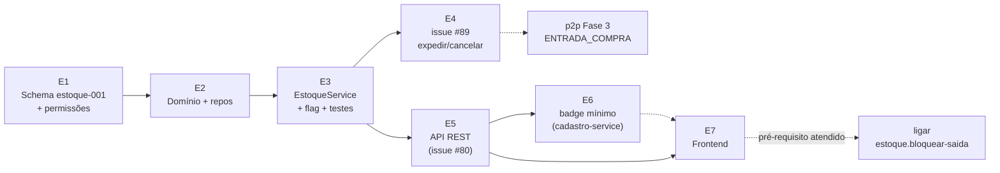

# Módulo ESTOQUE — saldo e movimento (`operacoes-service`) — Plano de implementação

**Última atualização:** 7 de setembro de 2026

**Status:** EM IMPLEMENTAÇÃO — **E1 a E5 feitos** (schema Liquibase + domínio/repositories; `EstoqueService` com flag `estoque.bloquear-saida`; baixa/estorno ligados em `PedidoService.expedir()`/`cancelar()`; API REST `EstoqueController`+DTOs+mapper). **E3-E5 verificados: `mvn test` verde no `operacoes-service` (usuário, 7 de setembro de 2026)**; E6-E7 ainda PLANEJADO · **Serviço:** `operacoes-service` (porta 8089, já existe — Fase 0 do `o2c-vendas.md`/`p2p-compras.md` feita), schema Postgres **`estoque`** · **Depende de:** nada além do que já está no ar (schema `vendas` aplicado, `Produto.tipo` já existe no `cadastro-service`) · **Fecha:** issue **#80** (parte estoque) e issue **#89** (baixa/estorno no O2C) · **Specs irmãos:** `o2c-vendas.md` (§7 expedição/cancelamento, §10 Fase 3), `p2p-compras.md` (Fase E), `Fin.md` §11.1 (contabilidade de estoque — fora de escopo aqui)

**Decisões fechadas (6 de setembro de 2026, com o usuário):**

- **D1 — Ajuste/inventário manual entra no MVP.** O módulo não é só espectador de vendas/compras: tem um caminho de escrita humano (`POST /api/v1/estoque/ajustes`). Sem ele todo saldo nasce em 0, não há como carregar estoque inicial, e o pré-requisito que o `o2c-vendas.md` §7 exige antes de ligar o bloqueio de expedição nunca é atendido.
- **D2 — Expedição continua NÃO bloqueando por saldo, mas a checagem já nasce escrita** atrás da flag `estoque.bloquear-saida` (default `false`), no mesmo padrão de `fiscal.split-payment`. Confirma para o lado de vendas a mesma decisão já fechada no `p2p-compras.md` ("Flag temporária"), com a diferença de que aqui a flag é código real e não promessa de PR futuro. Ligar vira uma linha de config.
- **D3 — `movimento_estoque` guarda `valor_unitario` (nullable).** A tabela é append-only: o que não for gravado na hora nunca poderá ser reconstruído. Preço da NF na entrada, preço de venda na saída. É a matéria-prima do custo médio ponderado (que segue fora de escopo).
- **D4 — O spec cobre backend e frontend**, o frontend na última fase (tela de saldos + extrato + form de ajuste), igual ao padrão do `o2c-vendas.md`/`p2p-compras.md`.
- **D5 — Um único endpoint de escrita, por saldo contado, não por delta** (§5.3). Ajuste e inventário são o mesmo mecanismo: o operador informa "o saldo certo é 12" e o serviço calcula a diferença. Muda a *forma* da opção aprovada em D1, não o alcance — justificativa em §3.2.

---

## 1. Contexto

### O que existe hoje (verificado no código, 6 de setembro de 2026)

| Item | Estado |
|---|---|
| `operacoes-service` (porta 8089) | OK — schema `vendas` aplicado, `PedidoService` completo (máquina de estados, faturamento com motor fiscal, eventos Kafka) |
| Rota do gateway `/api/v1/estoque/**` → `lb://operacoes-service` | OK — **já declarada** (`gateway/src/main/resources/application.yml:28`, junto de `/api/v1/pedidos/**` e `/api/v1/compras/**`), antes do catch-all `/api/**` |
| Schema `estoque` no Postgres | **NÃO existe** — `init/000-initial-schemas.yaml` cria `auth`, `cadastros`, `vendas`, `financeiro`, `logistica`, `rh`. O schema nasce no próprio `estoque-schema-001.yaml`, no padrão de `fiscal-001-create-schema` |
| `cadastros.deposito` (`Deposito`) | OK — com `estabelecimento_id`, `ativo`, CRUD e tela |
| `cadastros.produto_estoque_config` | OK, mas **só parametrização** (`estoque_minimo`, `estoque_maximo`, `ponto_reposicao`, `lead_time_dias`, `fornecedor_preferencial_id`). **Sem controller** no `cadastro-service` (ver Fase E6) |
| `Produto.tipo` (`MERCADORIA`/`SERVICO`) + `codigo_servico` | OK no `cadastro-service`; `PedidoItem.tipo_item` já é snapshot resolvido na criação do pedido |
| Saldo/movimento de estoque | **NÃO existe nada** — nenhuma tabela, entidade ou serviço |
| Baixa de estoque na expedição | Stub — comentário `ponytail:` em `PedidoService.expedir()` |
| Estorno no cancelamento pós-expedição | Stub — comentário `ponytail:` em `PedidoService.cancelar()` |

### Por que agora

Ordem registrada no `p2p-compras.md` (Fase E, 6 de setembro de 2026): **O2C → estoque → P2P**. O estoque é a espinha compartilhada dos dois módulos; deixá-lo dentro da Fase 3 do P2P manteria a expedição do O2C sem baixa real por mais duas fases, sem ganho nenhum. Adiantando-o, a Fase 3 do P2P vira só o plug de `ENTRADA_COMPRA` numa máquina que já existe.

**Risco fechado:** hoje o pedido percorre `CONFIRMADO → EXPEDIDO → FATURADO` sem que nenhuma quantidade saia de lugar nenhum. O sistema não sabe o que tem. Este módulo passa a saber — ainda sem impedir (D2), mas com o número e o rastro corretos.

---

## 2. Onde o módulo mora

**Dentro do `operacoes-service`**, ao lado de `vendas` (e, depois, `compras`). Decisão já fechada em `p2p-compras.md` [Rev. 2]: os três domínios vivem no mesmo serviço, em schemas Postgres distintos do mesmo banco `loop-erp`. Não há `estoque-service`.

### 2.1 Pacotes (convenção do `operacoes-service`, espelhando `.../vendas/`)

```
com.l.erp.operacoesservice
├── api
│   ├── controllers/EstoqueController.java
│   ├── dto/
│   │   ├── AjusteEstoqueRequestDTO.java
│   │   ├── EstoqueSaldoResponseDTO.java
│   │   └── MovimentoEstoqueResponseDTO.java
│   └── mappers/EstoqueMapper.java          (MapStruct, padrão de PedidoMapper)
├── domain/estoque
│   ├── MovimentoEstoque.java
│   ├── EstoqueSaldo.java
│   └── enumerators/
│       ├── TipoMovimentoEstoque.java
│       └── OrigemMovimentoEstoque.java
├── repository/estoque
│   ├── MovimentoEstoqueRepository.java
│   └── EstoqueSaldoRepository.java
└── services/estoque
    └── EstoqueService.java
```

Entidades estendem `BaseTenantEntity` e carregam as 4 colunas de auditoria (`created_at NOT NULL`, `updated_at`, `created_by NOT NULL`, `last_updated_by`) — mesma regra do `vendas`. `@Table(schema = "estoque")`. `ddl-auto=validate`, DDL 100% no `liquibase-service`.

### 2.2 Como vendas e compras chamam o estoque

**Chamada Java direta, na mesma transação. Nenhum Kafka, nenhuma interface.**

`PedidoService` (vendas) e, depois, `RecebimentoService` (compras) recebem `EstoqueService` no construtor e chamam **um único método público**:

```java
// EstoqueService — a API in-process inteira do lado da escrita
public void registrarMovimento(MovimentoRequisicao requisicao);

public record MovimentoRequisicao(
        Long tenantId,
        UUID userId,
        TipoMovimentoEstoque tipo,
        OrigemMovimentoEstoque origemTipo,
        UUID origemId,              // id do pedido/recebimento; null só para AJUSTE/INVENTARIO
        UUID depositoId,
        Instant ocorridoEm,
        List<Linha> linhas) {

    public record Linha(UUID produtoId, BigDecimal quantidade, BigDecimal valorUnitario) {}
}
```

`ponytail:` uma classe concreta, um método, sem interface — há **uma** implementação e ela não vai ser trocada dentro do mesmo processo. Interface entra se e quando o estoque virar serviço próprio, o que a decisão de arquitetura já descartou.

Como os dois módulos rodam no mesmo `@Transactional` do chamador, a garantia é transacional e não eventual: **ou o pedido é expedido e o estoque baixa, ou nenhum dos dois acontece**. Não há retry, DLQ nem janela de inconsistência a administrar — não existe fronteira de rede para falhar.

Do lado da leitura, quem está dentro do serviço chama `EstoqueService.saldo(produtoId, depositoId)` direto; quem está fora usa os endpoints do §5.

---

## 3. Modelagem de dados (schema `estoque`)

### 3.1 `estoque.movimento_estoque` — append-only, imutável

Nunca sofre `UPDATE` nem `DELETE`. Correção é sempre **um movimento novo** (estorno ou ajuste). É o livro-razão do estoque: `estoque_saldo` pode ser reconstruído inteiro a partir daqui.

| Coluna | Tipo | Notas |
|---|---|---|
| `id` | UUID PK | `GenerationType.UUID` |
| `tenant_id` | BIGINT NOT NULL | multi-tenant, `BaseTenantEntity` |
| `produto_id` | UUID NOT NULL | ref. `cadastros.produto` — **sem FK física** (outro serviço), como em `vendas.pedido` |
| `deposito_id` | UUID NOT NULL | ref. `cadastros.deposito` — sem FK física |
| `tipo` | VARCHAR(25) NOT NULL | enum `TipoMovimentoEstoque` (§3.2) |
| `quantidade` | NUMERIC(15,4) NOT NULL | **sempre positiva**; o sinal vem do `tipo`. CHECK `quantidade > 0` |
| `valor_unitario` | NUMERIC(15,4) NULL | **[D3]** preço da NF na entrada, preço de venda na saída, custo informado (ou null) no ajuste |
| `origem_tipo` | VARCHAR(20) NOT NULL | enum `OrigemMovimentoEstoque` (§3.2) |
| `origem_id` | UUID NULL | id do `vendas.pedido` ou do `compras.recebimento_mercadoria`. **NULL para `AJUSTE`/`INVENTARIO`** (não têm documento) |
| `motivo` | VARCHAR(500) NULL | obrigatório para `AJUSTE`/`INVENTARIO` (validado no service), null nos demais |
| `usuario_id` | UUID NOT NULL | userId do JWT |
| `ocorrido_em` | TIMESTAMPTZ NOT NULL | momento do fato (expedição/recebimento), **não** o `created_at` da linha |
| 4 colunas de auditoria | — | padrão do projeto |

> **Divergência registrada vs. `p2p-compras.md`:** naquele spec `origem_id` está como `UUID NOT NULL`. Com ajuste/inventário no escopo (D1) não existe documento de origem para essas linhas, então a coluna passa a ser **nullable com CHECK**: `CHECK (origem_tipo IN ('AJUSTE','INVENTARIO') OR origem_id IS NOT NULL)`. As colunas `valor_unitario` e `motivo` também são novas em relação àquele desenho. O `p2p-compras.md` precisa apontar para este spec como fonte da modelagem de estoque (§11.3).

**Índices:**

| Índice | Definição | Para quê |
|---|---|---|
| `idx_mov_estoque_produto_deposito` | (`tenant_id`, `produto_id`, `deposito_id`, `ocorrido_em` DESC) | extrato do §5.2, o acesso dominante |
| `idx_mov_estoque_origem` | (`tenant_id`, `origem_tipo`, `origem_id`) | achar os movimentos de um documento (estorno, auditoria) |
| `uq_mov_estoque_origem_produto` | UNIQUE (`tenant_id`, `tipo`, `origem_tipo`, `origem_id`, `produto_id`) **WHERE `origem_id` IS NOT NULL** | idempotência: duplo-clique/retry não gera baixa dupla do mesmo documento |

O índice único só fecha porque **o serviço agrega as linhas por produto antes de gravar** (§4.1): um documento produz no máximo uma linha de movimento por produto. Isso também deixa o extrato legível (uma linha por produto por documento, não N).

### 3.2 Enums

```java
public enum TipoMovimentoEstoque {
    ENTRADA_COMPRA,          // (+) recebimento confirmado (P2P, Fase 3 daquele spec)
    ESTORNO_ENTRADA_COMPRA,  // (-) recebimento CONFIRMADO cancelado
    SAIDA_VENDA,             // (-) expedição do pedido de venda (O2C)
    ESTORNO_SAIDA_VENDA,     // (+) cancelamento de pedido que estava EXPEDIDO
    AJUSTE_ENTRADA,          // (+) acerto manual para cima
    AJUSTE_SAIDA             // (-) acerto manual para baixo
}

public enum OrigemMovimentoEstoque {
    PEDIDO_VENDA,    // origem_id = vendas.pedido.id
    RECEBIMENTO,     // origem_id = compras.recebimento_mercadoria.id
    AJUSTE,          // origem_id null — acerto avulso
    INVENTARIO       // origem_id null — contagem física
}
```

> **[D5] Por que `INVENTARIO` é origem, e não tipo.** A opção aprovada listava `INVENTARIO` como um sétimo *tipo* de movimento. Ele não cabe ali: o modelo fixa "quantidade sempre positiva, sinal vem do tipo", e uma contagem física pode apontar tanto para cima quanto para baixo — um tipo `INVENTARIO` teria sinal indefinido. A solução mantém o mesmo alcance funcional e a tabela homogênea: o serviço recebe a **quantidade contada**, calcula a diferença contra o saldo atual e grava `AJUSTE_ENTRADA` ou `AJUSTE_SAIDA` conforme o sinal, com `origem_tipo = 'INVENTARIO'`. O extrato continua distinguindo contagem de acerto avulso — pela origem, que é onde essa informação pertence.

### 3.3 `estoque.estoque_saldo` — saldo materializado

| Coluna | Tipo | Notas |
|---|---|---|
| `id` | UUID PK | |
| `tenant_id` | BIGINT NOT NULL | |
| `produto_id` | UUID NOT NULL | sem FK física |
| `deposito_id` | UUID NOT NULL | sem FK física |
| `quantidade` | NUMERIC(15,4) NOT NULL DEFAULT 0 | atualizada por upsert com `SELECT ... FOR UPDATE` na **mesma transação** do movimento |
| 4 colunas de auditoria | — | `updated_at`/`last_updated_by` mudam a cada movimento |

**UNIQUE (`tenant_id`, `produto_id`, `deposito_id`)** — é o que torna o upsert seguro e a leitura por par produto+depósito um index lookup.

**Sem CHECK `quantidade >= 0`** — decisão D2: saldo negativo sistêmico é aceitável no MVP. Um CHECK aqui seria bloqueio disfarçado de constraint, e devolveria erro de banco em vez da mensagem PT-BR correta. O bloqueio, quando ligado, é validação de aplicação (§6).

**Sem `quantidade_reservada`** — reserva na confirmação é upgrade futuro (`o2c-vendas.md` §11), coluna aditiva quando existir.

### 3.4 Migração Liquibase

Pasta nova `estoque/` no changelog (padrão por schema, como `vendas/`, `fiscal/`, `auth/`):

- **`estoque/estoque-schema-001.yaml`**
  1. `estoque-001-create-schema` — `CREATE SCHEMA IF NOT EXISTS estoque` (o schema não vem do `init/000`), com `rollback: DROP SCHEMA IF EXISTS estoque CASCADE`, idêntico a `fiscal-001-create-schema`.
  2. `estoque-002-create-movimento-estoque` — tabela + CHECKs (`quantidade > 0`, origem/origem_id).
  3. `estoque-003-create-estoque-saldo` — tabela + unique.
  4. `estoque-004-indexes` — os 3 índices do §3.1 (o parcial via `<sql>`, porque `createIndex` do Liquibase não expressa `WHERE`).
- **`db.changelog-master.yaml`** — bloco novo `# 8. Schema Estoque (operacoes-service)` depois do bloco de `vendas`, com o include.
- **`auth/auth-schema-019.yaml`** — seed das permissões no padrão `DOMINIO_ACAO`, idempotente com `ON CONFLICT`, espelhando `auth-schema-018.yaml` (as `PEDIDO_*`):

| Permissão | Domínio | Descrição |
|---|---|---|
| `ESTOQUE_VISUALIZAR` | `ESTOQUE` | Consultar saldos e extrato de movimentos (nome já reservado no `p2p-compras.md`) |
| `ESTOQUE_AJUSTAR` | `ESTOQUE` | Registrar ajuste/inventário de saldo |

Ambas atribuídas ao papel de proprietário no mesmo changeset, como as `PEDIDO_*`.

> **Nota de implementação (7 de setembro de 2026):** o `auth-schema-018.yaml` real (PEDIDO_*) **não** contém nenhuma atribuição a `role_permission` — só o `INSERT INTO auth.permission ... ON CONFLICT (code) DO NOTHING`. O mesmo vale para `auth-schema-009.yaml` (seed maior de permissões CADASTRO/AUTH). Não existe nenhum seed de `role_permission` em todo o changelog. `auth-schema-019.yaml` (E1) seguiu o precedente real — só o insert em `auth.permission` — em vez do texto acima. A atribuição ao papel de proprietário, se existir, é resolvida em runtime pelo bypass `isOwner` do JWT (`AuthService`/`TokenService`), não por linha de `role_permission`.

---

## 4. Regras de gravação (`EstoqueService`)

### 4.1 `registrarMovimento` — o caminho único de escrita

Toda escrita de estoque no sistema passa por aqui: expedição, cancelamento, recebimento, ajuste. `ponytail:` um só ponto de entrada é o que permite que validação de saldo, auditoria e a flag de bloqueio existam em um lugar em vez de em cada chamador.

Em uma transação (a do chamador, propagada — `@Transactional` sem `REQUIRES_NEW`):

1. **Valida a requisição** — `depositoId` não nulo; ao menos 1 linha; `quantidade > 0` em toda linha; `motivo` obrigatório quando `origemTipo` for `AJUSTE`/`INVENTARIO`; `origemId` obrigatório caso contrário. Falha → `BusinessException` 400 PT-BR (mensagens em `common/Constants.java`).
2. **Agrega as linhas por `produto_id`** (soma quantidades, média ponderada do `valor_unitario`) — garante uma linha de movimento por produto por documento e sustenta o índice único de idempotência.
3. **Ordena os produtos por `produto_id`** antes de travar. `ponytail:` ordem determinística de lock — duas transações que mexem nos mesmos produtos travam na mesma sequência e não deadlockam. Custa um `sort`.
4. **Por produto:** `SELECT ... FOR UPDATE` em `estoque_saldo` (`findByProdutoIdAndDepositoIdForUpdate`, `@Lock(PESSIMISTIC_WRITE)`); se não existir, insere com `quantidade = 0`. **Aplica a checagem de bloqueio do §6** quando o tipo for de saída. Soma/subtrai conforme o sinal do tipo. `save`.
5. **Insere a linha em `movimento_estoque`** (nunca update).
6. Retorna `void`. Falha em qualquer passo → a transação inteira do chamador reverte.

Nenhum evento Kafka é publicado pelo módulo de estoque no MVP. Quem quiser notificar o mundo (BI, financeiro) publica do seu lado, depois do commit — é o que o `p2p-compras.md` já prevê para `compra.recebimento.confirmado`.

### 4.2 Saldo negativo

Enquanto a flag do §6 estiver desligada, `estoque_saldo.quantidade` pode ficar negativa — e isso é **informação, não corrupção**: significa "vendemos o que o sistema não sabia que tínhamos". O extrato mostra exatamente quando e por quê. O caminho de conserto é o ajuste do §5.3, nunca um `UPDATE` manual no banco.

---

## 5. Endpoints REST

Base `/api/v1/estoque`, no `operacoes-service`. Rota do gateway **já existe**. Tenant pelos headers injetados pelo gateway (`X-Tenant-Id`), `@PreAuthorize` por permissão, paginação e HATEOAS no padrão de `PedidoController`/`PedidoAssembler`.

### 5.1 `GET /api/v1/estoque/saldos` — `ESTOQUE_VISUALIZAR`

Filtros (todos opcionais, combináveis): `produtoId`, `depositoId`, `comSaldo` (`true` = só quantidade diferente de 0), `abaixoMinimo` (Fase E6). Paginado.

```json
{
  "produtoId": "…", "depositoId": "…", "quantidade": 12.0000,
  "estoqueMinimo": null, "abaixoMinimo": null,
  "atualizadoEm": "2026-09-06T14:02:11Z"
}
```

`estoqueMinimo`/`abaixoMinimo` vêm de `ProdutoEstoqueConfig`, que mora no `cadastro-service` e **hoje não tem controller**. Ficam `null` até a Fase E6 — os campos já existem no contrato para o frontend não precisar mudar depois.

### 5.2 `GET /api/v1/estoque/movimentos` — `ESTOQUE_VISUALIZAR`

Extrato. Filtros: `produtoId`, `depositoId`, `de`/`ate` (sobre `ocorrido_em`), `tipo`, `origemTipo`. Paginado, ordenado por `ocorrido_em DESC`. Devolve tipo, origem (com `origemId` para o front linkar o pedido/recebimento), quantidade, `valorUnitario`, `motivo`, `usuarioId`, `ocorridoEm`.

`ponytail:` sem `GET /movimentos/{id}` — o extrato já traz a linha inteira, e ninguém navega para um movimento isolado.

### 5.3 `POST /api/v1/estoque/ajustes` — `ESTOQUE_AJUSTAR`

**[D5] Um endpoint só, por saldo contado.** O operador informa o saldo que **de fato existe**, não a diferença — é o que ele conta na prateleira, e elimina a classe inteira de erro de sinal invertido.

```json
{
  "produtoId": "…",
  "depositoId": "…",
  "quantidadeContada": 12.0000,
  "origem": "INVENTARIO",
  "motivo": "Contagem cíclica setembro/2026",
  "valorUnitario": null
}
```

Serviço: trava o saldo (`FOR UPDATE`), calcula `delta = quantidadeContada - saldoAtual`, grava `AJUSTE_ENTRADA` (delta > 0) ou `AJUSTE_SAIDA` (delta < 0) com `origem_tipo` = `AJUSTE` ou `INVENTARIO`. **`delta == 0` é no-op**: 200 sem gravar movimento (contagem que confirma o saldo não é fato de estoque). `motivo` obrigatório, até 500 caracteres. `quantidadeContada >= 0` (contagem física não é negativa).

`ponytail:` sem documento de inventário com máquina de estados (abertura → contagem → apuração). Contagem em lote é upgrade direto: N chamadas, ou um endpoint que faz batch das mesmas linhas. O modelo não muda.

---

## 6. Regras de negócio

| RN | Regra | Onde |
|---|---|---|
| **RN-EST-01** | **Só item `MERCADORIA` movimenta estoque.** Item `SERVICO` nunca gera linha em `movimento_estoque` — nem na venda (`o2c-vendas.md` D2), nem no recebimento (`p2p-compras.md` Rev. 5). O filtro é do chamador (que conhece o tipo do item), não do `EstoqueService` | `PedidoService`, `RecebimentoService` |
| **RN-EST-02** | **Movimento é imutável.** Sem `UPDATE`/`DELETE` em `movimento_estoque`, nem por caminho administrativo. Correção = movimento novo | repository (só `save`/`find`) + revisão |
| **RN-EST-03** | **`quantidade > 0` sempre**; o sinal vem do `tipo` | CHECK + service |
| **RN-EST-04** | **Saldo e movimento commitam juntos.** Nunca existe movimento sem saldo atualizado, nem o contrário | mesma transação, §4.1 |
| **RN-EST-05** | **Saldo insuficiente NÃO bloqueia saída** enquanto `estoque.bloquear-saida = false` (default). Com a flag ligada, `SAIDA_VENDA` e `AJUSTE_SAIDA` que deixariam o saldo negativo lançam 400 PT-BR (`Constants.ESTOQUE_SALDO_INSUFICIENTE`, com produto/depósito/saldo/documento na mensagem). **`ESTORNO_*` e `AJUSTE_ENTRADA` nunca são bloqueados** — devolver e corrigir precisam funcionar mesmo com saldo torto, senão a flag prende o sistema num estado sem saída | `EstoqueService` (§4.1 passo 4) |
| **RN-EST-06** | **Ajuste exige motivo** (até 500 caracteres) — é o único movimento sem documento de origem, e sem motivo vira buraco de auditoria | service |
| **RN-EST-07** | **Idempotência por documento:** o mesmo (`tipo`, `origem_tipo`, `origem_id`, `produto_id`) não entra duas vezes. Violação = 409 (documento já movimentado), não 500 | índice único parcial + tradução no `GlobalExceptionHandler` |
| **RN-EST-08** | **Recebimento não checa saldo.** Entrada só aumenta — "saldo insuficiente" não se aplica. A validação equivalente do lado da compra seria capacidade física do depósito, fora de escopo | doc |

### 6.1 A flag `estoque.bloquear-saida`

```yaml
# operacoes-service/src/main/resources/application.yaml
estoque:
  bloquear-saida: ${ESTOQUE_BLOQUEAR_SAIDA:false}
```

Lida no `EstoqueService` via `@Value`, aplicada **dentro** do passo 4 do §4.1 — um lugar, todos os chamadores. `ponytail:` a checagem mora no serviço e não em `PedidoService.expedir()`; ligar a flag protege expedição, ajuste e qualquer saída futura de uma vez, em vez de um `if` por caller.

**Ordem de ativação (herdada do `o2c-vendas.md` §7):** a flag só deve ser ligada **depois** de existirem a tela de saldo e o caminho de ajuste (Fase E7) e de o saldo inicial ter sido carregado. Ligar antes disso barra toda venda no dia 1, porque todo saldo começa em 0. Sem flag por tenant no MVP — é config de serviço; granularidade por tenant entra quando o primeiro cliente pedir bloqueio e outro não (upgrade: mesma allowlist por tenant já usada em `fiscal.split-payment`).

---

## 7. Fechando a issue #89 — O2C

`PedidoService` ganha `EstoqueService` no construtor. Os dois comentários `ponytail:` viram chamada real.

### 7.1 `expedir()` — gera `SAIDA_VENDA`

No lugar do comentário atual, **depois** de `registrarHistorico` e **dentro** do mesmo `@Transactional`:

```java
List<PedidoItem> itens = pedidoItemRepository.findAllByPedidoId(pedido.getId());
List<Linha> linhas = itens.stream()
        .filter(i -> i.getTipoItem() == TipoItemPedido.MERCADORIA)   // RN-EST-01
        .map(i -> new Linha(i.getProdutoId(), i.getQuantidade(), i.getPrecoUnitario()))
        .toList();
if (!linhas.isEmpty()) {
    estoqueService.registrarMovimento(new MovimentoRequisicao(
            tenantId, userId, SAIDA_VENDA, PEDIDO_VENDA, pedido.getId(),
            depositoId, agora, linhas));
}
```

Pontos já resolvidos, que não exigem trabalho novo:

- **Tipo do item não custa chamada externa.** `PedidoItem.tipo_item` já é snapshot gravado na criação do pedido (D2 do `o2c-vendas.md`) — o filtro `MERCADORIA` é leitura local, sem ida ao `cadastro-service`.
- **Depósito é único e já validado.** `expedir()` já exige `depositoId` não nulo (`Constants.PEDIDO_DEPOSITO_OBRIGATORIO`) e o grava no cabeçalho; `pedido_item` não tem depósito próprio. Toda a baixa sai desse depósito. Expedição multi-depósito é upgrade (§10).
- **Pedido só-serviço nem chega aqui:** `expedir()` já lança 400 (`PEDIDO_EXPEDICAO_SO_MERCADORIA`) antes. Pedido misto expede e baixa só a parte mercadoria — é o que a lista filtrada faz.
- **`valorUnitario` = `precoUnitario` do item** (preço de venda, D3). Não é custo; a coluna guarda "o valor daquele movimento", e o que ela significa depende do tipo — documentado no §3.1.
- **Sem risco de duplicidade:** a máquina de estados só permite `CONFIRMADO → EXPEDIDO` uma vez, e o índice único (RN-EST-07) é a rede de segurança.

### 7.2 `cancelar()` — gera `ESTORNO_SAIDA_VENDA` quando `statusAnterior == EXPEDIDO`

```java
if (statusAnterior == StatusPedido.EXPEDIDO) {
    // mesmas linhas MERCADORIA da expedição, movimento contrário
    estoqueService.registrarMovimento(new MovimentoRequisicao(
            tenantId, userId, ESTORNO_SAIDA_VENDA, PEDIDO_VENDA, pedido.getId(),
            pedido.getDepositoId(), agora, linhas));
}
```

- **Só `EXPEDIDO` estorna.** `ORCAMENTO`/`BLOQUEADO_CREDITO`/`CONFIRMADO` nunca baixaram nada. `FATURADO` e `CANCELADO` já são bloqueados pela máquina de estados (não se cancela pedido faturado — devolução é fluxo próprio, §10).
- **Depósito vem de `pedido.getDepositoId()`**, gravado na expedição. Ele nunca muda depois: só `expedir()` escreve nesse campo.
- **As linhas são reconstruídas dos itens do pedido, não relidas de `movimento_estoque`.** É seguro porque `atualizar()` só aceita pedido em `ORCAMENTO` — itens são imutáveis a partir da confirmação, então os itens de hoje são exatamente os que foram baixados. `ponytail:` reler o movimento original seria um JOIN a mais para chegar no mesmo número.
- O estorno é uma **linha nova** (RN-EST-02), com o mesmo `origem_id`. O `tipo` diferente é o que faz o índice único do §3.1 aceitar os dois.

### 7.3 O que **não** muda

`confirmar()` não reserva estoque (reserva é upgrade, `o2c-vendas.md` §11). `faturar()` não toca em estoque — a mercadoria já saiu na expedição. `reabrir()` só volta de `CONFIRMADO`/`BLOQUEADO_CREDITO`, estados que nunca movimentaram.

---

## 8. Testes

Padrão do projeto: JUnit + Mockito para serviço, `@WebMvcTest` + MockMvc para controller. **Gate JaCoCo do `operacoes-service` é 60%** (não 40%). Nada é considerado funcionando até rodado — o usuário executa os builds.

### 8.1 `EstoqueServiceTest` (novo)

| Cenário | Verifica |
|---|---|
| Movimento de entrada em produto sem saldo | cria `estoque_saldo` com a quantidade; grava 1 movimento |
| Movimento de entrada em produto com saldo | soma; não duplica linha de saldo |
| Movimento de saída | subtrai |
| Saída maior que o saldo, flag **off** | permite; saldo fica **negativo** (RN-EST-05) |
| Saída maior que o saldo, flag **on** | `BusinessException` 400 PT-BR; nada gravado |
| `ESTORNO_SAIDA_VENDA` com saldo negativo, flag **on** | **passa** — estorno nunca é bloqueado (RN-EST-05) |
| Duas linhas do mesmo produto na requisição | agrega em 1 movimento com a soma (§4.1 passo 2) |
| Ajuste com `quantidadeContada` > saldo | grava `AJUSTE_ENTRADA` com o delta |
| Ajuste com `quantidadeContada` < saldo | grava `AJUSTE_SAIDA` com o módulo do delta |
| Ajuste com `quantidadeContada` == saldo | no-op: nenhum movimento gravado |
| Ajuste sem motivo | 400 (RN-EST-06) |
| `quantidade <= 0` na requisição | 400 (RN-EST-03) |
| Movimento com origem documental e `origemId` null | 400 |

### 8.2 `PedidoServiceTest` — cenários novos (hoje inexistentes)

O teste atual não cobre estoque nenhum. `EstoqueService` entra como `@Mock`.

| Cenário | Verifica |
|---|---|
| `expedir()` de pedido só-mercadoria | `registrarMovimento` chamado 1x, tipo `SAIDA_VENDA`, origem `PEDIDO_VENDA`/`pedido.id`, depósito da expedição, N linhas |
| `expedir()` de pedido **misto** | só as linhas `MERCADORIA` vão; item `SERVICO` ausente (RN-EST-01) |
| `expedir()` de pedido só-serviço | 400 já existente; `registrarMovimento` **nunca** chamado (`verifyNoInteractions`) |
| `expedir()` que falha na validação (sem depósito / sem transportadora) | `registrarMovimento` nunca chamado |
| `expedir()` quando `EstoqueService` lança | exceção propaga; pedido **não** fica `EXPEDIDO` (transação reverte) |
| `cancelar()` com `statusAnterior == EXPEDIDO` | `registrarMovimento` com `ESTORNO_SAIDA_VENDA`, mesmas linhas, depósito do pedido |
| `cancelar()` de `ORCAMENTO` / `CONFIRMADO` / `BLOQUEADO_CREDITO` | `verifyNoInteractions(estoqueService)` |
| `cancelar()` de pedido expedido cujas linhas MERCADORIA são vazias | nenhuma chamada (lista filtrada vazia não gera movimento) |

### 8.3 `EstoqueControllerTest` (`@WebMvcTest`)

Os 3 endpoints: 200 com filtros, 400 em payload inválido de ajuste, **403 sem a permissão** (`ESTOQUE_VISUALIZAR` / `ESTOQUE_AJUSTAR`) — mesmo padrão dos casos 403 de `PedidoControllerTest`.

---

## 9. Fases de implementação

PRs pequenos e independentes, na ordem. Cada fase compila e passa no gate sozinha.

| Fase | Entrega | Depende de |
|---|---|---|
| **E1** | **Schema.** `estoque/estoque-schema-001.yaml` (schema + 2 tabelas + CHECKs + 3 índices) + include no `db.changelog-master.yaml` + `auth/auth-schema-019.yaml` (seed `ESTOQUE_VISUALIZAR`/`ESTOQUE_AJUSTAR`, idempotente). Migração rodada pelo usuário via `liquibase-service` | — |
| **E2** | **Domínio + repositories.** `MovimentoEstoque`, `EstoqueSaldo`, os 2 enums, `MovimentoEstoqueRepository` (query do extrato com filtros), `EstoqueSaldoRepository` (com `@Lock(PESSIMISTIC_WRITE)`). `ddl-auto=validate` valida contra E1. `EstoqueSaldoRepositoryTest`/`MovimentoEstoqueRepositoryTest` (`@DataJpaTest`, H2 — não conta pro gate de cobertura) cobrem os repositories; cada classe força `hibernate.dialect=H2Dialect` + `@DirtiesContext(AFTER_CLASS)` porque o dialect de produção é Postgres (`for no key update` do `@Lock` não existe no H2, e sem isolar o contexto as duas classes reaproveitavam o mesmo H2 embarcado) | E1 |
| **E3** | ✅ **FEITO e VERDE (`mvn test`, 7/9/2026).** **`EstoqueService`** — `registrarMovimento` (agregação, ordenação de lock, upsert `FOR UPDATE`, insert do movimento), `ajustar` (§5.3), flag `estoque.bloquear-saida` no `application.yaml`, mensagens novas em `common/Constants.java`. **`EstoqueServiceTest` completo (§8.1)** | E2 |
| **E4** | ✅ **FEITO e VERDE (`mvn test`, 7/9/2026).** **Fecha a issue #89** — `PedidoService.expedir()`/`cancelar()` chamam o estoque (§7). **`PedidoServiceTest` com os 8 cenários do §8.2.** A partir daqui a expedição baixa estoque de verdade | E3 |
| **E5** | ✅ **FEITO e VERDE (`mvn test`, 7/9/2026).** **API REST** — `EstoqueController` (3 endpoints), DTOs, `EstoqueMapper` (sem assembler dedicado — `RepresentationModelAssembler` é interface funcional, método do mapper basta), `@PreAuthorize`, OpenAPI (`@Operation`; `@ApiResponse` não usado — sem precedente no resto do codebase). **`EstoqueControllerTest` (§8.3)**. Fecha a parte estoque da issue **#80** | E3 |
| **E6** | **Badge "abaixo do mínimo"** — endpoint interno no `cadastro-service` para ler `ProdutoEstoqueConfig` em lote (`GET /api/v1/interno/estoque-config?produtoIds=…&depositoId=…`, atrás do `InternalRequestFilter`) + método no `CadastroServiceClient` + preenchimento de `estoqueMinimo`/`abaixoMinimo` no `GET /saldos`. **Única fase que toca outro serviço** | E5 |
| **E7** | **Frontend `erp-front-end-web`** — grupo "Estoque" no menu: (a) tela de **saldos** (filtro produto/depósito, badge da E6, ação "ajustar" na linha), (b) **extrato de movimentos** (filtros de período/tipo, link para o pedido/recebimento de origem), (c) **modal de ajuste** (saldo contado + motivo). Design system `jb-*`, `{{ }}` sempre, `<p-toast>` **só** o global do `app.html`, botão escondido (não `disabled`) quando falta permissão. Rotas guardadas por `ESTOQUE_*`. **Conclui o pré-requisito para ligar a flag do §6.1** | E5 (E6 para o badge) |

**Depois deste spec:** a Fase 3 do `p2p-compras.md` pluga `ENTRADA_COMPRA`/`ESTORNO_ENTRADA_COMPRA` chamando o mesmo `registrarMovimento` — nenhuma tabela, migração ou serviço novo.



---

## 10. Fora de escopo (YAGNI — com caminho de upgrade)

| Item | Por que fora | Upgrade |
|---|---|---|
| **Reserva de estoque na confirmação** | MVP baixa na expedição; reserva exige saldo disponível diferente de saldo físico e política de expiração | coluna `quantidade_reservada` em `estoque_saldo` (aditiva) + movimento de reserva/liberação; `confirmar()` passa a chamar o módulo |
| **Custo médio ponderado / valorização** | contabilidade é spec separado (`Fin.md` §11.1) | **[D3]** `valor_unitario` já grava a matéria-prima em cada movimento; o custo médio vira projeção sobre a tabela append-only, sem migração de dados |
| **Lote / validade / número de série** | nenhum cliente-alvo exige rastreio por lote hoje | tabela `estoque_lote` + `lote_id` em `movimento_estoque`; `estoque_saldo` ganha granularidade por lote (é o upgrade caro deste modelo) |
| **Transferência entre depósitos** | não pedida; hoje se resolve com dois ajustes | tipos `TRANSFERENCIA_SAIDA`/`TRANSFERENCIA_ENTRADA` + endpoint que grava o par na mesma transação. Sem mudança de tabela |
| **Documento de inventário com máquina de estados** | contagem cíclica linha a linha resolve o MVP (§5.3) | `inventario` + `inventario_item` (abertura → contagem → apuração); a apuração gera os mesmos `AJUSTE_*` do endpoint atual |
| **Expedição/recebimento multi-depósito** | `pedido.deposito_id` é do cabeçalho, um por documento | `deposito_id` em `pedido_item` (nullable, default = o do cabeçalho); `registrarMovimento` já recebe depósito por requisição — bastaria quebrar em N requisições |
| **Devolução de cliente (RMA)** | fluxo fiscal próprio (NF de devolução), `o2c-vendas.md` §11 | tipo `ENTRADA_DEVOLUCAO` + origem `DEVOLUCAO`; até lá, cancelamento pós-expedição cobre o caso simples |
| **Sugestão automática de compra (ponto de reposição)** | precisa de saldo estabilizado antes | job cruzando `estoque_saldo` × `ProdutoEstoqueConfig.ponto_reposicao` gerando requisições RASCUNHO (`p2p-compras.md`) |
| **Bloqueio de saída por tenant** | flag de serviço resolve o MVP (§6.1) | allowlist por tenant, mesmo padrão de `fiscal.split-payment` |
| **Eventos Kafka de estoque** | nenhum consumidor existe; vendas/compras já publicam os eventos de negócio | tópico `estoque.movimento.registrado` publicado em `AFTER_COMMIT`, quando houver BI/WMS externo |
| **Capacidade física do depósito** | validação do lado da entrada, sem demanda | campo de capacidade em `Deposito` + checagem em `ENTRADA_COMPRA` |

---

## 11. Pendências e riscos assumidos

1. **Saldo inicial.** Nenhuma fase carrega estoque histórico. O caminho oficial é a tela de ajuste (E7) ou N chamadas ao `POST /ajustes`. Import em massa (CSV) não está no escopo — se um cliente entrar com milhares de SKUs, isso vira item de `spec/migracao-dados-syax.md`, não deste módulo.
2. **Saldo pode ficar negativo até a flag ser ligada** (RN-EST-05) — risco #6 do `o2c-vendas.md`, aceito e agora *visível*: antes deste módulo o sistema simplesmente não sabia; a partir dele, o número errado aparece na tela e pode ser corrigido.
3. **`p2p-compras.md` precisa de revisão** apontando este spec como fonte da modelagem de estoque: `origem_id` passou a nullable, e `valor_unitario`/`motivo` são colunas novas em relação ao desenho daquele documento (§3.1).
4. **E6 é a única fase que toca o `cadastro-service`** — se o endpoint interno atrasar, E7 entrega saldos e extrato sem o badge, sem bloquear nada.
5. **Nada aqui foi compilado ou rodado** — é planejamento. O usuário executa builds e testes.
