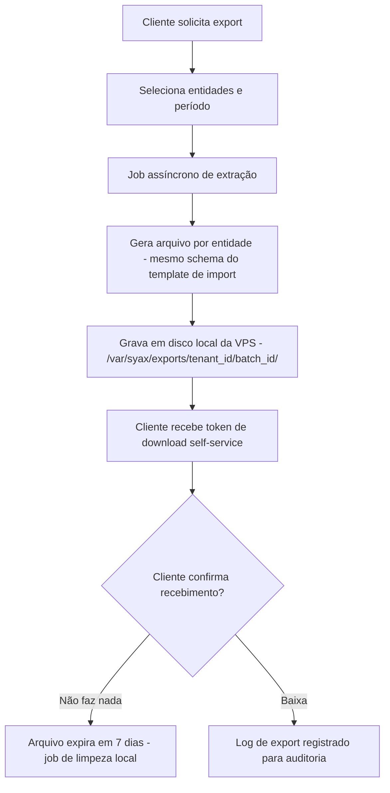
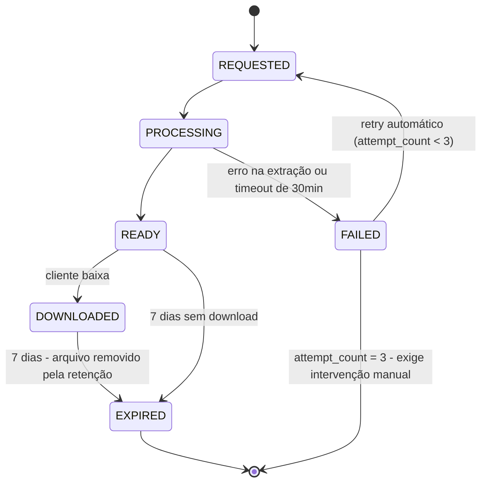
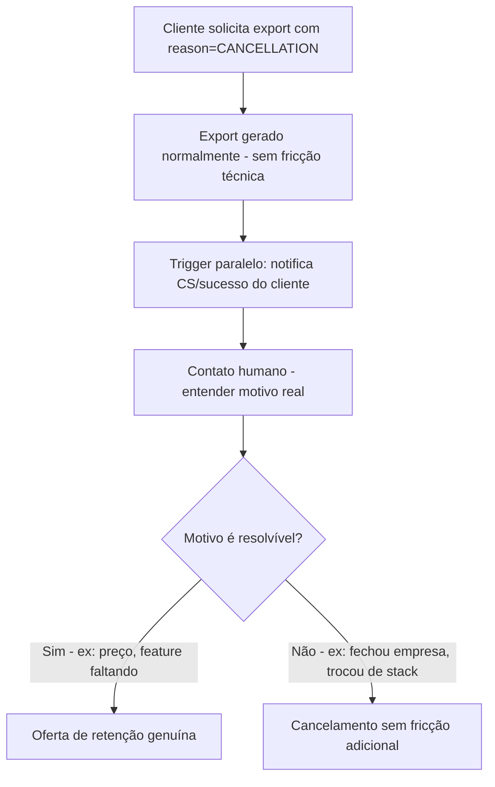

# Exportação de Dados — SYAX ERP

**Status:** Draft técnico
**Autor:** Vitor
**Última atualização:** 5 de agosto de 2026
**Documento relacionado:** `migracao-dados-syax.md`
**Serviço:** `migracao-service` (mesmo serviço do doc de import — novo, fora do MVP inicial). Registra no Eureka e fica atrás do gateway — reusa validação de JWT e resolução de tenant (`SecurityUtils`) dos demais serviços, não reimplementa auth do zero.
**Infra alvo:** VPS própria (Hostgator ou similar) — sem dependência de bucket/object storage; deploy provavelmente segue o mesmo pipeline Docker/Jenkins dos demais serviços (ver CLAUDE.md), não systemd standalone — a decisão de disco local (vs. S3) continua valendo, só muda para volume montado no container

---

## 1. Objetivo

Definir o pipeline de exportação de dados para tenants do SYAX, garantindo portabilidade completa do dado bruto (alinhado ao Art. 18 da LGPD) sem depender de intervenção manual, ao mesmo tempo em que preserva como diferencial competitivo legítimo tudo que é trabalho de engenharia construído em cima do dado (integrações, configuração, visões agregadas).

## 2. Princípio de design

**Dado bruto sempre exporta, sempre self-service, sempre completo.** Não existe trilha de exceção aqui — ao contrário do import, a exportação não pode ter um caminho "concierge" que atrase ou condicione a entrega, sob risco de configurar prática abusiva de retenção de dado.

O que legitimamente fica de fora da exportação não é decisão técnica de dificultar acesso — é escopo: relatórios consolidados prontos, dashboards, regras de automação parametrizadas e histórico de auditoria formatado são *produto*, não *dado do cliente*. Essa linha precisa estar documentada e comunicável ao cliente, não implícita.

## 3. Escopo

- **Dentro do escopo:** export self-service de todas as entidades transacionais e cadastrais (mesmas entidades do MVP de import: Plano de Contas, Clientes/Fornecedores, Produtos, Saldos, e adicionalmente Lançamentos/Transações acumuladas), em formato documentado e reimportável.
- **Fora do escopo:** export de dashboards/relatórios consolidados como artefato pronto, export de regras de automação/workflow configuradas, export de logs de auditoria em formato de apresentação (dado bruto de auditoria em si exporta; a formatação não).

## 4. Visão geral da arquitetura



**Decisão de infra:** armazenamento é disco local da própria VPS, não object storage (S3/GCS). Numa VPS single-node com acesso root, isso elimina uma dependência externa inteira sem perder nenhuma capacidade — o "link temporário" vira um token validado pelo próprio backend, e o "lifecycle policy do bucket" vira um `@Scheduled` job. Ver seção 12 para detalhes de infra e o cenário em que valeria migrar para S3.

**"Job assíncrono" e "fila assíncrona" no fluxograma acima são `@Async` do Spring, não um broker externo** — mesmo modelo do import (`migracao-dados-syax.md`, seção 3.2), pelo mesmo motivo: extração roda dentro do próprio `migracao-service`, sem consumidor externo do evento. `Q` no diagrama é o `TaskExecutor` interno do serviço, não uma fila de mensageria.

## 5. Modelo de dados — jobs de export

O pipeline de export **não espelha** `import_batch`/`raw_import_row` — a semelhança é só de nome. `raw_import_row` é uma **staging table**: guarda o dado do cliente em trânsito, com validação por linha e estado próprio antes de virar dado real. O export não tem staging nenhum: a extração vai direto do dado transacional (que já é válido, é o próprio sistema) para o arquivo final. E `export_audit_log` não é o equivalente de `raw_import_row` — é um **log de eventos**, coisa que o import não tem nem precisa (ver `migracao-dados-syax.md`, seção 4.2).

```sql
CREATE TABLE export_batch (
    id              UUID PRIMARY KEY,
    tenant_id       UUID NOT NULL,
    requested_by    UUID NOT NULL,          -- user_id de quem solicitou
    scope           JSONB NOT NULL,          -- {"entities": ["CUSTOMER","PRODUCT","GL_ENTRY"], "date_from":..., "date_to":...}
    scope_hash      CHAR(64) NOT NULL,       -- SHA-256 do scope normalizado; base do dedupe (5.2)
    schema_version  VARCHAR(10) NOT NULL DEFAULT '1.0',
    status          VARCHAR(20) NOT NULL DEFAULT 'REQUESTED', -- REQUESTED, PROCESSING, READY, DOWNLOADED, EXPIRED, FAILED
    file_paths      JSONB,                   -- {"CUSTOMER": "/var/syax/exports/{tenant_id}/{batch_id}/customer.xlsx", ...}
    download_token  VARCHAR(64) UNIQUE,      -- token opaco exposto ao cliente; nunca o path real (ver 5.3)
    attempt_count   SMALLINT NOT NULL DEFAULT 0, -- tentativas de extração; teto de 3 (ver seção 6)
    reason          VARCHAR(50),             -- 'ROUTINE_BACKUP', 'CANCELLATION', 'AUDIT', 'OTHER' - opcional, não bloqueante
    created_at      TIMESTAMPTZ NOT NULL DEFAULT now(),
    ready_at        TIMESTAMPTZ,
    expires_at      TIMESTAMPTZ,             -- ready_at + 7 dias (configurável, ver 5.1)
    downloaded_at   TIMESTAMPTZ
);

CREATE INDEX idx_export_batch_tenant ON export_batch (tenant_id, status);
CREATE INDEX idx_export_batch_dedupe ON export_batch (tenant_id, scope_hash, status);
```

```sql
CREATE TABLE export_audit_log (
    id              BIGINT GENERATED ALWAYS AS IDENTITY PRIMARY KEY,
    export_batch_id UUID NOT NULL REFERENCES export_batch(id),
    tenant_id       UUID NOT NULL,
    action          VARCHAR(30) NOT NULL,    -- REQUESTED, GENERATED, DOWNLOADED, DOWNLOAD_DENIED, EXPIRED
    actor_id        UUID,
    created_at      TIMESTAMPTZ NOT NULL DEFAULT now()
);
```

`reason` é opcional e não deve nunca ser obrigatório ou bloquear a geração do export — pedir justificativa para o cliente exportar o próprio dado é, por si só, fricção que pega mal e não tem função técnica real. Serve só para métricas internas (ex: quantos exports são motivados por cancelamento vs. rotina).

### 5.1 Assimetria proposital com o modelo de import

`export_batch` é **multi-entidade** (`scope.entities` é um array); `import_batch` é **mono-entidade**. Isso é deliberado — a tabela comparativa e a justificativa estão em `migracao-dados-syax.md`, seção 4.1. Resumo: no import cada entidade tem template, mapeamento, validação e ordem de promoção próprios, e um batch multi-entidade teria estado ambíguo (metade `DONE`, metade `AWAITING_FIX`); no export não existe falha parcial nem validação, então agrupar N entidades num pedido só reduz cliques sem custo.

### 5.2 Expiração, período default e dedupe

- **Expiração:** `expires_at = ready_at + 7 dias`, configurável via `syax.export.retention-days` (default 7). Sete dias é o mesmo valor do lifecycle do bucket na alternativa S3 (seção 12.2) — manter os dois iguais evita que a política mude de significado se um dia migrar de disco local para S3.
- **Período default:** `date_from`/`date_to` omitidos no `scope` significam **todo o histórico do tenant**. Export de dado bruto tem que ser completo por default; obrigar o cliente a adivinhar um período para não receber dado parcial é o tipo de pegadinha que a seção 2 rejeita.
- **Dedupe:** antes de criar um novo batch, `POST /exports` procura por `(tenant_id, scope_hash, status=READY, expires_at > now())`. Se existe, retorna o batch existente em vez de gerar de novo. `scope_hash` é o SHA-256 do `scope` normalizado (entidades ordenadas, datas resolvidas para o default). Evita que um duplo clique ou um cliente ansioso gere N cópias idênticas do mesmo dump ocupando disco.

### 5.3 `download_token` — geração e modelo de autorização

**Decisão:**

- **Geração:** 32 bytes de `java.security.SecureRandom` codificados em Base64 URL-safe sem padding (43 caracteres). Nunca UUID — UUIDv1/v7 carregam tempo e são parcialmente previsíveis, e UUIDv4 tem menos entropia do que custa gerar o certo aqui.
- **Coluna `UNIQUE`**, e colisão (praticamente impossível, mas) tratada como erro de geração, com retry.
- **Autorização — o token NÃO é a credencial:** `GET /exports/download/{token}` continua exigindo **sessão autenticada do tenant**. O token serve para (a) não expor o path real em disco e (b) ser um segundo fator de escopo — o backend valida que o `tenant_id` do batch é o mesmo do `SecurityContext` da sessão. Token válido com sessão de outro tenant é 404, não 403 (não confirma a existência do batch).
- **Exceção documentada:** o único caso em que o token vira credencial de posse por si só é o do tenant em encerramento — ver seção 10.1.
- **Auditoria:** toda tentativa de download com token inválido, expirado ou de outro tenant gera linha em `export_audit_log` com `action='DOWNLOAD_DENIED'`. É o sinal que denuncia enumeração de token.

**Razão:** um link de posse pura sem sessão é o modelo de menor atrito, mas transforma qualquer vazamento de URL (histórico de navegador, log de proxy, e-mail encaminhado) em vazamento do dump completo do tenant — e o dump contém CPF/CNPJ de terceiros. Exigir sessão devolve o custo de segurança para onde ele é barato (o cliente já está logado quando pede o export) sem tirar nada da promessa de self-service.

## 6. Estados do batch de export



**Teto de retentativa:** cada transição `FAILED --> REQUESTED` incrementa `attempt_count`. Ao chegar em 3, o batch para em `FAILED` definitivo e dispara alerta interno — o cliente vê "falha ao gerar, já avisamos o time" em vez de um spinner que nunca resolve. Retry automático sem teto contra um erro determinístico (dado corrompido, disco cheio) roda para sempre e consome a VPS inteira.

**Retenção depois do download:** `DOWNLOADED` também expira. O arquivo é apagado pelo mesmo job de limpeza (seção 12.1) — sem isso, todo export já baixado ficaria em disco para sempre.

### 6.1 Instrumentação do SLA de geração

O SLA de "minutos" (seção 7) só existe se for medido:

- **Timeout duro em `PROCESSING`:** batch que passa de 30 minutos em `PROCESSING` é marcado `FAILED` com `reason` de timeout pelo mesmo job diário. Sem isso, um job travado deixa o batch em `PROCESSING` para sempre e o cliente esperando sem erro nem resultado.
- **Alerta:** `ready_at - created_at > 15 minutos` gera alerta interno (mesmo canal do alerta de disco). É o gatilho que revela degradação antes de virar reclamação.
- **Métrica:** p50/p95 de `ready_at - created_at` exposto como métrica Micrometer, para o SLA ser acompanhável e não anedótico.

## 7. Fluxo — export self-service (único caminho)

```mermaid
sequenceDiagram
    participant C as Cliente
    participant UI as SYAX UI
    participant API as Export Service
    participant Q as Fila assíncrona
    participant D as Disco local (VPS)

    participant L as export_audit_log

    C->>UI: Solicita export (entidades + período)
    UI->>API: POST /exports (scope)
    API->>API: Dedupe por scope_hash - se existe batch READY válido, retorna ele
    API->>API: INSERT export_batch (status=REQUESTED, scope_hash)
    API->>L: action=REQUESTED (actor_id = requested_by)
    API-->>UI: batch_id
    API->>Q: Enfileira job de extração
    Q->>Q: Extrai dado por entidade, gera XLSX/CSV
    Q->>D: Grava arquivos em /var/syax/exports/{tenant_id}/{batch_id}/
    Q->>API: UPDATE export_batch (status=READY, file_paths, download_token, expires_at)
    Q->>L: action=GENERATED
    Q->>C: E-mail "seu export está pronto" (com link, não só notificação na UI)
    UI->>API: GET /exports/{batch_id}/status
    API-->>UI: READY (o token vai no link, não no polling)
    C->>UI: Baixa via GET /exports/download/{token}
    API->>API: Valida sessão do tenant + token, faz streaming do arquivo do disco
    API->>L: action=DOWNLOADED (ou DOWNLOAD_DENIED se token inválido/de outro tenant)
    API->>API: UPDATE status=DOWNLOADED, downloaded_at
    Note over Q,L: Job diário: 24h antes de expires_at envia e-mail de aviso;<br/>ao expirar, apaga arquivos e grava action=EXPIRED
```

**SLA técnico:** geração deve ser medida em minutos, não dias — não existe justificativa operacional para export de dado bruto levar mais que isso, dado que não há validação de conteúdo envolvida (diferente do import). Como isso é medido e o que acontece quando estoura: seção 6.1.

**Notificação por e-mail, não só polling na UI:** o cliente é avisado por e-mail (a) quando o export fica pronto e (b) 24h antes de expirar. Depender de o cliente ficar com a aba aberta esperando é justamente o cenário em que o arquivo expira sem ninguém baixar — e o caso mais comum de export (cancelamento) é o caso em que o cliente **menos** tende a voltar na UI.

As quatro `action` declaradas em `export_audit_log` são todas escritas pelo fluxo: `REQUESTED` no POST, `GENERATED` ao fim da extração, `DOWNLOADED`/`DOWNLOAD_DENIED` no endpoint de download e `EXPIRED` no job de limpeza.

## 8. Formato do arquivo exportado

Mesmo schema canônico usado no template de import (`migracao-dados-syax.md`, seção 4) — isso é o que garante a portabilidade real: o dado exportado do SYAX é reimportável em outro SYAX (outro tenant, ambiente de homologação) ou serve de referência de mapeamento para o cliente montar o import em outro ERP concorrente. Formato divergente entre import e export seria, na prática, uma forma sutil de dificultar a saída.

```json
{
  "entity_type": "CUSTOMER",
  "schema_version": "1.0",
  "exported_at": "2026-08-05T14:30:00Z",
  "tenant_id": "b3f1...",
  "row_count": 342,
  "fields": ["id", "razao_social", "cnpj", "endereco", "created_at", "updated_at"]
}
```

**Onde esse metadata vive (formato fechado, uma opção só):**

| Formato do export | Onde fica o metadata |
|---|---|
| XLSX | aba separada chamada `_syax_meta` — nunca misturada com as linhas de dado |
| CSV | arquivo irmão `{entity}.meta.json` no mesmo diretório — **nunca** embutido no corpo do CSV |

A regra é fechada porque a alternativa (bloco JSON no topo do arquivo) quebra o parser da Trilha 1 do import: um CSV com header de metadata antes do cabeçalho real não é mais um CSV válido para nenhum parser padrão, e o próprio SYAX não conseguiria reimportar o que exportou. Do lado do import, o parser **ignora/pula** esse metadata — a aba `_syax_meta` não é lida como dado, e o `.meta.json` é opcional (ver `migracao-dados-syax.md`, seção 6).

O array `fields` do exemplo acima não é digitado à mão em produção — é gerado a partir de `canonical_schema_field` (`migracao-dados-syax.md`, seção 4.3), a mesma tabela que a Trilha 2 do import usa para listar campos-alvo na tela de mapeamento. É isso que garante que os nomes de campo do export e os nomes esperados pelo import nunca divirjam por schema hardcoded em dois lugares.

### 8.1 Limitação conhecida: `GL_ENTRY` exporta mas não importa

`GL_ENTRY` (lançamentos/transações) está no escopo de export, mas **não** faz parte do vocabulário de `entity_type` do pipeline de import — que no MVP cobre só `CHART_OF_ACCOUNTS`, `CUSTOMER`, `PRODUCT` e `OPENING_BALANCE`. Na prática: o cliente consegue levar o histórico de lançamentos embora (que é o que a LGPD e a promessa de portabilidade exigem), mas não consegue reimportá-lo no SYAX. Isso é limitação declarada de v1, não bug — importar lançamento histórico exige regra de partida contábil que está fora do escopo do onboarding. Está registrado como item de v2 em `migracao-dados-syax.md`, seção 15.

## 9. O que fica fora, e como comunicar isso

| Categoria | Exporta? | Justificativa |
|---|---|---|
| Cadastros (Clientes, Produtos, Plano de Contas) | Sim, sempre | Dado bruto do cliente |
| Lançamentos/transações | Sim, sempre | Dado bruto do cliente |
| Saldos e histórico de auditoria (dado cru) | Sim, sempre | Dado bruto do cliente |
| Dashboards e relatórios consolidados prontos | Não | Produto — recriável a partir do dado bruto exportado |
| Regras de automação/workflow configuradas | Não | Configuração proprietária do SYAX, não dado |
| Integrações ativas (SEFAZ, Asaas, conciliação) | Não aplicável | Não é "dado" — é serviço vivo, encerra com o cancelamento |

Essa tabela deve estar documentada em local acessível ao cliente (central de ajuda, contrato), não descoberta na hora do cancelamento — comunicar isso com antecedência é o que separa de fato uma política de retenção honesta de uma armadilha.

## 10. Touchpoint de cancelamento



### 10.1 Tenant desativado antes do download

Cenário concreto e nada raro: o cliente pede o export com `reason=CANCELLATION`, o contrato encerra, o tenant é desativado — e só então ele tenta baixar. Com a regra da seção 5.3 (sessão autenticada obrigatória), ele não consegue logar e o export vira letra morta. Isso configuraria exatamente a retenção abusiva que a seção 2 rejeita.

**Regra:** quando o batch tem `reason='CANCELLATION'` ou o tenant entra em processo de encerramento, o link de download é enviado **por e-mail ao `requested_by`** e passa a valer como **token de posse puro** — o endpoint aceita o token sem sessão ativa. As três salvaguardas que tornam isso aceitável:

1. o token continua sendo os 32 bytes de `SecureRandom` da seção 5.3;
2. o e-mail vai para o endereço que já estava cadastrado **antes** do pedido de cancelamento, nunca para um informado no momento do pedido;
3. todo acesso por esse caminho grava `export_audit_log` com `action='DOWNLOADED'` e o IP de origem.

O prazo de 7 dias e o e-mail de aviso 24h antes de expirar (seção 7) valem igual — e são especialmente importantes aqui, porque é o cliente que menos volta na UI.

O touchpoint humano roda em paralelo ao export, nunca como bloqueio dele. Condicionar a entrega do dado a uma conversa de retenção é exatamente o tipo de prática que gera reclamação e desgasta a marca — a conversa acontece porque é boa prática de CS, não porque o cliente precisa "passar por ela" para conseguir os dados.

## 11. Métrica interna de saúde

Acompanhar `reason=CANCELLATION` em `export_batch` ao longo do tempo como proxy de churn precoce — mas sem usar isso para atrasar ou complicar o export em si. É sinal para o time de produto/CS agir, não gatilho para fricção técnica.

## 12. Infraestrutura — disco local vs. object storage

### 12.1 Decisão para o MVP: disco local na VPS

Numa VPS single-node com acesso root (ex: Hostgator VPS 16GB/400GB), armazenar os arquivos de export no próprio filesystem elimina a dependência de S3/GCS sem perder funcionalidade — bucket só se justifica quando a aplicação escala para múltiplas instâncias sem disco compartilhado, o que não é o cenário do MVP.

**Estrutura de diretórios**, isolada por usuário de serviço dedicado (não rodar a JVM como root):

```bash
sudo useradd -r -m -d /opt/syax -s /usr/sbin/nologin syax
sudo mkdir -p /var/syax/exports /var/syax/imports
sudo chown -R syax:syax /var/syax
sudo chmod 750 /var/syax
```

`/var/syax/imports` é criado aqui mas a política de retenção e o job de purga dele são do outro lado do pipeline — ver `migracao-dados-syax.md`, seção 12. Diretório de staging de import guarda dado pessoal de terceiros e tem TTL próprio (30 dias); não é coberto pelo job de limpeza de export.

**Processo gerenciado via systemd**, não `java -jar` solto — dá restart automático, logs via `journalctl`, start no boot:

```ini
# /etc/systemd/system/migracao-service.service
[Unit]
Description=SYAX - migracao-service (import + export de dados)
After=network.target postgresql.service

[Service]
User=syax
Group=syax
WorkingDirectory=/opt/syax/migracao-service
ExecStart=/usr/bin/java -Xmx8g -Xms2g -jar /opt/syax/migracao-service/app.jar
Restart=on-failure
RestartSec=5
Environment=SPRING_PROFILES_ACTIVE=prod

[Install]
WantedBy=multi-user.target
```

Porta HTTP sugerida: `8094`, seguindo a numeração dos demais serviços do CLAUDE.md (`fiscal-service` usa 8093) — a confirmar quando o serviço for de fato aberto no MVP posterior.

**Nginx na frente da JVM**, com TLS via Let's Encrypt/certbot:

```nginx
server {
    listen 443 ssl;
    server_name app.syax.com.br;
    ssl_certificate     /etc/letsencrypt/live/app.syax.com.br/fullchain.pem;
    ssl_certificate_key /etc/letsencrypt/live/app.syax.com.br/privkey.pem;
    client_max_body_size 50M;

    location / {
        proxy_pass http://127.0.0.1:8080;
        proxy_set_header Host $host;
        proxy_set_header X-Forwarded-For $proxy_add_x_forwarded_for;
    }
}
```

**Limpeza de arquivos expirados** — job Spring, mantém a lógica junto do código em vez de espalhada em cron externo. Filtra por `expires_at` com status em `{READY, DOWNLOADED, FAILED}`: batch baixado também precisa ser limpo (senão o arquivo fica em disco para sempre), e batch que falhou pode ter deixado arquivos parciais.

```java
private static final Set<ExportStatus> LIMPAVEIS = EnumSet.of(READY, DOWNLOADED, FAILED);

@Scheduled(cron = "0 0 3 * * *") // 3h da manhã, todo dia
public void cleanupExpiredExports() {
    List<ExportBatch> expired = exportBatchRepo
            .findByExpiresAtBeforeAndStatusIn(Instant.now(), LIMPAVEIS);
    for (ExportBatch batch : expired) {
        try {
            // FAILED pode nem ter chegado a gravar file_paths
            if (batch.filePaths() != null) {
                for (String path : batch.filePaths().values()) {
                    Files.deleteIfExists(Path.of(path));
                }
                // remove o diretório {batch_id}/ vazio; sem isso ele acumula para sempre
                Files.deleteIfExists(batch.batchDir());
            }
            batch.setStatus(EXPIRED);
            exportBatchRepo.save(batch);
            auditLog.record(batch, EXPIRED);
        } catch (IOException e) {
            // uma falha de I/O não pode abortar a varredura dos outros batches
            log.warn("Falha ao limpar export {}: {}", batch.id(), e.getMessage());
        }
    }
}
```

O mesmo job faz a varredura de timeout da seção 6.1 (`PROCESSING` há mais de 30min → `FAILED`) e a checagem de deadline da fila concierge do import (`migracao-dados-syax.md`, seção 8).

**Monitoramento de disco** — diferente de bucket, aqui disco cheio derruba a aplicação inteira, não só o export. Vale expor via Spring Boot Actuator (`diskSpace` health indicator já vem pronto) e alertar cedo:

```bash
# /etc/cron.d/disk-check — roda a cada 30min
*/30 * * * * root df -h /var/syax | awk 'NR==2{print $5}' | tr -d '%' | \
  awk '{if ($1 > 85) print "ALERTA: disco em " $1 "%"}' | \
  xargs -I{} curl -X POST -H 'Content-Type: application/json' -d '{"text":"{}"}' https://hooks.slack.com/services/SEU/WEBHOOK
```

**Backup** — os arquivos de export são transientes e regeneráveis a partir do banco a qualquer momento, então não precisam de backup próprio. O que precisa é o Postgres:

```bash
# /usr/local/bin/pg-backup.sh
#!/bin/bash
set -euo pipefail          # sem pipefail, pg_dump falhando + gzip OK = "sucesso" com dump vazio
DEST=/var/backups/syax
pg_dump syax_prod | gzip > "$DEST/syax_$(date +%F).sql.gz"
find "$DEST" -name 'syax_*.sql.gz' -mtime +30 -delete   # rotação: mantém 30 dias
```

```bash
# /etc/cron.d/pg-backup
0 2 * * * postgres /usr/local/bin/pg-backup.sh
```

Os dois detalhes não são preciosismo: sem `pipefail`, o exit code do pipe é o do `gzip`, então um `pg_dump` que morre no meio produz um `.gz` truncado marcado como sucesso — o backup só se revela inútil no dia do restore. E sem rotação, o diretório de backup cresce até encher o disco, que na VPS single-node derruba a aplicação inteira (o mesmo risco da seção de monitoramento acima).

Mandar essa cópia para fora da VPS (ex: `rclone`/`restic` para um storage barato só de disaster recovery) é o único ponto onde vale ter algo "fora da VPS" — não é infra de produto, é seguro contra perda total da máquina.

### 12.2 Alternativa: S3 standalone (sem precisar de EC2/RDS/resto da AWS)

S3 pode ser contratado isoladamente — não exige o resto do ecossistema AWS. Vale considerar se, no futuro, a aplicação escalar para múltiplas instâncias sem disco compartilhado, ou se quiser tirar do código a responsabilidade de lifecycle/backup.

- **Custo:** ~$0.023/GB/mês de storage + ~$0.09/GB de egress no download — para volume de export de ERP (arquivos pequenos por tenant), fica na casa de poucos dólares/mês, dentro do free tier no primeiro ano.
- **Lifecycle policy do bucket** substitui o `@Scheduled` de limpeza:
  ```json
  { "Rules": [{ "ID": "expire-exports", "Status": "Enabled", "Expiration": { "Days": 7 } }] }
  ```
- **IAM restrito** — usuário/role com `s3:PutObject`, `s3:GetObject`, `s3:DeleteObject` limitado ao bucket específico, nunca a chave root da conta.
- **Presigned URL** tira a carga de download da própria VPS: o cliente baixa direto do S3, não pela aplicação Spring Boot.

Para o estágio atual (MVP, onboarding em andamento), disco local é a escolha mais simples — uma dependência a menos para gerenciar, com espaço de sobra na VPS contratada. Migrar para S3 é decisão a revisitar quando a arquitetura mudar (múltiplas instâncias) ou o volume justificar, não uma otimização prematura agora.
