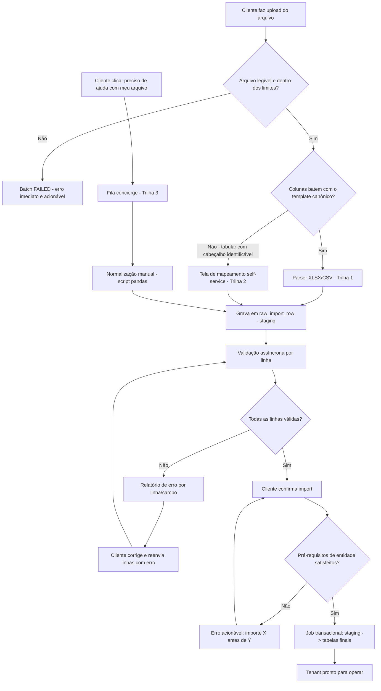
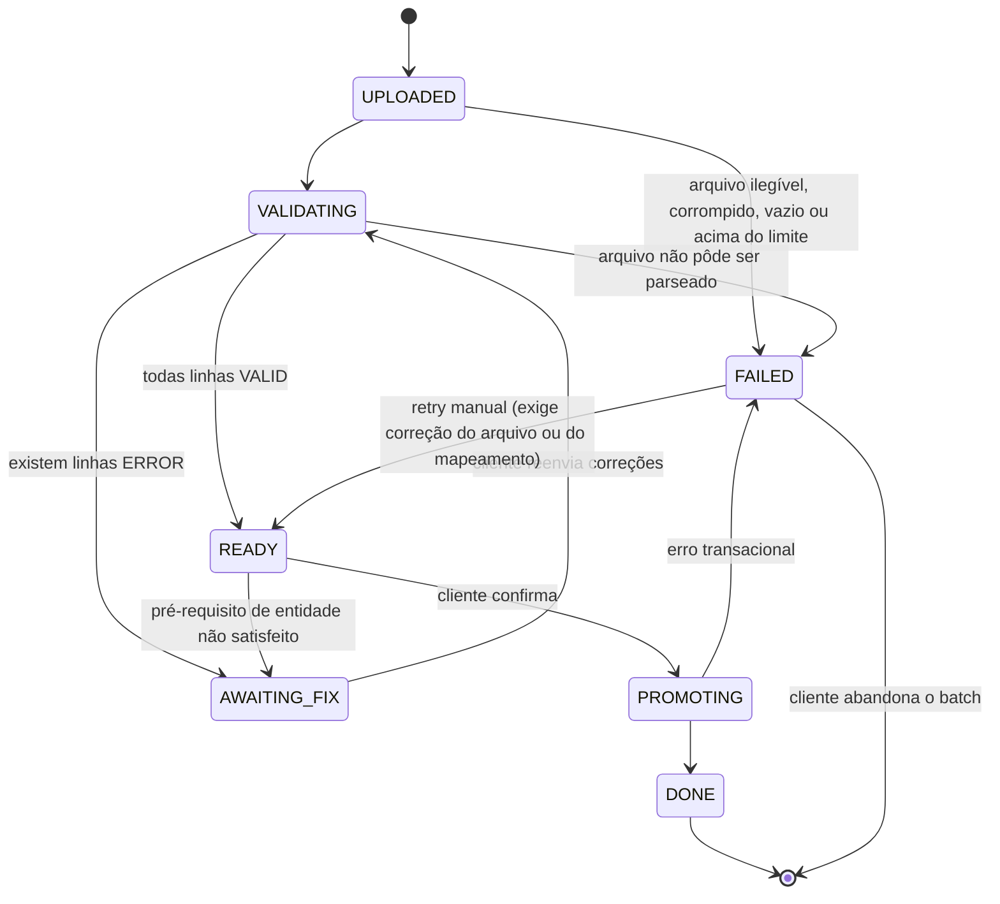
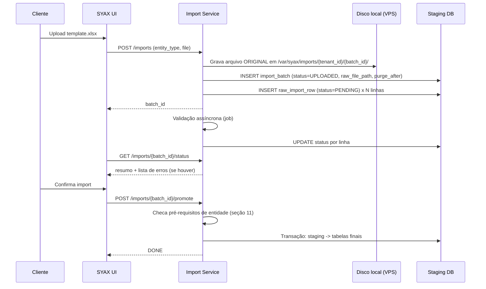
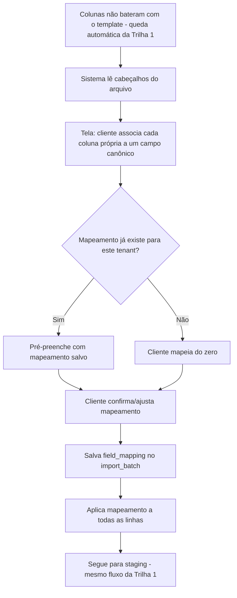
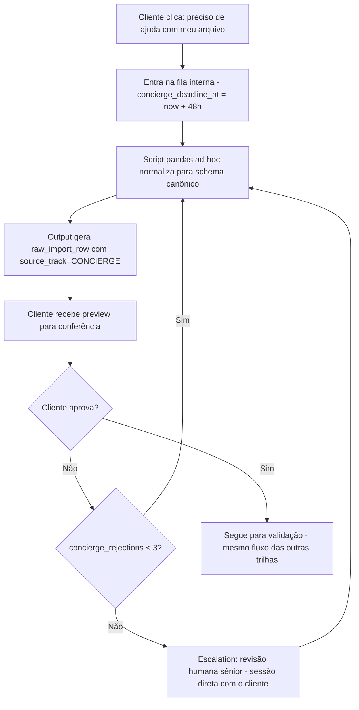

# Migração de Dados de Onboarding — SYAX ERP

**Status:** Draft técnico
**Autor:** Vitor
**Última atualização:** 5 de agosto de 2026
**Documento relacionado:** `exportacao-dados-syax.md`
**Serviço:** `migracao-service` (novo, fora do MVP inicial — sem prazo de entrega definido). Registra no Eureka e fica atrás do gateway — reusa validação de JWT e resolução de tenant (`SecurityUtils`) dos demais serviços, não reimplementa auth do zero.

---

## 1. Objetivo

Definir o pipeline de migração de dados para onboarding de novos tenants no SYAX, cobrindo entidades mínimas do MVP (Plano de Contas, Clientes/Fornecedores, Produtos, Saldos de Abertura).

**Meta de negócio:** cliente consegue concluir a migração em até 1 semana. Essa meta é **um SLA de regime maduro**, não uma garantia desde o onboarding #1 — o pipeline precisa absorver 3–4 clientes reais antes que o template e as regras de validação estejam calibrados o suficiente para bater o prazo de forma consistente. Isso deve estar explícito para quem definiu o requirement.

**Consequência de design:** o SLA de 1 semana é o critério de desempate deste documento. Nenhum estado do pipeline pode ficar sem saída, nenhum retry pode ser infinito e nenhuma decisão de roteamento pode depender de julgamento humano em tempo real — qualquer um dos três trava um onboarding por tempo indeterminado. A seção 13 define como o SLA é medido de fato, não só declarado.

## 2. Escopo

- **Dentro do escopo:** template fixo por entidade, staging table multi-tenant, validação assíncrona, mapeamento self-service de colunas, relatório de erro granular, promoção transacional para tabelas finais.
- **Fora do escopo (v2):** motor de mapeamento genérico com IA/heurística para reconciliar schemas arbitrários, importação incremental contínua (sync), suporte a formatos não tabulares (PDF, imagem) via OCR automatizado.

## 3. Visão geral da arquitetura

O roteamento entre trilhas é **automático apenas entre Trilha 1 e Trilha 2**, por critério estrutural objetivo (as colunas batem com o template ou não). A Trilha 3 (concierge) **não é auto-detectada** — ver seção 3.1.



### 3.1 Decisão de roteamento entre trilhas

**Decisão:** o sistema sempre tenta primeiro a Trilha 1. Se o arquivo é tabular e tem cabeçalho identificável mas as colunas não batem com o template, cai automaticamente na Trilha 2, sem intervenção humana. A Trilha 3 é acionada **exclusivamente por ação explícita do cliente** (botão "não consigo montar meu arquivo, preciso de ajuda" na própria tela de import), nunca por classificação automática.

**Razão:** classificar automaticamente um arquivo como "bagunçado demais" exige um julgamento que nenhum critério objetivo sustenta — na prática viraria uma fila de triagem humana no meio do caminho crítico do onboarding, que é exatamente o que trava o SLA de 1 semana por tempo indeterminado. Estrutura (colunas batem / não batem) é decidível por código; "bagunça" não é. Deixar a Trilha 3 como porta de entrada separada e voluntária mantém o fluxo automático com apenas duas saídas determinísticas e dá ao cliente o controle de quando pedir ajuda — sem que o sistema decida por ele que ele precisa esperar.

### 3.2 Modelo de execução assíncrona

Validação (`VALIDATING`) e promoção (`PROMOTING`) rodam via `@Async` do Spring, não Kafka. O motivo é escopo: são tarefas internas do próprio `migracao-service`, contra o próprio banco dele, sem nenhum outro serviço consumindo o evento. Trazer um broker para decolar uma tarefa sem consumidor externo é complexidade sem comprador — o resto do projeto usa Kafka para comunicação *entre* serviços (auditoria cruzando `auth-service`), não é esse o caso aqui.

**Configuração obrigatória, não o padrão default do Spring:**
- `@Async` sem executor configurado cai no `SimpleAsyncTaskExecutor`, que cria uma thread nova por chamada sem teto — um pico de uploads derruba a VPS antes de qualquer limite de disco. `ThreadPoolTaskExecutor` com fila limitada é obrigatório.
- Exceção não capturada num método `@Async void` é engolida silenciosamente pelo `AsyncUncaughtExceptionHandler` default (só loga). Cada handler de job precisa de try/catch explícito que grava `status=FAILED` + `failure_reason` — sem isso, o batch fica preso no estado assíncrono para sempre sem ninguém saber por quê.
- **Recuperação de crash:** `@Async` não sobrevive a restart da JVM — diferente de uma mensagem Kafka não confirmada, uma task em memória simplesmente some. Ver seção 12.1 para o job de timeout que cobre isso.

**Gatilho de revisão:** esta decisão vale para instância única. Se o `migracao-service` escalar para múltiplas instâncias, `@Async` para de funcionar (job pego pela instância A que morre não é retomado por B) — mesmo gatilho de revisão já usado para a decisão de disco local vs. S3 no doc de export (seção 12.2 de lá).

## 4. Modelo de dados — staging

Toda entrada, independente da trilha de origem, converge para a mesma tabela de staging. Isso garante que a exceção (trilha concierge) não precise de caminho de código separado no restante do pipeline.

```sql
CREATE TABLE import_batch (
    id                    UUID PRIMARY KEY,
    tenant_id             UUID NOT NULL,
    entity_type           VARCHAR(50) NOT NULL,
    schema_version        VARCHAR(10) NOT NULL DEFAULT '1.0', -- versão do template canônico usada neste upload
    status                VARCHAR(20) NOT NULL DEFAULT 'UPLOADED', -- UPLOADED, VALIDATING, AWAITING_FIX, READY, PROMOTING, DONE, FAILED
    updated_at            TIMESTAMPTZ NOT NULL DEFAULT now(), -- mantido pela aplicação a cada transição de status; base do timeout da seção 12.1
    source_track          VARCHAR(20) NOT NULL,   -- TEMPLATE, SELF_MAPPED, CONCIERGE
    field_mapping         JSONB,                  -- salvo por tenant para reuso em imports futuros
    raw_file_path         TEXT,                   -- arquivo ORIGINAL enviado pelo cliente, como veio: /var/syax/imports/{tenant_id}/{batch_id}/original.xlsx
    row_count             INTEGER,
    concierge_deadline_at TIMESTAMPTZ,            -- só na Trilha 3: entrada na fila + 48h
    concierge_rejections  SMALLINT NOT NULL DEFAULT 0,
    failure_reason        TEXT,                   -- preenchido quando status=FAILED
    created_at            TIMESTAMPTZ NOT NULL DEFAULT now(),
    promoted_at           TIMESTAMPTZ,            -- início da promoção (PROMOTING)
    done_at               TIMESTAMPTZ,            -- fim da promoção com sucesso (DONE)
    purge_after           TIMESTAMPTZ,            -- ver seção 12 (retenção do staging)
    purged_at             TIMESTAMPTZ
);

CREATE INDEX idx_import_batch_tenant ON import_batch (tenant_id, entity_type, status);
```

```sql
CREATE TABLE raw_import_row (
    id              BIGINT GENERATED ALWAYS AS IDENTITY PRIMARY KEY,
    tenant_id       UUID NOT NULL,
    batch_id        UUID NOT NULL REFERENCES import_batch(id) ON DELETE CASCADE,
    entity_type     VARCHAR(50) NOT NULL,   -- 'CHART_OF_ACCOUNTS', 'CUSTOMER', 'PRODUCT', 'OPENING_BALANCE'
    row_num         INTEGER NOT NULL,
    raw_json        JSONB NOT NULL,          -- linha JÁ MAPEADA para o schema canônico (não é o conteúdo original do arquivo)
    status          VARCHAR(20) NOT NULL DEFAULT 'PENDING', -- PENDING, VALID, ERROR, PROMOTED, PURGED
    error_detail    JSONB,                   -- lista de {field, message}
    source_track    VARCHAR(20) NOT NULL,    -- TEMPLATE, SELF_MAPPED, CONCIERGE
    created_at      TIMESTAMPTZ NOT NULL DEFAULT now(),
    validated_at    TIMESTAMPTZ,
    promoted_at     TIMESTAMPTZ,

    CONSTRAINT uq_raw_import_row UNIQUE (batch_id, entity_type, row_num)
);

CREATE INDEX idx_raw_import_batch ON raw_import_row (tenant_id, batch_id, status);
```

`field_mapping` persistido por tenant é o que torna a trilha self-service rápida em uploads subsequentes do mesmo cliente — ele não precisa remapear colunas toda vez. Os campos-alvo que o cliente associa na tela de mapeamento vêm de `canonical_schema_field` (seção 4.3), não de uma lista fixa no código.

`entity_type` em `raw_import_row` é redundante com `import_batch.entity_type` enquanto o batch for mono-entidade (ver 4.1). Fica mantido porque é o que permite a UNIQUE ser estável se um dia o batch virar multi-entidade, e porque evita join em toda query de validação. Redundância consciente, não descuido.

### 4.1 Assimetria proposital com o modelo de export

`import_batch` é **mono-entidade** (um batch = um `entity_type`); `export_batch` é **multi-entidade** (`scope.entities` é um array). A assimetria é deliberada e não deve ser "corrigida":

| | Import | Export |
|---|---|---|
| Granularidade | 1 batch = 1 entidade | 1 batch = N entidades |
| Motivo | cada entidade tem template, mapeamento, validação e ordem de promoção próprios; misturar entidades num batch tornaria o estado do batch ambíguo (metade DONE, metade AWAITING_FIX) | não há validação nem falha parcial: ou extrai tudo, ou falha; agrupar reduz N cliques do cliente a um |
| Falha parcial | esperada e endereçada por linha | não existe |

### 4.2 Decisão: sem tabela de audit log dedicada no import

**Decisão:** o import **não** ganha uma tabela `import_audit_log` espelhando a do export.

**Razão:** o que uma tabela dessas registraria — quem subiu, quando, quando promoveu, quando o dado pessoal foi descartado — já está em `import_batch` como colunas (`created_at`, `promoted_at`, `done_at`, `purged_at`, `source_track`) e sobrevive ao purge do staging, porque `import_batch` não guarda dado pessoal. O export precisa de log em tabela separada porque lá o evento relevante (tentativa de download, inclusive com token inválido) é **repetível e originado de fora**, sem lugar natural numa coluna. Aqui não é. Uma tabela a menos para manter, com a mesma rastreabilidade LGPD.

### 4.3 Schema canônico como tabela — fonte única de verdade

Até aqui, "schema canônico" era um conceito implícito — cada `entity_type` tem uma lista de campos que o parser, o validador, a tela de mapeamento self-service (Trilha 2) e o gerador de export (`exportacao-dados-syax.md`, seção 8) precisam concordar sobre, sem nenhum lugar único que declare essa lista.

```sql
CREATE TABLE canonical_schema_field (
    id              BIGINT GENERATED ALWAYS AS IDENTITY PRIMARY KEY,
    entity_type     VARCHAR(50) NOT NULL,     -- mesmo vocabulário de import_batch.entity_type
    schema_version  VARCHAR(10) NOT NULL,     -- mesmo campo que já existe em import_batch/export_batch
    field_name      VARCHAR(100) NOT NULL,    -- chave usada em raw_import_row.raw_json e no export "fields"
    field_order     SMALLINT NOT NULL,        -- ordem no template baixado pelo cliente
    data_type       VARCHAR(20) NOT NULL,     -- STRING, DECIMAL, DATE, CNPJ, CPF...
    required        BOOLEAN NOT NULL DEFAULT false,
    validation_rule VARCHAR(50),              -- identificador de estratégia (ex: 'CNPJ_DV', 'FK_CHART_OF_ACCOUNTS'), não regex livre
    help_text       TEXT,                     -- rótulo mostrado na Trilha 2
    is_active       BOOLEAN NOT NULL DEFAULT true, -- só versão ativa aparece em novo upload/export

    CONSTRAINT uq_canonical_field UNIQUE (entity_type, schema_version, field_name)
);

CREATE INDEX idx_canonical_field_lookup ON canonical_schema_field (entity_type, schema_version, is_active);
```

**O que isso muda:**
- `raw_import_row.raw_json` deixa de ter chaves definidas por convenção implícita no parser — as chaves são exatamente `field_name` desta tabela para o `entity_type`+`schema_version` daquele batch.
- A tela de mapeamento self-service (seção 7) lista os campos-alvo consultando esta tabela, não uma lista fixa no front.
- O `fields` do metadata de export (`exportacao-dados-syax.md`, seção 8) passa a ser gerado por `SELECT field_name FROM canonical_schema_field WHERE entity_type=? AND schema_version=? AND is_active ORDER BY field_order`, não digitado à mão.
- Evolução de schema (`schema_version` 1.0 → 2.0) vira um INSERT com `is_active=true` na nova versão e `false` na antiga — sem deploy de código.

**O que essa tabela NÃO elimina:** `validation_rule` é um identificador de estratégia, não regex livre em coluna — ainda existe um pequeno mapa `Map<String, Validator>` no código Java, porque validação de FK cross-batch (ex: `FK_CHART_OF_ACCOUNTS`, usada na seção 11) não dá para expressar só em SQL. A tabela decide *quais* regras se aplicam a cada campo; o código decide *como* validar cada regra.

**Seed inicial:** changeset de dado (não só DDL) populando os 4 `entity_type` do MVP, no mesmo molde dos changesets `fiscal-schema-0XX` que já povoam NCM/CFOP/regime no `fiscal-service` — é o mesmo movimento: tirar conteúdo de domínio do código Java e colocar no banco.

## 5. Estados do batch



`FAILED` é terminal por si só — nunca há retry automático em loop. O caminho de volta para `READY` depende de ação explícita do cliente (novo arquivo, novo mapeamento), e `failure_reason` sempre carrega a mensagem que diz o que fazer.

## 6. Trilha 1 — Caminho feliz (template padrão)

Maioria dos clientes deve cair aqui. Validação nativa do Excel (data validation, dropdown, máscara de CNPJ/CPF) elimina boa parte dos erros antes mesmo do upload.



O parser deve **ignorar o bloco de metadata** de arquivos gerados pelo próprio SYAX: no XLSX, a aba `_syax_meta`; no CSV, o arquivo irmão `*.meta.json`, que nunca vem embutido no corpo do CSV. Ver `exportacao-dados-syax.md`, seção 8 — é o que garante que um export do SYAX seja reimportável sem edição manual.

## 7. Trilha 2 — Mapeamento self-service

Cobre o caso mais comum de "dado desorganizado": não é bagunça de fato, é estrutura diferente da esperada (colunas em outra ordem, nomes diferentes, planilha própria do cliente). Resolvido pelo próprio cliente, sem intervenção manual.



**Critério de entrada nesta trilha:** arquivo tabular, com cabeçalho identificável, mas colunas não batem com o template. Não requer normalização de conteúdo — só de estrutura. A entrada é **automática**: o cliente não escolhe a trilha, ele cai nela ao subir um arquivo cujo cabeçalho o parser não reconheceu. A lista de campos-alvo mostrada na tela de mapeamento vem de `canonical_schema_field` (seção 4.3).

## 8. Trilha 3 — Exceção / concierge

Reservada para dado de fato não estruturado (PDF escaneado, planilha sem cabeçalho, múltiplos formatos misturados). Tratada como serviço com SLA interno definido, não como suporte aberto — isso é o que impede a exceção de virar gargalo de escala.

**Ponto de entrada:** botão explícito na tela de import ("não consigo montar meu arquivo, preciso de ajuda"). O sistema **nunca** roteia um cliente para cá automaticamente — ver 3.1.



**Mecanismo do SLA de 24–48h:** `concierge_deadline_at` é calculado na entrada da fila (`created_at + 48h`). Um job diário varre `import_batch WHERE source_track='CONCIERGE' AND done_at IS NULL AND concierge_deadline_at < now()` e dispara alerta interno (mesmo canal do alerta de disco, seção 12 do doc de export). Sem alerta, "SLA de 24–48h" é só uma frase num documento.

**Teto de iterações:** após 3 rejeições do preview pelo cliente (`concierge_rejections >= 3`), o loop para de repetir e escala para revisão humana sênior. Loop de aprovação sem teto é a forma mais fácil de um onboarding ficar preso indefinidamente sem que ninguém perceba — não há estado de erro, só idas e voltas.

**Importante:** o script de normalização é descartável por cliente — não é reaproveitado como feature de produto. Se o volume desta trilha crescer a ponto de virar gargalo recorrente, isso é sinal para investir em v2 (heurística/LLM para reconciliação automática), não para expandir o time de concierge.

## 9. Contrato do relatório de erro

Erro deve ser acionável por linha e campo — nunca um erro genérico de "arquivo inválido".

```json
{
  "batch_id": "b3f1...",
  "total_rows": 512,
  "valid_rows": 498,
  "error_rows": 14,
  "errors": [
    {
      "row_num": 47,
      "field": "cnpj",
      "message": "Dígito verificador inválido",
      "raw_value": "12.345.678/0001-00"
    },
    {
      "row_num": 103,
      "field": "conta_contabil",
      "message": "Conta não existe no plano de contas já importado",
      "raw_value": "3.1.02.999"
    }
  ]
}
```

`raw_value` vem da linha **já mapeada** (`raw_import_row.raw_json`). Quando o cliente contesta o valor apontado — típico na Trilha 2, onde a suspeita é de mapeamento errado e não de dado errado —, o suporte cruza com o arquivo original em `import_batch.raw_file_path`, que é justamente por que ele é persistido.

### 9.1 Semântica de reenvio

| Modo | O que o cliente envia | Comportamento |
|---|---|---|
| Incremental por linha | só as linhas com erro, identificadas por `row_num` | UPDATE (upsert) da linha existente em `raw_import_row`, chave `(batch_id, entity_type, row_num)`; revalida só as linhas tocadas |
| Reupload completo | arquivo inteiro corrigido | merge por **chave natural** da entidade (abaixo); linhas ausentes no novo arquivo permanecem como estavam |

**Chave natural por entidade:**

| Entidade | Chave natural |
|---|---|
| `CUSTOMER` / fornecedor | CNPJ (ou CPF, para PF) |
| `PRODUCT` | código do produto (SKU) |
| `CHART_OF_ACCOUNTS` | código da conta contábil |
| `OPENING_BALANCE` | (código da conta, data de referência) |

**Reaproveitamento de mapeamento:** o reenvio incremental reusa o `field_mapping` já salvo no `import_batch` — o cliente não refaz o mapeamento nem reenvia o arquivo inteiro. A única exceção é quando o próprio mapeamento é o que está errado: aí ele volta para a tela da Trilha 2, e um novo arquivo completo é exigido, porque todas as linhas precisam ser remapeadas.

## 10. Limites de upload

| Limite | Valor | Motivo |
|---|---|---|
| Tamanho do arquivo | 50 MB | alinhado ao `client_max_body_size 50M` do Nginx (ver doc de export, seção 12.1); acima disso o gateway corta antes da aplicação ver o request |
| Linhas por arquivo | 50.000 | teto de parse/validação síncrona sem estourar timeout de gateway |
| Formatos aceitos | `.xlsx`, `.csv` | qualquer outro cai em `FAILED` imediato com mensagem explícita |

Acima do teto de linhas, a UI orienta a dividir em múltiplos uploads da mesma entidade (o merge por chave natural da seção 9.1 é o que torna isso seguro). A validação de limite acontece **antes** do parse, na borda, e o erro é imediato — um timeout de gateway no primeiro upload é a pior primeira impressão possível do produto e come dias do SLA em investigação de suporte.

## 11. Dependência de ordem entre entidades

Entidades do MVP não são independentes: saldo de abertura referencia conta contábil, e lançamento referencia cliente/produto. Sem checagem de pré-requisito, importar na ordem errada produz 100% das linhas em erro genérico de FK — o cliente não descobre que o problema é ordem, e sim que "nada funciona".

```
CHART_OF_ACCOUNTS  ──┐
                     ├──> OPENING_BALANCE
CUSTOMER / PRODUCT ──┘
```

**Regra de promoção:** `POST /imports/{batch_id}/promote` valida os pré-requisitos **antes** de abrir a transação:

| Entidade sendo promovida | Pré-requisito |
|---|---|
| `CHART_OF_ACCOUNTS` | nenhum |
| `CUSTOMER` | nenhum |
| `PRODUCT` | nenhum |
| `OPENING_BALANCE` | existe `import_batch` do mesmo tenant com `entity_type='CHART_OF_ACCOUNTS'` e `status='DONE'` |

Se o pré-requisito não está satisfeito, o batch volta para `AWAITING_FIX` com mensagem acionável, não com 500 linhas de erro de FK:

> "Plano de Contas precisa ser importado e confirmado antes de Saldos de Abertura. Importe o Plano de Contas primeiro e confirme; depois volte aqui."

A mesma regra vale para qualquer entidade que referencie outra por chave natural: a validação por linha aponta o registro faltante (`"Conta não existe no plano de contas já importado"`), mas o **bloqueio de pré-requisito no nível do batch** é o que evita que o cliente descubra isso linha a linha.

## 12. Retenção e descarte do staging

`raw_import_row` e o arquivo original guardam CPF/CNPJ, endereço e contato de **terceiros** (os clientes do cliente). Manter isso indefinidamente num diretório e numa staging table é o pior passivo do pipeline — não há razão operacional para reter dado de staging depois que ele foi promovido.

**Política:**

| Situação do batch | Retenção do staging (`raw_import_row` + `raw_file_path`) |
|---|---|
| `DONE` | 30 dias após `done_at` — janela para o cliente conferir o import e o suporte cruzar com o original |
| `FAILED` / abandonado | 30 dias após `created_at` |
| `import_batch` (metadados, sem dado pessoal) | mantido indefinidamente — é a base da métrica de SLA (seção 13) e o registro de rastreabilidade |

`purge_after` é gravado no INSERT do batch e é configurável (`syax.import.retention-days`, default 30). O job é simétrico ao de limpeza de export (doc de export, seção 12.1):

```java
@Scheduled(cron = "0 30 3 * * *") // 3h30, depois do cleanup de export
public void purgeExpiredImportStaging() {
    List<ImportBatch> toPurge = importBatchRepo
            .findByPurgeAfterBeforeAndPurgedAtIsNull(Instant.now());
    for (ImportBatch batch : toPurge) {
        try {
            if (batch.rawFilePath() != null) {
                Files.deleteIfExists(Path.of(batch.rawFilePath()));
                Files.deleteIfExists(Path.of(batch.rawFilePath()).getParent()); // remove {batch_id}/
            }
            rawImportRowRepo.purgeByBatchId(batch.id()); // DELETE das linhas; status PURGED se optar por manter contagem
            batch.setPurgedAt(Instant.now());
            importBatchRepo.save(batch);
        } catch (IOException e) {
            log.warn("Falha ao purgar staging do batch {}: {}", batch.id(), e.getMessage());
            // segue para o próximo batch — uma falha de I/O não pode abortar a varredura inteira
        }
    }
}
```

O diretório `/var/syax/imports/{tenant_id}/{batch_id}/` é criado no upload e removido pelo purge — sem isso ele só cresce, e disco cheio na VPS derruba a aplicação inteira, não só o import.

### 12.1 Recuperação de falha e timeout do processamento assíncrono

Simétrico ao job de timeout do export (`exportacao-dados-syax.md`, seção 6.1) — sem isso, um crash da JVM no meio de um `@Async` (seção 3.2) deixa o batch preso em `VALIDATING` ou `PROMOTING` para sempre, sem erro nem retry.

| Estado | Timeout | Ação |
|---|---|---|
| `VALIDATING` | 15 minutos | volta para `FAILED` com `failure_reason='Timeout na validação'` |
| `PROMOTING` | 5 minutos | volta para `FAILED` com `failure_reason='Timeout na promoção'` — a transação já está sob controle do banco, então o pior caso é rollback automático, não dado inconsistente |

Mesmo job diário (`0 30 3 * * *`) que faz a purga do staging (seção 12) varre `import_batch WHERE status IN ('VALIDATING','PROMOTING') AND updated_at < now() - interval` (usando o timeout da tabela acima) e aplica os timeouts. `FAILED` por timeout segue a mesma regra da seção 5: volta para `READY` só por ação explícita do cliente, nunca retry automático em loop.

## 13. Medição do SLA de 1 semana

O SLA é sobre o **onboarding completo** do tenant (todos os batches obrigatórios promovidos), não sobre um batch isolado. Como `import_batch` é mono-entidade, um onboarding é sempre N batches.

**Decisão:** não existe tabela `onboarding_tracking`. O onboarding é derivado por agregação sobre `import_batch`.

**Razão:** uma tabela de tracking seria um segundo lugar guardando um fato que já está em `import_batch` — com o custo permanente de mantê-la em sincronia com as transições de status, e o risco clássico de ela divergir e a métrica mentir. A agregação é uma query; ela não pode ficar dessincronizada porque não guarda nada. Se um dia o onboarding passar a ter etapas que não são import (configuração fiscal, usuários, integrações), aí sim vale a tabela — mas isso é outro escopo.

**Heurística de agrupamento:** onboarding de um tenant = do primeiro `import_batch.created_at` do tenant até o `done_at` do último batch **obrigatório**. Entidades obrigatórias do MVP: `CHART_OF_ACCOUNTS`, `CUSTOMER`, `PRODUCT`, `OPENING_BALANCE`. O onboarding só conta como concluído quando as quatro têm um batch `DONE`.

```sql
-- Tempo de onboarding por tenant; NULL em done significa onboarding ainda aberto
SELECT tenant_id,
       MIN(created_at) AS started_at,
       CASE WHEN COUNT(DISTINCT entity_type) FILTER (WHERE status = 'DONE') = 4
            THEN MAX(done_at) END AS finished_at,
       CASE WHEN COUNT(DISTINCT entity_type) FILTER (WHERE status = 'DONE') = 4
            THEN MAX(done_at) - MIN(created_at) END AS elapsed
FROM import_batch
WHERE entity_type IN ('CHART_OF_ACCOUNTS','CUSTOMER','PRODUCT','OPENING_BALANCE')
GROUP BY tenant_id;
```

**Alerta:** onboarding aberto há mais de 7 dias (`started_at < now() - interval '7 days'` e `finished_at IS NULL`) vira alerta interno diário. É a única forma de o SLA ser um compromisso e não uma aspiração — sem esse alerta, um onboarding travado só aparece quando o cliente reclama.

### 13.1 Faseamento do SLA

| Fase | Onboardings | Trilha dominante | SLA realista |
|---|---|---|---|
| Calibração | Clientes 1–3 | Concierge + ajuste de template | Sem garantia de prazo — foco em capturar erros e maturar o template |
| Estabilização | Clientes 4–8 | Self-service + concierge pontual | 1–2 semanas |
| Regime | Cliente 9+ | Template + self-service | 1 semana |

## 14. Considerações de multi-tenancy

- **Toda query de staging filtra obrigatoriamente por `tenant_id`** — validação, promoção, relatório de erro e purge. Não há particionamento físico (`PARTITION BY`) do Postgres envolvido; é regra de acesso, e nenhuma query pode cruzar tenants.
- `field_mapping` é por tenant — mapeamento de um cliente nunca deve ser sugerido como default para outro (dados de clientes diferentes têm semânticas de coluna diferentes mesmo com nomes parecidos).
- Promoção para tabelas finais deve ser transacional por tenant, permitindo rollback de um batch sem afetar outros tenants em import simultâneo.
- Diretório de upload é isolado por tenant (`/var/syax/imports/{tenant_id}/{batch_id}/`), sob o mesmo usuário de serviço `syax` descrito no doc de export.

## 15. Próximos passos (v2, fora do escopo atual)

- Heurística ou LLM-assisted para sugerir `field_mapping` automaticamente com base em nomes de coluna e amostra de dados, reduzindo fricção da Trilha 2.
- OCR + extração estruturada para admitir PDFs na Trilha 3 sem intervenção manual completa.
- Import incremental/sync contínuo, para clientes que querem manter SYAX espelhado a um ERP legado durante período de transição.
- `entity_type=GL_ENTRY` (lançamentos/transações), hoje exportável mas não importável — ver doc de export, seção 8.
