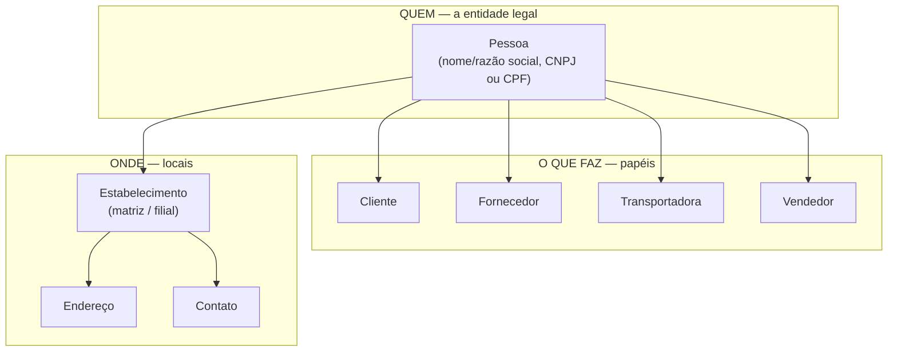
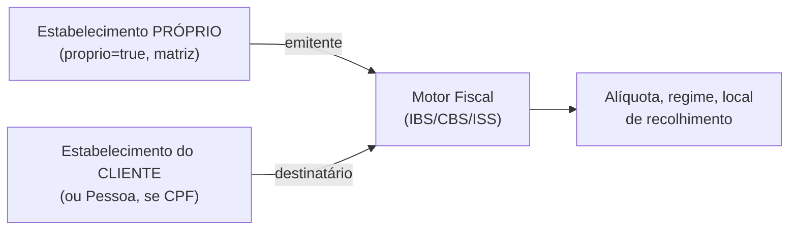

# TCA — como as entidades do ERP são organizadas (visão funcional)

**Status:** modelo em produção (Fases 1-4) · **Data:** 13 de setembro de 2026 · **Módulo:** `cadastro-service` (porta 8086)

> Este documento explica, em linguagem de negócio, como o sistema organiza "quem é quem" —
> empresa, cliente, fornecedor, filial, endereço. Sem schema de banco, endpoint ou classe Java.
> Para o detalhe técnico completo (tabelas, migração, status de cada fase), ver
> `spec/modulos/estabelecimentos/estabelecimentos-filiais.md`.

---

## O que é "TCA"

TCA é a sigla de **Trading Community Architecture**, um padrão de modelagem de dados criado
pela Oracle e hoje usado como referência em vários ERPs. A ideia central, resumida:

> **Separar "quem" alguém é, do "que papel" essa pessoa desempenha, do "onde" ela está.**

O nosso sistema segue essa mesma lógica. Não existe uma tabela "Cliente" isolada com nome,
CNPJ e endereço próprios, nem uma tabela "Fornecedor" duplicando os mesmos dados. Existe **uma
entidade central** (a empresa ou pessoa em si) e, em volta dela, **papéis** e **locais** que se
penduram nela. Isso evita cadastro duplicado e permite que uma mesma empresa seja, ao mesmo
tempo, cliente e fornecedora — sem dois cadastros que podem divergir.

## Os três blocos do modelo

### 1. QUEM — a `Pessoa`

É a entidade legal: uma empresa (CNPJ) ou uma pessoa física (CPF). Guarda o nome/razão social e
o documento. Cada `Pessoa` é cadastrada **uma única vez** por empresa cliente do ERP (o
"tenant") — mesmo que essa empresa/pessoa desempenhe vários papéis ao mesmo tempo.

### 2. O QUE FAZ — os papéis

Uma `Pessoa` pode acumular quantos papéis fizerem sentido pro negócio, todos apontando pra ela:

- **Cliente** — compra da empresa. Carrega dado comercial: limite de crédito, condição de
  pagamento, vendedor responsável, tabela de preço, grupo de cliente.
- **Fornecedor** — vende pra empresa.
- **Transportadora** — realiza fretes.
- **Vendedor** — representante comercial interno.

Uma mesma empresa pode ser cliente **e** fornecedora ao mesmo tempo (troca mercadoria nos dois
sentidos) sem duplicar o cadastro — é uma `Pessoa` com um registro de `Cliente` e outro de
`Fornecedor`, ambos apontando pra ela.

### 3. ONDE — matriz, filial, endereço e contato

Aqui mora a parte que mais gera confusão, e é a que mais importa pra regra fiscal:

- Empresa (CNPJ) tem **matriz** e pode ter **filiais**. Matriz e filiais compartilham a
  **raiz do CNPJ** (os 8 primeiros dígitos) e diferem só nos 4 dígitos seguintes
  (`0001` = matriz, `0002`, `0003`... = filiais).
- Cada matriz/filial é um `Estabelecimento`. É **no estabelecimento**, não na `Pessoa`, que
  vivem: CNPJ completo (com o sufixo da filial), Inscrição Estadual, Inscrição Municipal e o
  endereço fiscal daquele local.
- **Por que isso importa pra regra fiscal:** a Inscrição Estadual e o endereço — e portanto o
  Estado/Município usados no cálculo de imposto — são **por filial**, não por empresa. Uma
  empresa com filiais em 3 Estados tem 3 IEs diferentes e pode ter alíquota/regra diferente em
  cada uma. O modelo atual já reflete isso: quem carrega esses dados é o `Estabelecimento`, não
  a `Pessoa`.
- **Pessoa física (CPF) não tem estabelecimento.** Só empresa (CNPJ) se desdobra em
  matriz/filial; pessoa física é sempre um único registro, sem filial.
- Endereço e contato ficam pendurados **no estabelecimento** (empresas) ou **na pessoa**
  (pessoas físicas) — nunca nos dois ao mesmo tempo para o mesmo registro.

## Emitente e destinatário: onde isso aparece na nota fiscal e no cálculo de imposto

Essa organização existe, na prática, pra resolver uma pergunta que o motor fiscal precisa
responder em toda operação: **de onde sai a mercadoria/serviço, e pra onde vai?**

- **Emitente** = o `Estabelecimento` marcado como `proprio=true` — ou seja, a própria empresa
  dona da conta no ERP (o tenant). Hoje o cálculo sempre usa a **matriz** como emitente; ainda
  não existe seleção de "qual filial emitiu este pedido" (ver seção "O que fica de fora").
- **Destinatário** = o `Estabelecimento` (ou, se for pessoa física, a `Pessoa`) do cliente
  daquela venda.
- O endereço fiscal de cada lado (UF, município/IBGE) alimenta diretamente o motor
  IBS/CBS/ISS — é esse dado que decide alíquota, regime e local de recolhimento.

## Resumo das regras de negócio

| Situação | Regra |
|---|---|
| Empresa é cliente e fornecedora ao mesmo tempo | Uma única `Pessoa`, com um registro `Cliente` e outro `Fornecedor` apontando pra ela — sem cadastro duplicado |
| Matriz e filial da mesma empresa | Compartilham a raiz do CNPJ (8 primeiros dígitos); colapsam numa única `Pessoa`, com um `Estabelecimento` por CNPJ completo |
| Inscrição Estadual / Municipal | Vive no `Estabelecimento` (por filial), não na `Pessoa` — porque cada filial pode ter IE diferente |
| Endereço fiscal usado no cálculo de imposto | O do `Estabelecimento` (empresas) ou da `Pessoa` (pessoa física) — nunca os dois preenchidos no mesmo registro |
| Pessoa física (CPF) | Nunca tem estabelecimento/filial — sempre um único registro |
| Emitente da nota fiscal | Sempre o estabelecimento `proprio=true` da empresa dona do ERP — hoje sempre a matriz |
| Destinatário da nota fiscal | O estabelecimento (ou pessoa, se CPF) do cliente da venda |

## O que fica de fora por enquanto

- **Emissão por filial:** o motor fiscal já sabe calcular por UF/estabelecimento, mas o fluxo de
  venda ainda sempre usa a matriz como emitente — não existe hoje "escolher a filial que está
  vendendo" num pedido.
- **Tela de cadastro de filial:** o backend já tem CRUD completo de `Estabelecimento`, mas ainda
  não existe tela no sistema para o usuário final criar/editar uma filial — só é acessível hoje
  por chamada direta à API.
- **Estoque por filial:** a coluna que amarra depósito a estabelecimento já foi escrita, mas
  ainda não foi testada nem tem tela de seleção de filial.
- Nada disso muda a regra de negócio explicada acima — são só partes da interface/operação que
  ainda não foram ligadas ao modelo que já existe no banco.

## Glossário rápido

| Termo aqui | Nome no padrão TCA (Oracle) | Em uma frase |
|---|---|---|
| Pessoa | Party | A entidade legal — quem é, independente do que faz |
| Cliente / Fornecedor / Transportadora / Vendedor | Papel / conta comercial | O que aquela pessoa faz em relação à empresa |
| Estabelecimento | Party Site | Um local/CNPJ específico daquela pessoa — matriz ou filial |
| Raiz do CNPJ | — | Os 8 primeiros dígitos do CNPJ, comuns a matriz e todas as filiais |
| Emitente | — | Quem está vendendo/prestando o serviço na operação (sempre a própria empresa) |
| Destinatário | — | Quem está comprando/recebendo o serviço na operação |

---

# Como os módulos operacionais se conectam ao TCA

As seções acima descrevem o "cadastro" — quem é cada `Pessoa`, que papel ela tem, onde fica cada
filial. A partir daqui, a análise é sobre os módulos que **usam** esse cadastro no dia a dia:
Estoque, Vendas (O2C), Compras (P2P) e o Motor Fiscal. Nenhum desses módulos guarda de novo o
nome/CNPJ/endereço de ninguém — todos **referenciam** o `Cliente`, `Fornecedor`, `Estabelecimento`
ou `Depósito` já cadastrados no bloco TCA, por `id`. Essa é a razão prática de o TCA existir: um
único lugar de verdade sobre "quem" e "onde", que todo o resto do sistema aponta de volta.

> Cada seção abaixo é um resumo funcional — para a regra de negócio completa, os documentos
> `spec/estoque-funcional.md`, `spec/o2c-vendas-funcional.md`, `spec/p2p-compras-funcional.md` e
> `spec/motor-fiscal-proximos-passos.md` têm o detalhe.

## Estoque

**Onde mora:** `operacoes-service`, schema `estoque`.

Controla quanto existe de cada `Produto` em cada `Depósito` — o saldo é alimentado
automaticamente pela expedição de uma venda (sai) e pelo recebimento de uma compra (entra), com
um caminho manual de ajuste/inventário para correção. Todo movimento fica num histórico
permanente (nunca é editado ou apagado — correção é sempre um novo lançamento).

**Conexão com o TCA:** o `Depósito` é cadastrado no `cadastro-service` (junto com Cliente/
Fornecedor) e, desde a Fase 5 do modelo de estabelecimentos, pode opcionalmente pertencer a um
`Estabelecimento` (filial) — hoje essa coluna existe no banco, mas ainda não foi testada nem tem
tela para o usuário escolher a filial de um depósito.

**Regras-chave:**

| Situação | Regra |
|---|---|
| Venda expedida / compra recebida | Baixa ou entrada automática no saldo, na mesma operação |
| Item de serviço | Nunca movimenta estoque |
| Ajuste/inventário | Usuário informa o saldo contado; sistema calcula a diferença sozinho, com motivo obrigatório |
| Saldo insuficiente para vender | Não bloqueia hoje (fica negativo) — o bloqueio existe pronto atrás de uma chave ainda desligada (`estoque.bloquear-saida`) |

## O2C — Vendas

**Onde mora:** `operacoes-service`, schema `vendas`.

Fluxo: orçamento → confirmação → expedição (só mercadoria) → faturamento. O pedido referencia
o `Cliente`, o `Vendedor` e o `Depósito` de onde vai sair a mercadoria — todos vindos do TCA por
`id`, sem duplicar dado nenhum de cadastro no pedido.

**Conexão com o TCA / motor fiscal:** é no **faturamento** que o pedido chama o `fiscal-service`
por item e grava o resultado (`valor_ibs`, `valor_cbs`, `valor_is`, `valor_iss`) no próprio
pedido. O endereço fiscal do cliente (destinatário) alimenta essa chamada — por isso a UF/
município corretos dependerem de o `Estabelecimento`/`Pessoa` do cliente estar com endereço
fiscal completo.

**Regras-chave:**

| Situação | Regra |
|---|---|
| Limite de crédito estourado | Bloqueio "soft": pedido fica pendente, liberável por permissão especial (não é rejeitado) |
| Desconto do vendedor | Livre, sem teto, mas auditado em relatório |
| Item de serviço | Pula expedição/estoque, vai direto da confirmação ao faturamento |
| Impostos | Calculados só no faturamento, via `fiscal-service`, sobre o valor da nota |
| Emissão de NF-e/NFS-e | Ainda por fora do sistema — o cálculo do imposto já existe, a emissão em si não |

## P2P — Compras

**Onde mora:** `operacoes-service`, schema `compras`.

Fluxo: requisição interna (opcional) → cotação com fornecedores (opcional) → pedido de compra →
recebimento de mercadoria → faturamento (título a pagar). O pedido de compra referencia o
`Fornecedor` e o `Depósito` de destino, ambos do TCA.

**Conexão com o TCA / motor fiscal:** o recebimento grava os dados da nota fiscal de entrada, mas
os campos de imposto (`impostos_ibs`/`impostos_cbs`/`impostos_is`) ainda ficam **zerados** — o
`fiscal-service` já sabe calcular o crédito de entrada (CFOP + regime do fornecedor), só falta o
P2P chamar esse cálculo e persistir o valor, mesma integração que o O2C já tem no faturamento.

**Regras-chave:**

| Situação | Regra |
|---|---|
| Preço 30% acima do último custo conhecido | Só alerta, não bloqueia o envio para aprovação |
| Recebimento acima da quantidade pedida | Tolera até +5%; acima disso, recusa o excesso |
| Impostos da nota de entrada | Zerados/informativos até a integração com o `fiscal-service` |
| Aprovação do pedido | Uma única permissão; o próprio solicitante pode aprovar (sem segregação obrigatória ainda) |
| Cancelamento | Livre até o primeiro recebimento confirmado; depois só "encerra o saldo restante" |

## Motor Fiscal

**Onde mora:** `fiscal-service` (porta 8093), schema `fiscal`.

É o único bloco desta análise que **não guarda cadastro nem transação** — é um motor de cálculo
puro: recebe os dados de uma operação (um item de uma venda ou compra) e devolve o valor de
IBS/CBS/IS/ISS e retenções, sem persistir nada sobre aquele pedido específico. Quem persiste o
resultado é quem chamou (o `Pedido` do O2C, ou o `RecebimentoMercadoria` do P2P quando essa
integração existir).

**Conexão com o TCA:** os dois dados que mais dependem do cadastro são a **UF/IBGE de origem** —
o endereço fiscal do `Estabelecimento` próprio (emitente, hoje sempre a matriz) — e a **UF/IBGE
de destino** — o endereço fiscal do `Estabelecimento` ou `Pessoa` do cliente (destinatário). É
exatamente por isso que a organização matriz/filial e o endereço-por-estabelecimento (explicados
no início deste documento) importam para o cálculo: alíquota, regime e local de recolhimento de
IBS/CBS mudam conforme esses dois endereços.

O motor consulta tabelas de referência próprias (NCM, CFOP, alíquotas de IBS por município, de
CBS por regime, de IS por NCM, regimes diferenciados) — são tabelas nacionais/fiscais, iguais
para todos os tenants, sem vínculo com `Pessoa` ou `Estabelecimento` de ninguém.

**Regras-chave:**

| Situação | Regra |
|---|---|
| Cálculo | Por item, não por nota inteira — cada linha de produto/serviço é uma chamada |
| Produto vs. serviço | Mutuamente exclusivo: usa NCM (produto) ou código de serviço + classificação tributária (serviço), nunca os dois |
| Retenções (IRRF/CSRF/INSS/ISS) | O motor calcula o valor retido; quem decide **se** retém é sempre quem chama, não o motor |
| Split payment | Existe, mas atrás de feature flag desligada por padrão (`fiscal.split-payment`) |
| Emissão de NF-e/NFC-e/NFS-e | Fora de escopo — o motor calcula o imposto, não emite o documento fiscal |

---

# Diagrama do esquema de banco

Visão simplificada das tabelas envolvidas — só as colunas que ajudam a entender as ligações
(chave primária, chaves que apontam para outra tabela e 1-2 campos de negócio). Colunas de
auditoria (`created_at`, `created_by` etc.) foram omitidas para não poluir o diagrama.

> **Atenção:** as setas entre `cadastro-service` (schema `cadastros`) e `operacoes-service`
> (schemas `vendas`/`compras`/`estoque`) são **referências lógicas** (um `UUID` gravado), não
> chaves estrangeiras de banco — são bancos/serviços diferentes. O `fiscal-service` nem isso tem:
> ele é consultado por uma chamada HTTP (`POST /fiscal/calcular`), não por junção de tabela.

```mermaid
erDiagram
    %% ===== cadastro-service · schema "cadastros" (o bloco TCA) =====
    pessoa ||--o{ cliente : "papel"
    pessoa ||--o{ fornecedor : "papel"
    pessoa ||--o{ transportadora : "papel"
    pessoa ||--o{ vendedor : "papel"
    pessoa ||--o{ estabelecimento : "matriz + filiais"
    estabelecimento ||--o{ endereco : "endereço (PJ)"
    estabelecimento ||--o{ contato : "contato (PJ)"
    pessoa ||--o{ endereco : "endereço (PF)"
    pessoa ||--o{ contato : "contato (PF)"
    estabelecimento |o--o{ deposito : "opcional (filial)"

    pessoa {
        uuid id PK
        string tipo "PF ou PJ"
        string nome_razao
        string documento "CPF ou CNPJ completo"
        string cnpj_raiz "agrupa matriz + filiais"
    }
    cliente {
        uuid id PK
        uuid pessoa_id FK
        uuid vendedor_id FK
        decimal limite_credito
    }
    fornecedor {
        uuid id PK
        uuid pessoa_id FK
    }
    transportadora {
        uuid id PK
        uuid pessoa_id FK
    }
    vendedor {
        uuid id PK
        uuid pessoa_id FK
    }
    estabelecimento {
        uuid id PK
        uuid pessoa_id FK
        string cnpj_completo
        string ordem "0001 = matriz"
        boolean is_matriz
        boolean proprio "empresa dona do ERP"
        string ie
    }
    endereco {
        uuid id PK
        uuid pessoa_id FK "preenchido só p/ PF"
        uuid estabelecimento_id FK "preenchido só p/ PJ"
        string uf
        string ibge_codigo
    }
    contato {
        uuid id PK
        uuid pessoa_id FK "preenchido só p/ PF"
        uuid estabelecimento_id FK "preenchido só p/ PJ"
    }
    deposito {
        uuid id PK
        uuid estabelecimento_id FK "opcional, não testado"
        string nome
    }
    produto {
        uuid id PK
        string sku
        string tipo "MERCADORIA ou SERVICO"
        string ncm
        string codigo_servico
        string class_trib
    }

    %% ===== operacoes-service · schema "vendas" (O2C) — referencia cadastros por id =====
    cliente ||--o{ pedido : "compra"
    deposito |o--o{ pedido : "expede de"
    pedido ||--o{ pedido_item : "itens"
    produto ||--o{ pedido_item : "produto vendido"

    pedido {
        uuid id PK
        uuid cliente_id "ref. cadastro-service"
        uuid vendedor_id "ref. cadastro-service"
        uuid deposito_id "ref. cadastro-service"
        string status
        decimal valor_total
        decimal valor_ibs "preenchido só no faturamento"
        decimal valor_cbs
        decimal valor_iss
    }
    pedido_item {
        uuid id PK
        uuid pedido_id FK
        uuid produto_id "ref. cadastro-service"
        decimal quantidade
        decimal preco_unitario
    }

    %% ===== operacoes-service · schema "compras" (P2P) — referencia cadastros por id =====
    requisicao_compra |o--o{ cotacao_compra : "origem opcional"
    requisicao_compra |o--o{ pedido_compra : "origem opcional"
    cotacao_compra |o--o{ pedido_compra : "vencedor vira pedido"
    pedido_compra ||--o{ recebimento_mercadoria : "1 pedido, N recebimentos"

    requisicao_compra {
        uuid id PK
        uuid solicitante_id
        uuid deposito_id "ref. cadastro-service"
        string status
    }
    cotacao_compra {
        uuid id PK
        uuid requisicao_id FK "opcional"
        uuid deposito_id "ref. cadastro-service"
        string status
    }
    pedido_compra {
        uuid id PK
        uuid fornecedor_id "ref. cadastro-service"
        uuid deposito_id "ref. cadastro-service"
        uuid requisicao_id FK "opcional"
        uuid cotacao_fornecedor_id FK "opcional"
        string status
        decimal valor_total
    }
    recebimento_mercadoria {
        uuid id PK
        uuid pedido_id FK
        uuid deposito_id "ref. cadastro-service"
        string nfe_numero
        decimal impostos_ibs "zerado até integrar o fiscal-service"
    }

    %% ===== operacoes-service · schema "estoque" — ligado a vendas/compras por origem_id, sem FK física =====
    produto ||--o{ estoque_saldo : "saldo"
    deposito |o--o{ estoque_saldo : "por depósito"
    produto ||--o{ movimento_estoque : "movimenta"
    deposito |o--o{ movimento_estoque : "movimenta em"

    estoque_saldo {
        uuid id PK
        uuid produto_id "ref. cadastro-service"
        uuid deposito_id "ref. cadastro-service"
        decimal quantidade
    }
    movimento_estoque {
        uuid id PK
        uuid produto_id "ref. cadastro-service"
        uuid deposito_id "ref. cadastro-service"
        string tipo "ENTRADA_COMPRA, SAIDA_VENDA, AJUSTE..."
        string origem_tipo "PEDIDO_VENDA, RECEBIMENTO, AJUSTE, INVENTARIO"
        uuid origem_id "id do pedido/recebimento, sem FK física"
    }

    %% ===== fiscal-service · schema "fiscal" — tabelas de referência, nacionais, sem FK com tenant =====
    ncm {
        string codigo PK
        string descricao
    }
    cfop {
        string codigo PK
        string tipo_operacao
    }
    aliq_ibs_municipio {
        string ibge_codigo PK
        decimal aliquota
    }
    aliq_cbs_regime {
        string regime PK
        decimal aliquota
    }
    aliq_is_ncm {
        string ncm PK
        decimal aliquota
    }
    regime_dif_ncm {
        string ncm PK
        string regime_diferenciado
    }
```

