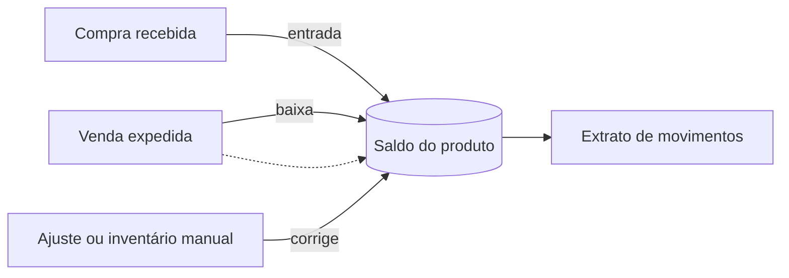

# Estoque: visão funcional

**Status:** decisões fechadas (E1-E7 no ar) + extensão planejada (§ "Revisão funcional") · **Data:** 16 de setembro de 2026 · **Módulo:** `operacoes-service` (microsserviço único, também dono de vendas e compras)

> Este documento descreve o controle de estoque em linguagem de negócio — sem schema de banco, endpoint ou detalhe técnico. Para a implementação, ver `spec/estoque.md`.

---

## Objetivo

Saber, a qualquer momento, quanto existe de cada produto em cada depósito — alimentado automaticamente pela saída de uma venda e pela entrada de uma compra, com um caminho manual (ajuste/contagem) para corrigir o saldo ou carregar o estoque inicial.

## O fluxo, passo a passo

### 1. Movimentação automática

Toda vez que uma venda é **expedida**, o sistema baixa do saldo a quantidade de cada item de mercadoria daquele pedido, no depósito informado na expedição. Se o pedido for cancelado depois de já ter sido expedido, o sistema devolve exatamente a mesma quantidade ao saldo (estorno) — nunca fica uma baixa sem par se a venda volta atrás.

O mesmo vale, na outra ponta, quando o módulo de compras confirma o **recebimento de mercadoria**: a quantidade recebida entra no saldo do depósito de destino, imediatamente e na mesma operação — não existe intervalo em que a mercadoria já chegou fisicamente mas o sistema ainda não sabe.

Item de **serviço nunca movimenta estoque** — não faz sentido "ter saldo" de uma prestação de serviço, então venda e compra de serviço não passam por aqui.

### 2. Ajuste e contagem de inventário

Além do que entra e sai sozinho pela venda ou compra, existe um caminho manual: o operador informa **o saldo que ele conta fisicamente na prateleira** — não a diferença, o número certo. O sistema calcula sozinho se isso significa uma entrada ou uma saída e registra o ajuste com o motivo, que é obrigatório para não virar um buraco de auditoria.

É o mesmo mecanismo tanto para o ajuste avulso ("achei duas unidades avariadas, tirando do saldo") quanto para a contagem cíclica periódica — o que muda é só o motivo que a pessoa digita, não a tela nem a regra.

Se a contagem bate com o saldo que o sistema já tinha, nada é gravado — contagem que confirma o saldo não é fato de estoque.

### 3. Extrato de movimentos

Toda entrada, saída, ajuste e estorno fica registrado permanentemente, sem exceção — o extrato nunca é editado ou apagado; qualquer correção é sempre um novo registro. É esse histórico completo que permite reconstruir "o que aconteceu com esse produto" a qualquer momento, e que sustenta a auditoria: quem fez, quando, e de onde veio o movimento (pedido de venda, recebimento de compra ou ajuste manual).

### 4. Bloqueio por saldo insuficiente (ainda desligado)

Hoje, vender mais do que o saldo mostra **não impede a venda** — o saldo simplesmente fica negativo, sinalizando que a operação vendeu algo que o sistema não sabia que tinha. Essa checagem já existe pronta no sistema, atrás de uma chave liga/desliga: assim que o saldo inicial de todos os produtos estiver carregado (via ajuste) e a tela de consulta/extrato estiver disponível para a operação acompanhar, a chave é ligada e passa a barrar a expedição ou o ajuste que deixaria algum produto negativo — sem precisar trocar de sistema nem esperar desenvolvimento novo. Estornos e entradas nunca são bloqueados, mesmo com a chave ligada — devolver e corrigir precisam sempre funcionar.

## Resumo das regras de negócio

| Situação | Regra |
|---|---|
| Venda expedida | Baixa automática do saldo, só de itens de mercadoria |
| Venda cancelada após expedida | Estorno automático (devolve o que foi baixado) |
| Compra recebida | Entrada automática no saldo do depósito, imediata |
| Item de serviço | Nunca movimenta estoque |
| Ajuste/inventário | Um único mecanismo: informa-se o saldo contado, o sistema calcula a diferença; motivo obrigatório |
| Contagem igual ao saldo atual | Nenhum movimento gravado (não é fato de estoque) |
| Saldo insuficiente para vender | Não bloqueia hoje (fica negativo); o bloqueio existe pronto, atrás de uma chave ainda desligada |
| Estorno/entrada com saldo negativo | Nunca bloqueado, mesmo com a chave de bloqueio ligada |
| Histórico de movimentos | Permanente e imutável — correção é sempre um novo registro, nunca edição |

## Revisão funcional (16 de setembro de 2026)

Um especialista externo revisou este documento; a segunda leitura confirmou que as perguntas apontavam para buracos reais. Decisões fechadas, **implementação ainda não começou** (desenho técnico em `estoque.md` §12):

- **Para que serve o produto.** Hoje o sistema só distingue mercadoria de serviço. Vai ganhar uma segunda informação — se aquela mercadoria é para revender, para uso e consumo interno, ou matéria-prima/produto acabado de uma produção própria. Essa informação alimenta o fiscal (que nota fiscal de entrada usar), o contábil (se vira despesa ou fica no estoque) e a regra de saldo negativo abaixo.
- **Consumo interno passa a movimentar estoque.** Hoje só existem duas portas de saída: venda e ajuste manual. Uma requisição de almoxarifado (papel, material de limpeza, EPI de uso próprio) vai virar um terceiro tipo de saída, com centro de custo obrigatório — é o que permite depois saber quanto cada setor gastou.
- **Ajuste ganha motivo tipificado e documento de apoio.** Hoje o operador escreve qualquer texto no motivo do ajuste. Vai virar uma lista fechada (avaria, perda, roubo, bonificação recebida, erro de lançamento, saldo inicial, inventário...) com espaço pra anexar um documento (laudo, boletim de ocorrência). Sem isso, ajuste sem lastro é a porta mais fácil pra sumir estoque sem explicação — e a Receita enxerga estoque que não fecha como venda não declarada.
- **Bloqueio de saldo negativo vai depender do tipo de produto, não de uma chave única.** Item de revenda com saldo negativo é sinal de compra feita sem nota fiscal — bloqueia por padrão assim que o saldo inicial estiver carregado (hoje a chave existe, mas é uma só pra tudo e está desligada). Produto acabado de produção própria pode ficar negativo temporariamente ("ainda não apontei a produção"), mas nunca atravessa um fechamento mensal de estoque.
- **Produção própria fica para depois.** Hoje o foco é serviço; produzir e montar produto próprio (com baixa de insumo e entrada do produto pronto) é uma etapa futura, só desenhada em linhas gerais para não fechar portas.

## O que fica de fora por enquanto

- Bloqueio de venda por saldo insuficiente (a checagem existe, mas está desligada até o saldo inicial ser carregado) — vai deixar de ser uma chave única e passar a depender do tipo de produto (ver revisão acima).
- Reserva de saldo na confirmação do pedido (hoje a baixa só acontece na expedição).
- Custo médio ponderado / valorização de estoque — **decidido na revisão acima, ainda não implementado**; deixa de ser "fica com o Financeiro" e passa a viver no próprio módulo de estoque.
- Consumo interno com baixa de estoque e custo médio — **decidido na revisão acima, ainda não implementado**.
- Ajuste com motivo tipificado e lastro documental — **decidido na revisão acima, ainda não implementado**; hoje o motivo é texto livre.
- Produção própria (ficha técnica, ordem de produção, baixa de insumo/entrada de produto acabado) — fica para uma fase futura.
- Controle por lote, validade ou número de série.
- Transferência entre depósitos (hoje se resolve com dois ajustes manuais).
- Documento de inventário com etapas (abertura → contagem → apuração) — hoje é contagem direta, produto a produto.
- Expedição ou recebimento dividido entre múltiplos depósitos no mesmo documento.
- Devolução de cliente (RMA) com fluxo fiscal próprio.
- Sugestão automática de compra por ponto de reposição.
- Importação em massa de saldo inicial (planilha/CSV).
