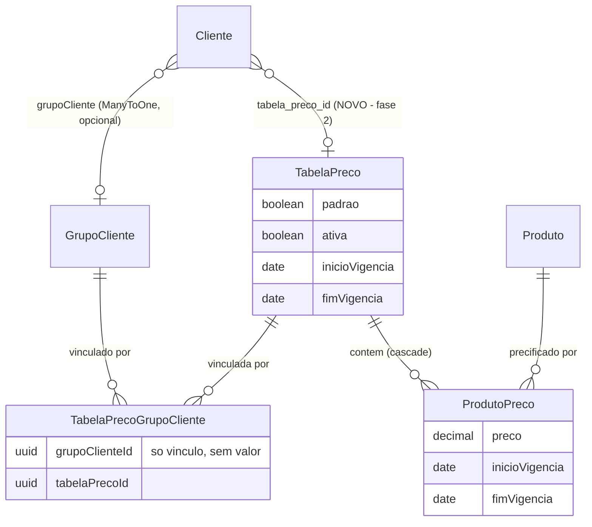
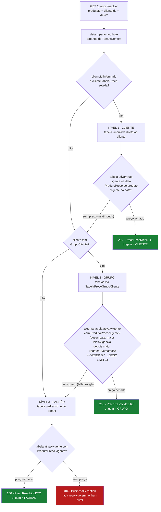
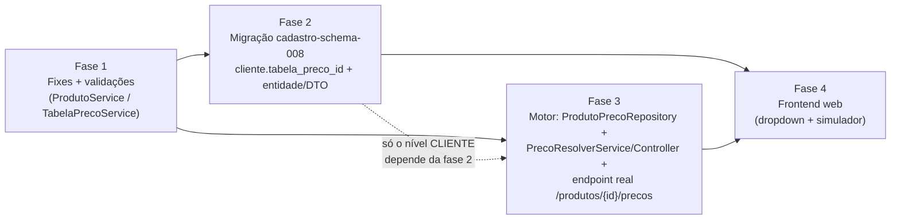

# Motor de resolução de preço (padrão → grupo → cliente) — Plano de implementação

**Status:** IMPLEMENTADO e integrado ao O2C (fases 1-3 + integração em `operacoes-service`); testado ao vivo via front-end em 2026-09-05/06 · **Última atualização:** 8 de setembro de 2026 (correção adicional: o corpo do doc — §Contexto, §Endpoints, §Algoritmo, §Fases — ainda descrevia o motor, o `ProdutoPrecoRepository` e o endpoint `/produtos/{id}/precos` como **não implementados**, contradizendo este próprio cabeçalho; conferidos `PrecoResolverService`/`PrecoResolverController`/`ProdutoPrecoRepository`/`PrecoResolverServiceTest` linha a linha — tudo já existe, testado, commitado; só a fase 4 de frontend segue pendente. Revisão anterior no mesmo dia: os 3 bugs colaterais da fase 1 — `.orElse(null)` em fornecedor/tabelaPreco, duplicidade de `padrao` no update, `tenantId`/`userId` mockados no create — corrigidos e commitados em `9ca797c`; segue pendente só a categoria com o mesmo padrão de `.orElse(null)`) · **Data original:** 2026-07-10 · **Serviços:** `cadastro-service` (foco) · `operacoes-service` (integração no O2C) · `liquibase-service` (migração) · `Angular/erp-front-end-web` (fase 4, ainda pendente)

**Decisões fechadas:** preço individual de cliente = **TabelaPreco vinculada direto ao cliente** (nova FK `cliente.tabela_preco_id`), **sem** entidade `PrecoCliente` nova · precedência **CLIENTE → GRUPO → PADRÃO** com fall-through por nível · desempate determinístico (maior `inicioVigencia`, depois maior `updatedAt`/`createdAt`) · validação de sobreposição de vigência **só dentro da mesma tabela** (tabelas distintas coexistem por design).

---

## Contexto / problema

Hoje existem 3 CRUDs de cadastro relacionados a preço, mas **nenhum motor que responda "qual o preço do produto X para o cliente Y na data Z"**:

- **`GrupoCliente`** — CRUD simples; `Cliente.grupoCliente` é `@ManyToOne` **opcional**.
- **`TabelaPreco`** — CRUD com flag `padrao`, `ativa`, vigência (`inicioVigencia`/`fimVigencia`) e lista de `produtoPrecos` persistida via cascade.
- **`TabelaPrecoGrupoCliente`** — associação N:N grupo↔tabela; **só vínculo**, sem valor próprio.

`ProdutoPreco` (produto + tabela + preço + vigência) é persistido por `ProdutoService.processProducts()` (`cadastro-service/src/main/java/com/l/erp/cadastroservice/services/ProdutoService.java:205-224`), alimentado pela aba "Preços" do form de Produto no `erp-front-end-web`.

> **Correção (8 de setembro de 2026):** a revisão anterior deste doc mantinha aqui, por engano, uma lista antiga chamada "O que NÃO existe hoje" (motor de resolução, validação de vigência, endpoint real) — texto escrito **antes** das fases 1-3, quando o motor ainda era só um plano. Essa lista foi **removida** por descrever um estado que não existe mais: hoje, lido o código atual, o motor (`PrecoResolverService`), a validação (`validarVigenciaPrecos`/`seSobrepoe`) e o endpoint real (`/api/v1/precos/resolver` e `/produtos/{id}/precos`) **já estão implementados e testados**. Ver §"Endpoints" e §"Algoritmo de resolução" para o estado real, com os arquivos e testes que comprovam isso.

**O que ainda não existe (confirmado 8 de setembro de 2026):**
- Dropdown "Tabela de preço individual" no form de Cliente do `erp-front-end-web` (fase 4) — `Cliente.tabelaPreco`/`cliente.tabela_preco_id` já existem no back-end, mas nenhuma tela usa esse campo ainda.
- A busca de **categoria** em `ProdutoService` (create/update) ainda usa `.orElse(null)` — mesmo padrão de bug do fornecedor/tabelaPreco já corrigido, não coberto pelo fix original (ver §"Fixes de bugs colaterais").
- Validação de sobreposição de vigência **entre tabelas diferentes** para o mesmo cliente/grupo — nunca foi proposta (por design: padrão + tabela de grupo coexistindo é esperado, o resolver desempata), mas vale registrar que só existe overlap-check **dentro da mesma tabela**.

**Bugs colaterais encontrados na investigação — os 3 abaixo foram corrigidos no commit `9ca797c` (fix de CodeSmells do SonarQube), confirmado lendo o código atual em 8 de setembro de 2026** (ver §"Fixes de bugs colaterais" para o detalhe de cada um):
- **`ProdutoService.java:188` e `:211` — `.orElse(null)` silencioso em fornecedor/tabelaPreco.** ✅ Corrigido: hoje usam `.orElseThrow(...)`. Ressalva: a busca de **categoria** (`ProdutoService.java`, `create`/`update`) ainda usa `.orElse(null)` — mesmo padrão de bug, não coberto pelo fix original.
- **`TabelaPrecoService.java:100` — checagem de `padrao=true` no update.** ✅ Corrigido: já exclui o próprio registro (`existsByPadraoIsTrueAndTenantIdAndIdNot`) e a auditoria já usa a action de update.
- **`ProdutoController.java:60-61` — `tenantId`/`userId` mockados no create.** ✅ Corrigido: todos os endpoints, incluindo o create, já usam `SecurityUtils`.

**Panorama visual do modelo atual** (o "motor" tracejado é o que falta):



> **Atualizado:** o `PrecoResolverService` (fase 3, já implementado — `cadastro-service/.../services/PrecoResolverService.java`) é quem percorre esse grafo hoje. A aresta `Cliente → TabelaPreco`, marcada acima como "NOVO", já existe em produção (changelog `cadastro-schema-014.yaml`).

**Frontends do monorepo:** 3 workspaces Angular — `erp-front-end-web` (tenant, **único** que consome cadastro-service/preço), `erp-front-end-admin` e `erp-front-end-partner` (**zero impacto**, não tocam preço).

---

## Decisão de modelagem — sem entidade PrecoCliente

Preço individual = uma `TabelaPreco` vinculada direto ao cliente via **nova coluna opcional `cliente.tabela_preco_id`** (FK, NULL).

**Justificativa:**
- Reaproveita `ProdutoPreco`, o CRUD de `TabelaPreco` e o cascade do `ProdutoService` — zero código novo de persistência de preço.
- O resolver fica **uniforme**: em todo nível ele resolve "qual tabela vale" e busca o `ProdutoPreco` nela. Um único caminho de código.

**Limitação aceita (caminho de upgrade):** se o volume de clientes com preço individual crescer muito (uma tabela inteira por cliente), migrar para entidade `PrecoCliente` dedicada — o resolver ganha um nível extra sem quebrar os demais.

---

## Endpoints (implementados)

1. **`GET /api/v1/precos/resolver?produtoId={uuid}&clienteId={uuid, opcional}&data={yyyy-MM-dd, opcional, default hoje}`** — `PrecoResolverController.resolver()`. Shape real do `PrecoResolvidoDTO` (record, `cadastro-service/.../api/dto/PrecoResolvidoDTO.java`) é mais enxuto do que o proposto originalmente — sem `moeda`/`tabelaPrecoNome`/vigência, que ficaram fora por YAGNI:
   ```
   PrecoResolvidoDTO { produtoId, clienteId, tabelaPrecoId, origem [CLIENTE|GRUPO|PADRAO], preco, data }
   ```
   Nada resolvido → `BusinessException` **404** (`Constants.PRECO_NAO_RESOLVIDO`).
2. **`GET /api/v1/produtos/{id}/precos`** (`ProdutoController.findPrecos()`) já é implementação real — mapeia `produto.getProdutoPrecos()` para `ProdutoPrecoDTO` via `produtoPrecoMapper`. Não é mais o stub descrito na revisão original deste doc.
3. **Fora de escopo:** endpoint batch de resolução. O service manteve a assinatura pura `resolver(produtoId, clienteId, data, tenantId)`, então dá pra adicionar depois sem refatorar.

---

## Algoritmo de resolução (`PrecoResolverService.resolver`)

1. `data` = parâmetro ou hoje; `tenantId` do `TenantContext`.
2. **Precedência por níveis:**
   - **Nível 1 — CLIENTE:** `cliente.tabelaPreco`, se setado.
   - **Nível 2 — GRUPO:** tabelas vinculadas ao grupo do cliente via `TabelaPrecoGrupoCliente`, se o cliente tem grupo.
   - **Nível 3 — PADRÃO:** tabela com `padrao=true` do tenant.
3. **Em cada nível:** a tabela precisa estar `ativa=true` e vigente na data (`inicioVigencia <= data` e (`fimVigencia` null ou `fimVigencia >= data`)); buscar o `ProdutoPreco` do produto nessa tabela, também vigente na data. **Primeiro preço achado vence.** Nível sem preço para o produto → fall-through para o próximo (não é erro).
4. **Desempate** — múltiplas tabelas vigentes no mesmo nível (ex.: grupo com 2 tabelas) ou `ProdutoPreco` duplicado (dados legados): maior `inicioVigencia`; empate → maior `updatedAt`/`createdAt`. Implementar como `ORDER BY ... DESC LIMIT 1` → comportamento determinístico mesmo com dados sujos.
5. Nada resolvido em nenhum nível → 404.
**Fluxo visual da cascata:**



6. **Implementação (já feita):** `ProdutoPrecoRepository.findVigentesEmTabelas(tenantId, produtoId, tabelaPrecoIds, data, Pageable)` — uma única query JPQL por nível (recebe a lista de IDs de tabela do nível inteiro, não uma tabela por vez), com `ORDER BY inicioVigencia DESC, updatedAt DESC NULLS LAST, createdAt DESC` e `Pageable(0, 1)` fazendo o desempate direto no banco. `PrecoResolverService.buscarPrecoVigente()` empacota isso num `Optional`. Loop sobre os 3 níveis no service — até 3 queries no pior caso (CLIENTE, GRUPO, PADRÃO), sem gargalo medido.

---

## Validações de vigência (implementadas)

- **`ProdutoService.validarVigenciaPrecos()`** (chamada de `processProducts`, antes de persistir) valida em memória a lista `dto.precos()`:
  - `inicioVigencia <= fimVigencia` quando `fimVigencia != null` → `Constants.PRODUTO_PRECO_VIGENCIA_INVALIDA`;
  - para o **mesmo** `tabelaPrecoId`, dois períodos não podem se sobrepor (`seSobrepoe()`, `fimVigencia` null tratado como `LocalDate.MAX`) → `Constants.PRODUTO_PRECO_VIGENCIA_SOBREPOSTA`.
- **`TabelaPrecoService.validarVigencia()`** (save/update) valida `inicioVigencia <= fimVigencia`. **Não** valida sobreposição entre tabelas distintas — padrão + tabelas de grupo coexistindo é o design esperado; o resolver desempata.
- Ambas lançam `BusinessException` **400**, padrão já usado na base (mensagens em PT-BR, via `GlobalExceptionHandler`).

---

## Fixes de bugs colaterais

1. ✅ **Corrigido** (commit `9ca797c`) — `ProdutoService.java:211` e `:188` trocaram `.orElse(null)` por `.orElseThrow(BusinessException 400)` para fornecedor/tabela de preço. A busca de **categoria**, no mesmo service, ficou de fora do fix e ainda usa `.orElse(null)` — mesmo risco (id inválido/de outro tenant vira `null` silencioso), pendente.
2. ✅ **Corrigido** (commit `9ca797c`) — `TabelaPrecoService.java:102` ganhou `existsByPadraoIsTrueAndTenantIdAndIdNot(tenantId, id)`, excluindo o próprio registro da checagem de duplicidade de `padrao`, e a action de auditoria já usa `TABELA_PRECO_UPDATE` em vez de `CREATION`. Confirmado lendo o código atual em 8 de setembro de 2026 — o sintoma relatado no teste manual de 2026-09-06 (editar a própria tabela padrão disparava falso-positivo de duplicidade) não reproduz mais.
3. ✅ **Corrigido** (commit `9ca797c`) — `ProdutoController.java` troca `tenantId`/`userId` mockados no create por `SecurityUtils`, igual aos demais endpoints.

---

## Impacto nos frontends

- **`erp-front-end-web`:** form de Cliente ganha dropdown **opcional** "Tabela de preço individual" (mesma fonte de dados de tabelas ativas que o form de Produto já usa). Nenhuma outra tela muda. **Opcional/não-bloqueante:** botão "Simular preço" chamando `/precos/resolver` — útil para validar o motor antes do módulo de vendas existir.
- **`erp-front-end-admin` / `erp-front-end-partner`:** zero impacto — não consomem cadastro-service.

---

## Fases

1. ✅ **Feita** — Bugs + validações de vigência: os 3 fixes de §"Fixes de bugs colaterais" + validações em `ProdutoService`/`TabelaPrecoService`.
2. ✅ **Feita** — Migração de schema: `cadastro-schema-014.yaml` (não o `-008` originalmente previsto — outros changelogs ocuparam os números entre eles) adiciona `cliente.tabela_preco_id UUID NULL` + FK `fk_cliente_tabela_preco_id`. Campo `tabelaPreco` na entidade `Cliente` + DTOs + mapper, todos presentes.
3. ✅ **Feita** — Motor: `ProdutoPrecoRepository`, `PrecoResolverService`, `PrecoResolverController`, `PrecoResolvidoDTO`; endpoint real de `/produtos/{id}/precos`. `PrecoResolverServiceTest` cobre os 4 cenários principais (CLIENTE, GRUPO, PADRÃO, 404 sem resolução em nenhum nível) — os cenários de desempate/tabela inativa/vigência expirada ficam cobertos indiretamente pela query JPQL do repositório, sem teste unitário dedicado a esses casos-limite.
4. ⬜ **Pendente** — Frontend web: dropdown de tabela individual no form de Cliente + simulador opcional. Nenhuma tela em `erp-front-end-web` usa `Cliente.tabelaPreco` hoje (confirmado 8 de setembro de 2026, grep no diretório de páginas).

**Dependências entre fases:**



> Fase 3 com níveis **GRUPO/PADRÃO** pode ser entregue em paralelo à fase 2 — só o nível **CLIENTE** do resolver precisa da FK nova.

---

## Fora de escopo agora (YAGNI — caminho de upgrade documentado)

- **Endpoint batch de resolução** — assinatura pura `resolver(produtoId, clienteId, data)` já deixa o caminho pronto.
- **Constraint `EXCLUDE` do Postgres** para vigência — hardening futuro, changelog à parte.
- **Entidade `PrecoCliente` dedicada** — só se o volume de preço individual por cliente justificar (ver decisão de modelagem).
- **Cache do resolver** — 3 queries no pior caso; medir antes de cachear.

---

## Bugs encontrados em teste manual da integração O2C (2026-09-05/06)

Achados testando o motor de preço integrado no fluxo de Pedido via front-end. **Os 4 itens abaixo estavam pendentes na última revisão e foram todos confirmados corrigidos lendo o código atual em 8 de setembro de 2026** — já commitados (commit `c06d7bc`), mas sem teste automatizado cobrindo os itens 2-4:

1. **`PedidoService.atualizar()` congelava preço auto-resolvido como manual** (`operacoes-service/.../services/vendas/PedidoService.java`, método `atualizar`) — **CORRIGIDO em 2026-09-06** e confirmado ao vivo pelo usuário. O front do `pedido-form` sempre reenvia o `precoUnitario` atual do item ao editar o pedido, e `resolverPrecoEValidarItem` tratava qualquer `precoUnitario` não-nulo como override manual. Qualquer edição do pedido (mesmo em outro campo/item) fixava `precoManual=true` pra sempre, e `recalcularPrecos()` passou a pular esse item pra sempre (ela ignora item manual por design). Fix: compara o valor recebido com o do item existente antes de resolver; se igual e o existente não era manual, zera o campo pra forçar reresolução fresca em vez de fixar manual. Teste: `PedidoServiceTest.deveAtualizarPedidoSemFixarPrecoManualQuandoFrontReenviaPrecoInalterado`. **Limitação:** o fix só evita novas corrupções — item que já ficou com `precoManual=true` gravado antes do fix precisa de recuperação manual (limpar o campo "Preço Unit." no form e salvar, manda `precoUnitario=null`, resolve fresco e zera o manual).

2. ✅ **Corrigido.** **Mensagem de erro genérica ao criar/editar Produto** (`Angular/.../pages/cadastros/produtos/produtos-form/produtos-form.ts:305-310` e `:322-327`) — o handler `error: (err: HttpErrorResponse) =>` já lê `err.error?.message || 'Erro ao criar/atualizar produto!'`, mostrando o motivo real vindo do `StandardError` do backend quando existir, com o texto fixo só como fallback.

3. ✅ **Corrigido.** **Pedidos: preciso clicar duas vezes no botão Editar + erro de console NG0100** (`Angular/.../pages/vendas/pedidos/pedidos.ts:146-155` `editarPedido()`) — o código atual já abre o diálogo de forma síncrona no clique (`selectedPedido`/`displayForm` setados antes do `subscribe`, não dentro dele), com comentário explícito no fix apontando o mesmo padrão usado em `produtos.ts:editProduto()`.

4. ✅ **Corrigido.** **Erro "produto sem preço vigente" mostra o UUID em vez do nome** (`operacoes-service/.../services/vendas/PedidoService.java:167`, `Constants.PEDIDO_ITEM_SEM_PRECO`) — já usa `produto.nome()` (via `cadastroServiceClient.buscarProduto(...)`) em vez do UUID cru, seguindo o mesmo padrão já usado no erro de produto inativo.