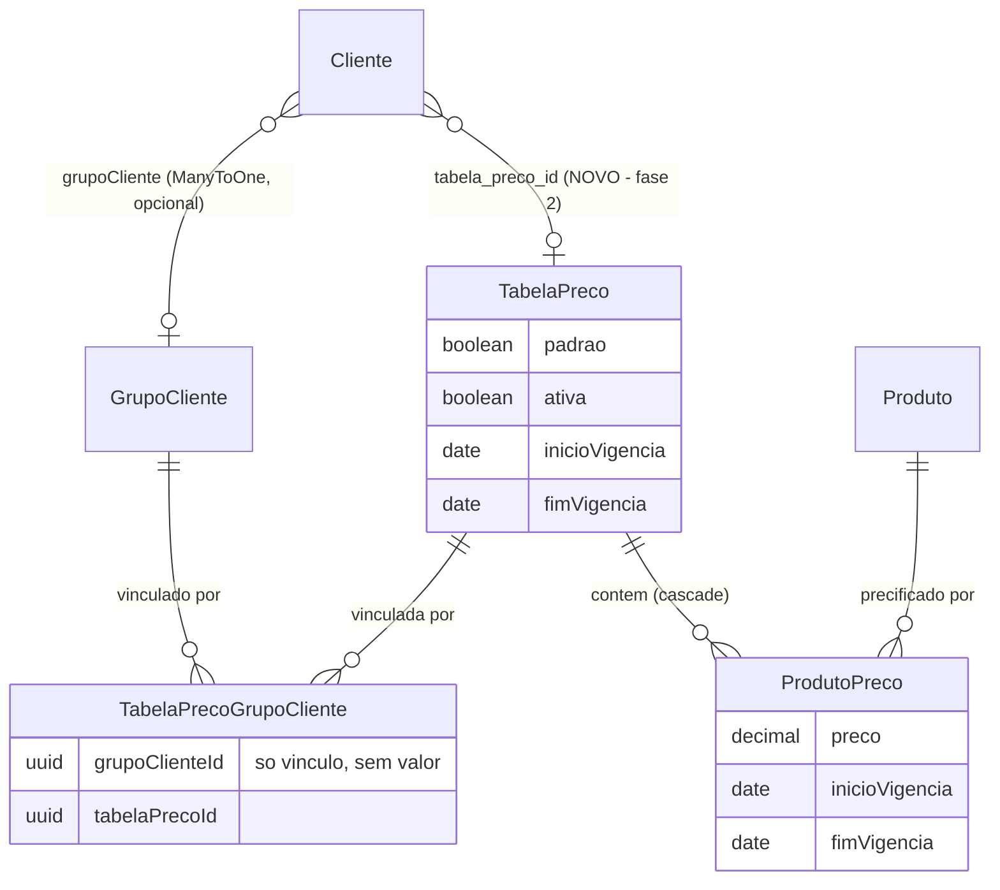
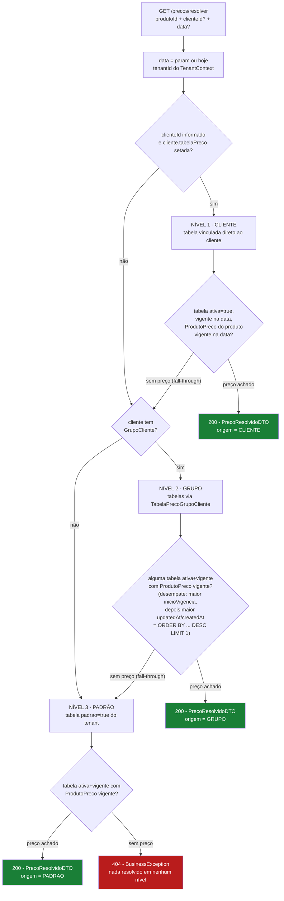
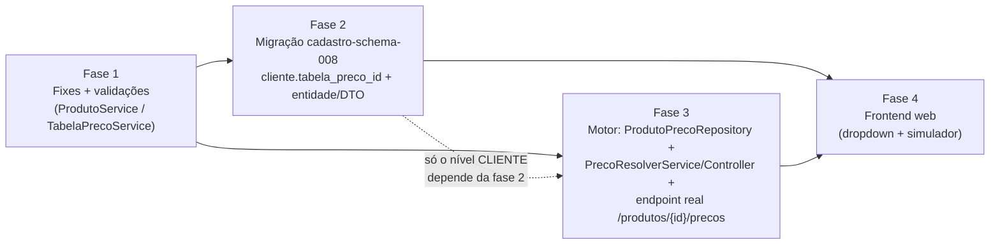

# Motor de resolução de preço (padrão → grupo → cliente) — Plano de implementação

**Status:** PLANEJADO (não iniciado) · **Data:** 2026-07-10 · **Serviços:** `cadastro-service` (foco) · `liquibase-service` (migração) · `Angular/erp-front-end-web` (fase 4)

**Decisões fechadas:** preço individual de cliente = **TabelaPreco vinculada direto ao cliente** (nova FK `cliente.tabela_preco_id`), **sem** entidade `PrecoCliente` nova · precedência **CLIENTE → GRUPO → PADRÃO** com fall-through por nível · desempate determinístico (maior `inicioVigencia`, depois maior `updatedAt`/`createdAt`) · validação de sobreposição de vigência **só dentro da mesma tabela** (tabelas distintas coexistem por design).

---

## Contexto / problema

Hoje existem 3 CRUDs de cadastro relacionados a preço, mas **nenhum motor que responda "qual o preço do produto X para o cliente Y na data Z"**:

- **`GrupoCliente`** — CRUD simples; `Cliente.grupoCliente` é `@ManyToOne` **opcional**.
- **`TabelaPreco`** — CRUD com flag `padrao`, `ativa`, vigência (`inicioVigencia`/`fimVigencia`) e lista de `produtoPrecos` persistida via cascade.
- **`TabelaPrecoGrupoCliente`** — associação N:N grupo↔tabela; **só vínculo**, sem valor próprio.

`ProdutoPreco` (produto + tabela + preço + vigência) é persistido por `ProdutoService.processProducts()` (`cadastro-service/src/main/java/com/l/erp/cadastroservice/services/ProdutoService.java:205-224`), alimentado pela aba "Preços" do form de Produto no `erp-front-end-web`.

**O que NÃO existe hoje:**
- Motor de resolução de preço (hierarquia padrão→grupo→individual).
- Validação de sobreposição de vigência (nem em `ProdutoPreco` nem em `TabelaPreco`).
- Endpoint de consulta real. O único parecido, `GET /api/v1/produtos/{id}/precos` (`ProdutoController.java:90-94`), é **stub/mock que retorna vazio** ("Mocks para os links HATEOAS").

**Bugs colaterais encontrados na investigação** (corrigir na fase 1):
- `ProdutoService.java:188` e `:211` — `.orElse(null)` silencioso em fornecedor/tabelaPreco: id inválido ou de outro tenant vira `null` sem erro.
- `TabelaPrecoService.java:100` — checagem de `padrao=true` no **update** não exclui o próprio registro → falso positivo de duplicidade ao salvar a própria tabela padrão. De quebra, a action de auditoria dessa linha usa `CREATION` num fluxo de update.
- `ProdutoController.java:60-61` — `tenantId`/`userId` **mockados** no create; os demais endpoints já usam `SecurityUtils`.

**Panorama visual do modelo atual** (o "motor" tracejado é o que falta):



> O que **não** existe: nada consulta esses relacionamentos para responder "preço do produto X para o cliente Y na data Z" — é o `PrecoResolverService` (fase 3) que vai percorrer esse grafo. A aresta `Cliente → TabelaPreco` marcada como **NOVO** é a única mudança de schema (fase 2).

**Frontends do monorepo:** 3 workspaces Angular — `erp-front-end-web` (tenant, **único** que consome cadastro-service/preço), `erp-front-end-admin` e `erp-front-end-partner` (**zero impacto**, não tocam preço).

---

## Decisão de modelagem — sem entidade PrecoCliente

Preço individual = uma `TabelaPreco` vinculada direto ao cliente via **nova coluna opcional `cliente.tabela_preco_id`** (FK, NULL).

**Justificativa:**
- Reaproveita `ProdutoPreco`, o CRUD de `TabelaPreco` e o cascade do `ProdutoService` — zero código novo de persistência de preço.
- O resolver fica **uniforme**: em todo nível ele resolve "qual tabela vale" e busca o `ProdutoPreco` nela. Um único caminho de código.

**Limitação aceita (caminho de upgrade):** se o volume de clientes com preço individual crescer muito (uma tabela inteira por cliente), migrar para entidade `PrecoCliente` dedicada — o resolver ganha um nível extra sem quebrar os demais.

---

## Endpoints

1. **`GET /api/v1/precos/resolver?produtoId={uuid}&clienteId={uuid, opcional}&data={yyyy-MM-dd, opcional, default hoje}`**
   Novos `PrecoResolverController` / `PrecoResolverService` / `PrecoResolvidoDTO`:
   ```
   PrecoResolvidoDTO { produtoId, clienteId, preco, moeda, origem [CLIENTE|GRUPO|PADRAO],
                       tabelaPrecoId, tabelaPrecoNome, inicioVigencia, fimVigencia }
   ```
   Nada resolvido → `BusinessException` **404**.
2. **Substituir o stub `GET /api/v1/produtos/{id}/precos`** por implementação real: lista de `ProdutoPreco` do produto via `ProdutoPrecoDTO`/mapper **já existentes**.
3. **Fora de escopo:** endpoint batch de resolução. Deixar o service com assinatura pura `resolver(produtoId, clienteId, data)` para facilitar depois.

---

## Algoritmo de resolução (`PrecoResolverService.resolver`)

1. `data` = parâmetro ou hoje; `tenantId` do `TenantContext`.
2. **Precedência por níveis:**
   - **Nível 1 — CLIENTE:** `cliente.tabelaPreco`, se setado.
   - **Nível 2 — GRUPO:** tabelas vinculadas ao grupo do cliente via `TabelaPrecoGrupoCliente`, se o cliente tem grupo.
   - **Nível 3 — PADRÃO:** tabela com `padrao=true` do tenant.
3. **Em cada nível:** a tabela precisa estar `ativa=true` e vigente na data (`inicioVigencia <= data` e (`fimVigencia` null ou `fimVigencia >= data`)); buscar o `ProdutoPreco` do produto nessa tabela, também vigente na data. **Primeiro preço achado vence.** Nível sem preço para o produto → fall-through para o próximo (não é erro).
4. **Desempate** — múltiplas tabelas vigentes no mesmo nível (ex.: grupo com 2 tabelas) ou `ProdutoPreco` duplicado (dados legados): maior `inicioVigencia`; empate → maior `updatedAt`/`createdAt`. Implementar como `ORDER BY ... DESC LIMIT 1` → comportamento determinístico mesmo com dados sujos.
5. Nada resolvido em nenhum nível → 404.
**Fluxo visual da cascata:**



6. **Implementação:** criar `ProdutoPrecoRepository` (**não existe hoje**) com query tipo `findPrecoVigente(produtoId, tabelaPrecoId, data, tenantId)`. Loop simples sobre os 3 níveis no service — 3 queries no pior caso, aceitável; otimizar só se virar gargalo medido.

---

## Validações de vigência a adicionar

- **`ProdutoService`** (antes de `processProducts`): validar **em memória** a lista `dto.precos()`:
  - `inicioVigencia <= fimVigencia` quando `fimVigencia != null`;
  - para o **mesmo** `tabelaPrecoId`, dois períodos não podem se sobrepor (`fimVigencia` null = aberto/infinito).
- **`TabelaPrecoService.save/update`**: validar `inicioVigencia <= fimVigencia`. **NÃO** validar sobreposição entre tabelas distintas — padrão + tabelas de grupo coexistindo é o design esperado; o resolver desempata.
- Erros como `BusinessException` **400**, padrão já usado na base (mensagens em PT-BR, via `GlobalExceptionHandler`).

---

## Fixes de bugs colaterais

1. `ProdutoService.java:211` e `:188` — trocar `.orElse(null)` por `.orElseThrow(BusinessException 400)` (fornecedor/tabela de preço inexistente ou de outro tenant deixa de virar null silencioso).
2. `TabelaPrecoService.java:100` — novo método `existsByPadraoIsTrueAndTenantIdAndIdNot(tenantId, id)` no repository, excluindo o próprio registro da checagem de duplicidade de `padrao`. Corrigir também a action de auditoria (usa `CREATION` num fluxo de update).
3. `ProdutoController.java:60-61` — trocar `tenantId`/`userId` mockados no create por `SecurityUtils`, como os demais endpoints.

---

## Impacto nos frontends

- **`erp-front-end-web`:** form de Cliente ganha dropdown **opcional** "Tabela de preço individual" (mesma fonte de dados de tabelas ativas que o form de Produto já usa). Nenhuma outra tela muda. **Opcional/não-bloqueante:** botão "Simular preço" chamando `/precos/resolver` — útil para validar o motor antes do módulo de vendas existir.
- **`erp-front-end-admin` / `erp-front-end-partner`:** zero impacto — não consomem cadastro-service.

---

## Fases

1. **Bugs + validações de vigência** (independente, pode ir primeiro) — os 3 fixes acima + validações no `ProdutoService`/`TabelaPrecoService` + testes unitários dos services afetados.
2. **Migração de schema** — novo changelog `cadastro/cadastro-schema-008.yaml` (próximo número livre; último existente é `cadastro-schema-007.yaml`): coluna `cliente.tabela_preco_id UUID NULL` + FK para `tabela_preco`. Campo `tabelaPreco` na entidade `Cliente` + DTOs + mapper.
3. **Motor** — `ProdutoPrecoRepository`, `PrecoResolverService`, `PrecoResolverController`, `PrecoResolvidoDTO`; endpoint real de `/produtos/{id}/precos` no lugar do stub. Níveis GRUPO e PADRÃO **não dependem da fase 2** — dá para entregar o motor com 2 níveis antes da migração, se necessário. Testes cobrindo: hierarquia completa, cliente sem grupo, sem `clienteId`, vigência expirada, tabela inativa, fall-through, desempate de sobreposição legada.
4. **Frontend web** — dropdown de tabela individual no form de Cliente + simulador opcional.

**Dependências entre fases:**



> Fase 3 com níveis **GRUPO/PADRÃO** pode ser entregue em paralelo à fase 2 — só o nível **CLIENTE** do resolver precisa da FK nova.

---

## Fora de escopo agora (YAGNI — caminho de upgrade documentado)

- **Endpoint batch de resolução** — assinatura pura `resolver(produtoId, clienteId, data)` já deixa o caminho pronto.
- **Constraint `EXCLUDE` do Postgres** para vigência — hardening futuro, changelog à parte.
- **Entidade `PrecoCliente` dedicada** — só se o volume de preço individual por cliente justificar (ver decisão de modelagem).
- **Cache do resolver** — 3 queries no pior caso; medir antes de cachear.