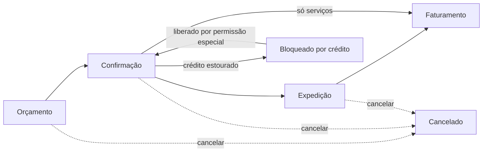

# O2C — Vendas: visão funcional

**Status:** decisões fechadas · **Data:** 2026-07-11 · **Rev.:** 3 de setembro de 2026 (crédito estourado ganha reabertura/cancelamento explícitos como alternativa à liberação; base do cálculo de crédito precisada para pedidos confirmados/expedidos ainda não faturados; nota sobre o `fiscal-service` já existir para cálculo fiscal, ainda não para emissão de NF-e) · **Rev.:** 3 de setembro de 2026 (venda de serviços: sem expedição nem estoque, nota fiscal de serviço no faturamento, impostos calculados no faturamento) · **Módulo:** `operacoes-service` (microsserviço único, também dono de compras e estoque)

> Este documento descreve o processo de venda em linguagem de negócio — sem schema de banco, endpoint ou detalhe técnico. Para a implementação, ver `spec/o2c-vendas.md`.

---

## Objetivo

Levar uma venda do orçamento até o faturamento, aplicando o preço correto (motor de preço), verificando crédito do cliente, e entregando ao financeiro um título a receber pronto para cobrança.

## O fluxo, passo a passo

### 1. Orçamento

O vendedor monta o pedido: cliente, itens, quantidades. Cada item pode ser **mercadoria ou serviço**, conforme o cadastro do produto — o sistema não trata os dois tipos como telas separadas, é o mesmo formulário de pedido. O preço de cada item vem automaticamente do motor de preço (preço do cliente, senão do grupo dele, senão o preço padrão da empresa). Se não houver preço cadastrado para aquele produto, o vendedor pode digitar um preço manualmente — o sistema registra que aquele preço foi digitado à mão, para auditoria.

Desconto por item é **livre** — o vendedor pode dar o desconto que achar necessário. Não há teto nem aprovação para desconto no lançamento inicial. Em compensação, todo desconto fica registrado e auditável (relatório gerencial de "descontos concedidos" para a diretoria acompanhar o comportamento comercial). O controle aqui é gerencial, não um bloqueio do sistema.

### 2. Confirmação

Ao confirmar o pedido, o sistema verifica:
- Se o cliente tem condição de pagamento definida (obrigatório).
- Se o cliente está com crédito disponível: soma o valor deste pedido com os outros pedidos **confirmados/expedidos e ainda não faturados** do cliente e compara com o limite de crédito cadastrado (pedidos em orçamento não entram na conta — ainda não são compromisso; pedidos já faturados viraram título e saem da exposição de crédito, não do limite).

**Se o crédito estourar, o pedido NÃO é rejeitado** — ele fica com status "Bloqueado por Crédito", esperando decisão. Um usuário com perfil de coordenador/gerente (permissão especial de liberação) pode confirmar mesmo assim, se a venda for aprovada por fora do sistema. Isso evita que o vendedor perca todo o trabalho de digitação por causa de um bloqueio duro. Se ninguém liberar, o vendedor tem duas saídas dentro do próprio fluxo: **reabrir o pedido** para ajustar valores/itens e tentar confirmar de novo, ou **cancelar** — não fica travado sem opção.

### 3. Expedição

Só existe para mercadoria. Pedido só de serviço vai da confirmação direto ao faturamento — não passa por depósito nem transportadora.

O pedido confirmado (com pelo menos um item de mercadoria) é expedido: informa-se o depósito de saída e, se houver frete, a transportadora. Num pedido misto (mercadoria + serviço), a expedição baixa estoque só da parte de mercadoria; o serviço segue no pedido até o faturamento.

**O sistema não verifica saldo de estoque nesta etapa.** Hoje o ERP não controla saldo real de estoque — a expedição é só um registro de que a mercadoria saiu. Fica a cargo da operação garantir fisicamente que o produto existe no depósito. **Essa ausência de verificação é temporária:** assim que o controle real de saldo estiver pronto (mesmo módulo de operações), a checagem é ligada automaticamente e a expedição passa a bloquear se não houver saldo — não é preciso trocar de sistema nem esperar um módulo novo, é a mesma funcionalidade sendo ativada.

**Atenção legal:** mercadoria não pode fisicamente sair da doca sem nota fiscal (XML/DANFE). **Hoje o `fiscal-service` já existe e já calcula os impostos da venda** (IBS/CBS/IS/ISS), mas ainda **não emite NF-e/NFC-e/NFS-e** — enquanto essa emissão não existir dentro do ERP, a empresa continua gerando a nota fiscal por fora (sistema emissor externo/SEFAZ) e anexando ao transporte. A regra vale **por tipo de item**, não é uma nota única para o pedido: a **NF-e acompanha a mercadoria na expedição** (é aqui que ela precisa estar pronta, porque é daqui que a mercadoria sai), e o **serviço tem NFS-e emitida no faturamento** (não há transporte a amarrar, a nota de serviço é por competência). Um **pedido misto emite as duas notas**, cada uma no seu momento. O sistema permite o fluxo interno avançar (confirmar, expedir, faturar) de forma desacoplada da emissão real das notas, mas elas têm que existir fisicamente antes do caminhão sair (mercadoria) ou até o faturamento (serviço).

### 4. Faturamento

Última etapa do processo de venda. **É neste momento que o sistema calcula os impostos** (IBS/CBS/IS para mercadoria, ISS para serviço, mais retenções quando aplicáveis) — antes do faturamento o pedido só tem valores de venda, sem imposto. Com o total da nota em mãos, o sistema calcula as parcelas de acordo com a condição de pagamento do cliente e envia ao financeiro um título a receber, pronto para cobrança. **O título a receber é sobre o valor da nota fiscal (venda + impostos, menos retenções), não sobre o valor do orçamento** — a venda "vira dinheiro a receber" pelo valor que realmente vai constar no documento fiscal.

Como dito acima, isso pode acontecer **antes** de existir emissão de NF-e/NFS-e dentro do próprio ERP — o faturamento sistêmico (calcular imposto e gerar o título financeiro) é independente da emissão da nota em si nesta fase do projeto.

### Cancelamento

Pode ser feito em qualquer etapa antes do faturamento, sempre com um motivo obrigatório. Depois de faturado, o pedido não pode mais ser cancelado dentro do fluxo de vendas — qualquer estorno passa a ser um assunto do financeiro (renegociação, distrato), não mais do módulo de vendas.

---

## Resumo das regras de negócio

| Situação | Regra |
|---|---|
| Preço sem cadastro no motor de preço | Vendedor digita manualmente; fica marcado como preço manual |
| Desconto do vendedor | Livre, sem teto, auditado em relatório |
| Limite de crédito estourado | Bloqueio "soft" — pedido fica pendente, liberável por permissão especial |
| Saldo de estoque | Não verificado no MVP — expedição é só registro |
| Item de serviço | Não passa por expedição/estoque; vai direto da confirmação ao faturamento |
| Impostos | Calculados no faturamento (IBS/CBS/IS/ISS + retenções); título a receber é sobre o valor da nota, não do orçamento |
| Nota fiscal (NF-e/NFS-e) | Emitida por fora do sistema por enquanto; faturamento sistêmico não depende dela |
| Cancelamento | Permitido até antes do faturamento, com motivo obrigatório |

## O que fica de fora por enquanto

- Emissão de NF-e/NFC-e/NFS-e dentro do sistema (o `fiscal-service` já existe e já calcula os impostos da venda; falta só a emissão — NF-e entra na expedição, NFS-e entra no faturamento).
- Controle real de saldo de estoque (mesmo módulo de operações — hoje desligado, liga quando ficar pronto).
- Teto/alçada de desconto por perfil de vendedor.
- Devolução de mercadoria (RMA).
- Comissão de vendedor (spec própria, futura).
- Faturamento parcial ou recorrente de serviço (medição, mensalidade) — primeira evolução prevista depois do MVP.
