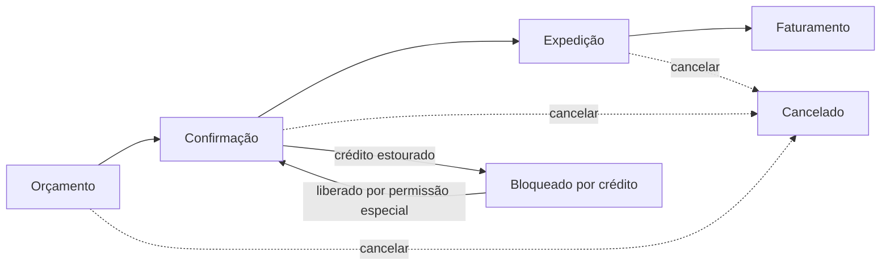

# O2C — Vendas: visão funcional

**Status:** decisões fechadas · **Data:** 2026-07-11 · **Módulo:** `operacoes-service` (microsserviço único, também dono de compras e estoque)

> Este documento descreve o processo de venda em linguagem de negócio — sem schema de banco, endpoint ou detalhe técnico. Para a implementação, ver `spec/o2c-vendas.md`.

---

## Objetivo

Levar uma venda do orçamento até o faturamento, aplicando o preço correto (motor de preço), verificando crédito do cliente, e entregando ao financeiro um título a receber pronto para cobrança.

## O fluxo, passo a passo

### 1. Orçamento

O vendedor monta o pedido: cliente, itens, quantidades. O preço de cada item vem automaticamente do motor de preço (preço do cliente, senão do grupo dele, senão o preço padrão da empresa). Se não houver preço cadastrado para aquele produto, o vendedor pode digitar um preço manualmente — o sistema registra que aquele preço foi digitado à mão, para auditoria.

Desconto por item é **livre** — o vendedor pode dar o desconto que achar necessário. Não há teto nem aprovação para desconto no lançamento inicial. Em compensação, todo desconto fica registrado e auditável (relatório gerencial de "descontos concedidos" para a diretoria acompanhar o comportamento comercial). O controle aqui é gerencial, não um bloqueio do sistema.

### 2. Confirmação

Ao confirmar o pedido, o sistema verifica:
- Se o cliente tem condição de pagamento definida (obrigatório).
- Se o cliente está com crédito disponível: soma o valor deste pedido com os outros pedidos em aberto do cliente e compara com o limite de crédito cadastrado.

**Se o crédito estourar, o pedido NÃO é rejeitado** — ele fica com status "Bloqueado por Crédito", esperando decisão. Um usuário com perfil de coordenador/gerente (permissão especial de liberação) pode confirmar mesmo assim, se a venda for aprovada por fora do sistema. Isso evita que o vendedor perca todo o trabalho de digitação por causa de um bloqueio duro.

### 3. Expedição

O pedido confirmado é expedido: informa-se o depósito de saída e, se houver frete, a transportadora.

**O sistema não verifica saldo de estoque nesta etapa.** Hoje o ERP não controla saldo real de estoque — a expedição é só um registro de que a mercadoria saiu. Fica a cargo da operação garantir fisicamente que o produto existe no depósito. **Essa ausência de verificação é temporária:** assim que o controle real de saldo estiver pronto (mesmo módulo de operações), a checagem é ligada automaticamente e a expedição passa a bloquear se não houver saldo — não é preciso trocar de sistema nem esperar um módulo novo, é a mesma funcionalidade sendo ativada.

**Atenção legal:** mercadoria não pode fisicamente sair da doca sem nota fiscal (XML/DANFE). Enquanto o `fiscal-service` (emissão de NF-e) não existir dentro do ERP, a empresa continua emitindo a nota fiscal por fora (sistema emissor externo/SEFAZ) e anexando ao transporte — o sistema permite o fluxo interno avançar (confirmar, expedir, faturar) de forma desacoplada da emissão real da nota, mas a nota tem que existir fisicamente antes do caminhão sair.

### 4. Faturamento

Última etapa do processo de venda: o sistema calcula as parcelas de acordo com a condição de pagamento do cliente e envia ao financeiro um título a receber, pronto para cobrança. É o momento em que a venda "vira dinheiro a receber".

Como dito acima, isso pode acontecer **antes** de existir emissão de NF-e dentro do próprio ERP — o faturamento sistêmico (gerar o título financeiro) é independente da nota fiscal em si nesta fase do projeto.

### Cancelamento

Pode ser feito em qualquer etapa antes do faturamento, sempre com um motivo obrigatório. Depois de faturado, o pedido não pode mais ser cancelado dentro do fluxo de vendas — qualquer estorno passa a ser um assunto do financeiro (renegociação, distrato), não mais do módulo de vendas.

---

## Resumo das regras de negócio

| Situação | Regra |
|---|---|
| Preço sem cadastro no motor de preço | Vendedor digita manualmente; fica marcado como preço manual |
| Desconto do vendedor | Livre, sem teto, auditado em relatório |
| Limite de crédito estourado | Bloqueio "soft" — pedido fica pendente, liberável por permissão especial |
| Saldo de estoque | Não verificado no MVP — expedição é só registro |
| Nota fiscal (NF-e) | Emitida por fora do sistema por enquanto; faturamento sistêmico não depende dela |
| Cancelamento | Permitido até antes do faturamento, com motivo obrigatório |

## O que fica de fora por enquanto

- Emissão de NF-e dentro do sistema (entra com o `fiscal-service`).
- Controle real de saldo de estoque (mesmo módulo de operações — hoje desligado, liga quando ficar pronto).
- Teto/alçada de desconto por perfil de vendedor.
- Devolução de mercadoria (RMA).
- Comissão de vendedor (spec própria, futura).
