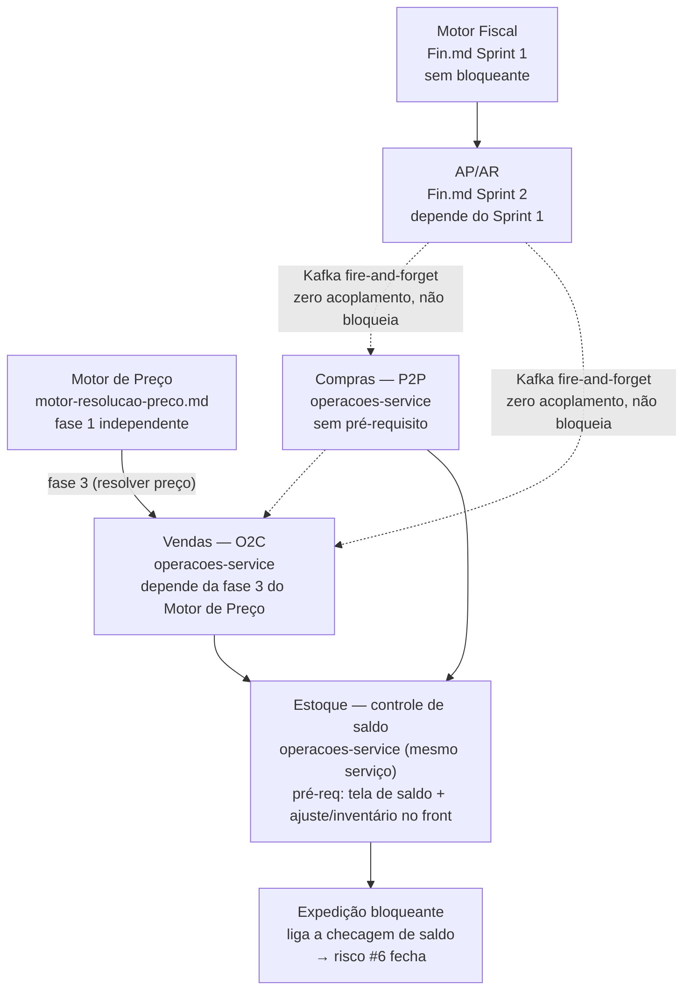
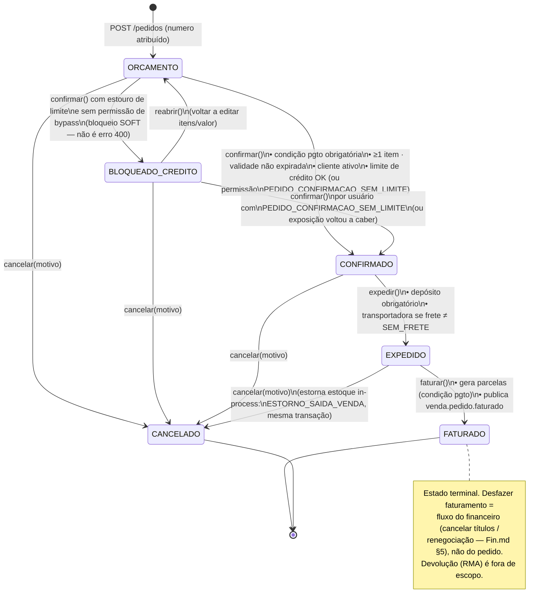
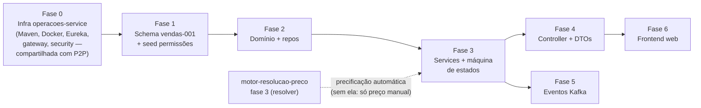

# O2C — Vendas (Order-to-Cash): orçamento → pedido → expedição → faturamento — Plano de implementação

**Status:** EM IMPLEMENTAÇÃO — Fase 0 (infra) feita, não testada · **Data:** 2026-07-10 · **Rev.:** 2026-07-11 (decisões do usuário aplicadas) · **Rev. 2:** 2026-07-11 (arquitetura consolidada) · **Rev. 3:** 2026-07-23 (ordem de implementação com estoque + pré-requisito de UI do bloqueio de expedição) · **Rev. 4:** 2026-09-01 (Fase 0 implementada — módulo `operacoes-service` criado, não testada) · **Serviços:** `operacoes-service` (**novo**, foco — também dono de P2P e estoque, ver `p2p-compras.md`) · `cadastro-service` (validação de referências + motor de preço, via API) · `fiscal-service` (**novo** — dono futuro de NF-e/motor fiscal) · `liquibase-service` (migração) · `auth-service` (seed de permissões) · `Angular/erp-front-end-web` (última fase)

**Decisões fechadas (rev. 2026-07-11):**
- **[Rev. 2] O módulo nasce dentro de um único microsserviço novo, `operacoes-service`** — decisão revista do usuário: em vez de 3 serviços separados (venda/compra/estoque), **vendas, compras e estoque vivem juntos num só serviço** (`operacoes-service`, schemas `vendas`/`compras`/`estoque` no mesmo Postgres `loop-erp`), porque os três domínios compartilhariam banco mesmo sendo serviços distintos — juntar evita pagar o custo de 3 infra novas (Maven/Docker/Eureka/gateway/Jenkins × 3) sem ganhar isolamento real. Só o **`fiscal-service`** continua separado (ciclo de vida próprio — NF-e/SEFAZ). Consequências na seção "Onde o módulo vive".
- Referências a cadastros (`cliente`, `produto`, `vendedor`, `condicao_pagamento`, `transportadora`, `deposito`, `tabela_preco`) são **UUIDs sem FK física** — validação de existência/atividade via HTTP ao `cadastro-service` (`RestClient` `@LoadBalanced` via Eureka, ver §2/§7). Essa fronteira continua existindo porque cadastro-service segue sendo serviço separado.
- Precificação de item via **`GET /api/v1/precos/resolver` por HTTP** no `cadastro-service` (o `PrecoResolverService` mora lá, junto com `Produto`/`Cliente`/`TabelaPreco` — chamada HTTP entre serviços, não in-process, porque o motor de preço não faz parte do `operacoes-service`), com **snapshot congelado no item** (preço, tabela, origem). Resolver 404 → permite preço manual com flag `preco_manual = true`.
- Máquina de estados: `ORCAMENTO → CONFIRMADO → EXPEDIDO → FATURADO`, com `CANCELADO` alcançável de qualquer estado pré-faturamento e **novo estado `BLOQUEADO_CREDITO`** (bloqueio SOFT de limite — decisão do usuário, §4/§7). Sem estado de separação/picking no MVP.
- Integração com o financeiro: **evento Kafka `venda.pedido.faturado`** no faturamento; o futuro `financeiro-service` consome e cria N títulos a receber com `origem = 'NF_SAIDA'` (consistente com Fin.md §11.2 e F4.3). Enquanto o financeiro não existir, o evento fica publicado e ignorado (sem consumer) — zero acoplamento. Publicação sempre **após commit** da transação de faturamento (§8) — nunca publicar título de um faturamento que sofreu rollback.
- NF-e/NFC-e e o motor fiscal IBS/CBS são responsabilidade do **`fiscal-service`** (único serviço que permanece separado, spec próprio futuro). Os pontos de integração reservados neste spec apontam para ele (§8).
- **Faturar sem NF-e no MVP: aceito, com ressalva operacional** — mercadoria não sai da doca sem XML/DANFE; a operação emite a NF-e num emissor externo por fora e anexa ao transporte enquanto o `fiscal-service` não existir (documentado em §7-expedição e §8).
- **Estoque não bloqueante: confirmado** — vender/expedir sem validar saldo; estoque negativo sistêmico aceitável no MVP. **[Rev. 2]** Como estoque agora é módulo do mesmo `operacoes-service` (não mais serviço externo), a expedição atualiza `movimento_estoque`/`estoque_saldo` **in-process**, na mesma transação (chamada Java direta ao módulo de estoque, sem Kafka) — mais simples e sem ganho nenhum em manter assíncrono dentro do mesmo processo. **Essa ausência de validação é uma flag temporária**: quando o controle real de disponibilidade for implementado (mesma base, mesmo serviço), a expedição passa a checar saldo antes da transição e a flag é desativada — não é preciso mudar de serviço nem de schema para isso, só ligar a validação que hoje está desligada.
- **Desconto do vendedor: confirmado livre e apenas auditado** (snapshot de preço de tabela). Decisão fechada — sem teto no MVP.
- Parcelas do título calculadas a partir de **`CondicaoPagamentoParcela`** (obtidas do `cadastro-service` via API no faturamento); resto de arredondamento vai na última parcela.
- Numeração do pedido: sequencial por tenant via tabela `vendas.pedido_sequencia` com `SELECT ... FOR UPDATE`.

---

## Ordem de implementação (com estoque)

O estoque **não é uma caixa nova** paralela ao Motor Fiscal ou ao Motor de Preço — ele já mora **dentro do `operacoes-service`** (mesmo serviço do O2C/P2P). O que tem fases é a *maturidade* dele. Hoje o saldo já existe como número (recebimento soma, expedição subtrai, pode ficar negativo), mas **sem tela e sem bloqueio**. Fechar o buraco de "faturar mercadoria fantasma" (o risco #6, ver §7-expedição) é **ligar a checagem de saldo na expedição** — e isso tem um pré-requisito que o diagrama de módulos esconde: **antes de bloquear, é preciso uma tela de saldo e um caminho de ajuste/inventário**, senão todo saldo começa em 0 e o sistema barraria *toda* venda no dia 1.



Leitura: **P2P e O2C alimentam o estoque** (geram `movimento_estoque` ao receber/expedir) — por isso o EST depende dos dois, e **não** do Fiscal nem do Preço. O EST vira bloqueio (`BLK`) só depois de existir tela de saldo + ajuste/inventário no frontend (hoje só há o cadastro de `deposito`, sem tela de saldo). Enquanto isso, expedição segue registrando sem travar (decisão aceita, §7-expedição).

---

## 1. Contexto

### O que existe hoje (verificado no código)

- **Nenhuma entidade de venda.** `cadastro-service/domain/` tem só cadastros: `Cliente`, `Produto`, `Deposito`, `Vendedor`, `CondicaoPagamento`(+`Parcela`), `Transportadora`, `TabelaPreco`, `ProdutoPreco`, `GrupoCliente`, `ProdutoEstoqueConfig` etc. Grep por `class (Pedido|ItemPedido|Orcamento|Venda)` em todo o monorepo: **zero resultados**. Nenhum controller/DTO parcial de pedido em nenhum serviço.
- **Insumos prontos para o O2C** (todos em `cadastro-service`, schema `cadastros`):
  - `Cliente` — tem `condicaoPagamento` (default), `vendedor` (default), `grupoCliente`, **`limiteCredito` numeric(15,2)** e **`classificacaoRisco`** (`Cliente.java:60-65`), `ativo`.
  - `CondicaoPagamentoParcela` — `numeroParcela`, `dias` (prazo), `percentual`, `formaPagamento` (enum). É exatamente o insumo para gerar vencimentos de título.
  - `Deposito`, `Transportadora`, `Vendedor` — CRUDs completos com controller.
  - `TabelaPreco`/`ProdutoPreco`/`GrupoCliente` — base do motor de preço (spec `motor-resolucao-preco.md`, planejado).
- **O que NÃO existe:** saldo de estoque (nenhuma tabela de movimentação/saldo — `ProdutoEstoqueConfig` é só parametrização min/max), `financeiro-service` (Fin.md é spec), NF-e, campo `bloqueado_para_vendas` no cliente (Fin.md §dunning D+15 prevê marcar o cliente e emitir evento "consumível pelo futuro módulo de pedidos" — hook documentado na seção de validações).

### Por que agora

Fin.md §11.2 (Diagrama 2, track O2C) marca **vendas/pedido** como "❌ fora do escopo — Módulo de Vendas" e define o contrato de saída: *"Ao confirmar pedido/NF de saída, dispara `POST /api/financeiro/titulos/receber` com `origem = 'NF_SAIDA'`"*. O motor de resolução de preço (spec já fechado) responde "qual o preço do produto X para o cliente Y na data Z" — a pergunta que só o pedido de venda faz. O O2C é o primeiro consumidor real do motor e o produtor dos títulos a receber do financeiro: é a peça que liga cadastros → preço → financeiro.

---

## 2. Onde o módulo vive — decisão e consequências

**[Rev. 2] Microsserviço `operacoes-service`, compartilhado com P2P e estoque** — decisão revista do usuário (2026-07-11): em vez de `venda-service`/`compra-service`/`estoque-service` como 3 serviços separados, os três domínios vivem **num único serviço novo** (schemas `vendas`, `compras`, `estoque` — ver `p2p-compras.md`), porque compartilhariam o mesmo Postgres de qualquer forma; juntar evita pagar 3× o custo de infra (Maven/Docker/Eureka/gateway/Jenkins) sem ganhar isolamento real. Só o **`fiscal-service`** nasce separado (ciclo de vida próprio de NF-e/SEFAZ, spec futuro). O custo de infra do serviço novo (único, não triplicado) é **custo aceito**.

Parâmetros (seguindo o padrão verificado nos `application.yaml` dos serviços existentes):
- **Banco:** o mesmo Postgres **`loop-erp`** compartilhado (auth/cadastro/partner/billing apontam todos para `jdbc:postgresql://.../loop-erp` e isolam por schema), com schemas próprios **`vendas`**, **`compras`**, **`estoque`** dentro do mesmo `operacoes-service`. DDL 100% no `liquibase-service`; o serviço roda `ddl-auto=validate`.
- **Porta:** `8089` (faixa 8085-8088 e 8090 ocupadas — ver tabela de módulos do CLAUDE.md).
- **Infra a criar:** módulo Maven no POM raiz, `Dockerfile`, `spring.application.name=operacoes-service` + registro no Eureka, rota no gateway, `SecurityConfig` + leitura de `X-Tenant-Id` (replicar o padrão `TenantInterceptor`/`TenantContext`/`SecurityUtils`/`BaseTenantEntity` do cadastro-service), estágio no Jenkinsfile/Sonar, gate JaCoCo. **Uma única fase 0** cobre vendas+compras+estoque (ver "Fases de implementação" e a nota equivalente em `p2p-compras.md` — não duplicar infra).

**Consequências (explícitas):**
1. **Sem integridade referencial com cadastros** (fronteira que permanece, pois cadastro-service segue sendo serviço separado). `cliente_id`, `produto_id`, `vendedor_id`, `condicao_pagamento_id`, `transportadora_id`, `deposito_id`, `tabela_preco_id` são colunas **UUID sem FK física** — o banco não impede referência órfã. A validação de existência/atividade acontece na borda (criação/edição e revalidada em cada transição) via HTTP ao `cadastro-service`.
2. **Padrão de chamada síncrona ao cadastro-service:** o monorepo hoje **não tem** chamada HTTP serviço-a-serviço interna (só clients para APIs externas — Asaas, ViaCEP, CNPJá — com `RestClient`/`RestTemplate`). Padrão proposto, consistente com o stack Spring Cloud já presente: **`RestClient` com `@LoadBalanced` resolvendo `lb://cadastro-service` via Eureka** (sem adicionar dependência OpenFeign nova). O `cadastro-service` ganha um endpoint interno de **validação em lote** (ex.: `POST /api/v1/interno/referencias/validar` — recebe mapa tipo→ids, devolve existência + `ativo` por id) para evitar N chamadas por pedido; a chamada propaga `X-Tenant-Id`/`X-Correlation-ID`.
3. **Motor de preço vira HTTP:** `GET /api/v1/precos/resolver` por item (ou variante em lote) no cadastro-service — ver §6.
4. **Estoque vira chamada in-process, não evento** — [Rev. 2] com vendas/compras/estoque no mesmo serviço, a expedição chama o módulo de estoque **direto, na mesma transação Java** (sem Kafka): mais simples, sem perda de garantia nenhuma, já que estão no mesmo processo. Kafka continua fazendo sentido só nas fronteiras reais entre serviços (cadastro-service, financeiro-service, fiscal-service).
5. **Rota no gateway:** hoje o gateway roteia `Path=/api/**` para o cadastro-service (catch-all, verificado em `gateway/application.yml`). As rotas novas (`/api/v1/pedidos/**`, `/api/v1/compras/**`, `/api/v1/estoque/**` → `lb://operacoes-service`) precisam ser declaradas **antes** da rota catch-all do cadastro, senão o cadastro engole a chamada.

> **Riscos aceitos com a decisão (registrados):** consistência apenas eventual entre operações e cadastro (um cliente pode ser inativado entre a validação e a confirmação — mitigado revalidando em cada transição de estado); latência extra de 1-2 chamadas HTTP por operação de escrita ao cadastro-service; e ausência de transação distribuída **nessa fronteira** — aceitável porque nenhum fluxo aqui precisa de atomicidade cross-serviço com o cadastro: toda escrita de vendas/compras/estoque é local (mesma transação, mesmo serviço) e as integrações externas (financeiro, fiscal) são eventos Kafka idempotentes com payload rico (padrão Fin.md).

---

## 3. Modelagem de dados (schema `vendas`)

Padrões replicados do cadastro-service no `operacoes-service`: `id UUID` gerado, `extends BaseTenantEntity` (filtro multi-tenant via `tenant_id BIGINT NOT NULL`), colunas de auditoria `created_at`/`created_by`/`updated_at`/`last_updated_by`, `@Table(schema = "vendas")` no banco compartilhado `loop-erp`.

> **Referências cross-serviço:** colunas marcadas "ref. cadastro" abaixo são UUID **sem FK física** (a entidade referenciada mora no banco lógico do cadastro-service). FKs físicas existem apenas **dentro** do schema `vendas` (`pedido_item → pedido`, `pedido_status_historico → pedido`).

### 3.1 `vendas.pedido`

| Coluna | Tipo | Null | Notas |
|---|---|---|---|
| `id` | UUID PK | not null | `GenerationType.UUID` |
| `tenant_id` | BIGINT | not null | `BaseTenantEntity` |
| `numero` | BIGINT | not null | sequencial por tenant; **UNIQUE (tenant_id, numero)** |
| `status` | VARCHAR(20) | not null | enum `StatusPedido` (STRING) |
| `cliente_id` | UUID (ref. cadastro, sem FK) | not null | validado via API do cadastro-service |
| `vendedor_id` | UUID (ref. cadastro, sem FK) | null | default: vendedor default do cliente na criação (retornado pela API) |
| `condicao_pagamento_id` | UUID (ref. cadastro, sem FK) | null | default: condição default do cliente; **obrigatória na confirmação** (validação, não constraint) |
| `transportadora_id` | UUID (ref. cadastro, sem FK) | null | obrigatória na expedição só se `modalidade_frete != SEM_FRETE` |
| `deposito_id` | UUID (ref. cadastro, sem FK) | null | **obrigatório na expedição** |
| `modalidade_frete` | VARCHAR(10) | not null | enum `ModalidadeFrete`: `CIF` \| `FOB` \| `SEM_FRETE` (default) |
| `valor_frete` | NUMERIC(15,2) | null | |
| `valor_itens` | NUMERIC(15,2) | not null | soma dos itens (bruto) |
| `valor_desconto` | NUMERIC(15,2) | not null default 0 | soma dos descontos de item |
| `valor_total` | NUMERIC(15,2) | not null | `valor_itens - valor_desconto + valor_frete` |
| `data_emissao` | DATE | not null | data do orçamento; **data usada no resolver de preço** |
| `data_validade` | DATE | null | validade do orçamento; expirado → não confirma |
| `data_confirmacao` | TIMESTAMP | null | |
| `data_expedicao` | TIMESTAMP | null | |
| `data_faturamento` | TIMESTAMP | null | |
| `data_cancelamento` | TIMESTAMP | null | |
| `motivo_cancelamento` | VARCHAR(500) | null | obrigatório ao cancelar |
| `observacao` | VARCHAR(1000) | null | |
| `created_at` / `created_by` / `updated_at` / `last_updated_by` | | | padrão do serviço |

### 3.2 `vendas.pedido_item`

| Coluna | Tipo | Null | Notas |
|---|---|---|---|
| `id` | UUID PK | not null | |
| `tenant_id` | BIGINT | not null | |
| `pedido_id` | UUID FK → `vendas.pedido` | not null | `@ManyToOne`; itens gerenciados por cascade no agregado Pedido (mesmo padrão `TabelaPreco`→`ProdutoPreco`) |
| `produto_id` | UUID (ref. cadastro, sem FK) | not null | validado via API; **UNIQUE (pedido_id, produto_id)** — sem linha duplicada do mesmo produto |
| `quantidade` | NUMERIC(15,4) | not null | > 0 |
| `preco_unitario` | NUMERIC(15,2) | not null | preço praticado (resolvido ou manual) |
| `desconto` | NUMERIC(15,2) | not null default 0 | absoluto, por linha; `< quantidade × preco_unitario` |
| `valor_total` | NUMERIC(15,2) | not null | `quantidade × preco_unitario − desconto` |
| `preco_manual` | BOOLEAN | not null default false | true quando o resolver deu 404 ou o usuário sobrescreveu |
| `preco_tabela` | NUMERIC(15,2) | null | snapshot do preço resolvido (null se manual sem resolução) |
| `tabela_preco_id` | UUID (ref. cadastro, sem FK) | null | snapshot: tabela que resolveu |
| `origem_preco` | VARCHAR(10) | null | snapshot: `CLIENTE` \| `GRUPO` \| `PADRAO` (do `PrecoResolvidoDTO`) |
| auditoria | | | padrão do serviço |

> Os campos `preco_tabela`/`tabela_preco_id`/`origem_preco` são **snapshot congelado** — o pedido não muda se a tabela de preço mudar depois. É a trilha de auditoria de "de onde veio esse preço" e a base do relatório futuro de desconto vs. tabela.
>
> **Escopo do relatório de desconto — vs. tabela, não vs. custo (nota de decisão):** o relatório gerencial de "descontos concedidos" (`o2c-vendas-funcional.md`) mede **quanto o vendedor abateu do preço de tabela** — usa o snapshot acima, **não** toca em custo nem calcula margem. **Não existe relatório de margem (preço − custo) no MVP de vendas.** Consequência: a preocupação de "margem não confiável" só se materializa *quando* uma visão de margem for construída — aí ela dependeria do `preco_custo` do produto, que é mantido **manualmente** (não atualiza sozinho na compra — ver `p2p-compras.md`). Enquanto o relatório for só desconto-vs-tabela, ele é auto-suficiente e correto. Upgrade de margem confiável: `p2p-compras.md` (custo médio/landed cost).

### 3.3 `vendas.pedido_status_historico`

| Coluna | Tipo | Notas |
|---|---|---|
| `id` UUID PK · `tenant_id` BIGINT | | |
| `pedido_id` | UUID FK → `vendas.pedido` not null | |
| `status_de` / `status_para` | VARCHAR(20) | `status_de` null na criação |
| `motivo` | VARCHAR(500) null | preenchido no cancelamento |
| `created_at` / `created_by` | | quem transicionou, quando |

Insert em **toda** transição (inclusive criação). Sem update/delete — append-only.

### 3.4 `vendas.pedido_sequencia`

| Coluna | Tipo | Notas |
|---|---|---|
| `tenant_id` | BIGINT PK | |
| `proximo_numero` | BIGINT not null default 1 | |

`PedidoNumeroService`: `SELECT proximo_numero FROM vendas.pedido_sequencia WHERE tenant_id = ? FOR UPDATE` → incrementa → retorna. Linha criada on-demand (upsert) no primeiro pedido do tenant. Número atribuído **na criação do orçamento** (orçamento e pedido compartilham a numeração — o que distingue é o `status`).

> **Por que não reaproveita `compra_numeracao` (p2p-compras.md §"Modelagem de dados")?** O P2P tem 4 tipos de documento com numeração independente (requisição, cotação, pedido, recebimento), por isso sua tabela tem PK composta `tenant_id + tipo_documento`. O O2C tem um único tipo de documento numerado (orçamento/pedido, mesma sequência), então a PK simples `tenant_id` já resolve — não é duplicação de padrão por descuido, é o formato mais simples pro caso de uso de vendas.

### 3.5 Enum `StatusPedido` (Java, `EnumType.STRING`)

`ORCAMENTO`, `BLOQUEADO_CREDITO`, `CONFIRMADO`, `EXPEDIDO`, `FATURADO`, `CANCELADO`.

### 3.6 Changelog Liquibase

Nova pasta `liquibase-service/src/main/resources/db/changelog/vendas/` (padrão por schema, como `auth/`, `cadastro/`, `billing/`) — o `liquibase-service` continua sendo o dono único do DDL mesmo com o schema pertencendo ao novo `operacoes-service` (mesmo banco `loop-erp`):
- `vendas-schema-001.yaml` — `CREATE SCHEMA vendas` + as 4 tabelas + **FKs internas do schema apenas** (`pedido_item→pedido`, `pedido_status_historico→pedido`; colunas de referência a cadastros são UUID sem FK) + uniques + índices (`pedido(tenant_id, status)`, `pedido(tenant_id, cliente_id)`, `pedido_item(pedido_id)`, `pedido_status_historico(pedido_id)`), incluída no `db.changelog-master.yaml`.
- **Não colide** com `cadastro/cadastro-schema-008.yaml`, já reservado pelo spec do motor de preço.

---

## 4. Máquina de estados



Regras transversais:
- **Edição de cabeçalho e itens só em `ORCAMENTO`.** `BLOQUEADO_CREDITO` é imutável — para editar, `reabrir()` de volta a `ORCAMENTO`. De `CONFIRMADO` em diante, o pedido é imutável exceto pelos campos da própria transição (depósito/transportadora/frete na expedição).
- `BLOQUEADO_CREDITO` **não é erro**: o `confirmar()` com estouro retorna 200 com o pedido no novo status (o front mostra o motivo — limite e exposição — vindos no response). Erro 400 fica só para transição inválida/validação estrutural.
- Transição inválida (ex.: faturar um `ORCAMENTO`) → `BusinessException` 400, mensagem PT-BR (`GlobalExceptionHandler` do `common`).
- Toda transição grava `pedido_status_historico` e publica evento de auditoria Kafka (padrão `AuditEventDTO` já usado no serviço), com actions em `common/Constants.java` (diretiva de constantes do projeto).
- Concorrência: transições fazem `SELECT ... FOR UPDATE` no pedido (ou `@Version` otimista — decidir na implementação; pessimista é mais simples e o volume é baixo).

---

## 5. Endpoints REST (`operacoes-service`, base `/api/v1/pedidos`)

Rota nova no gateway: `Path=/api/v1/pedidos/**` → `lb://operacoes-service`, declarada **antes** do catch-all `Path=/api/**` do cadastro-service. Autenticação/tenant: mesmo pipeline (gateway injeta headers → `SecurityUtils`/`TenantContext` replicados no serviço novo). Todos os endpoints filtram por tenant. Permissões RBAC novas (seed no auth, padrão `DOMINIO_ACAO`): `PEDIDO_LEITURA`, `PEDIDO_ESCRITA`, `PEDIDO_CONFIRMACAO`, `PEDIDO_EXPEDICAO`, `PEDIDO_FATURAMENTO`, `PEDIDO_CANCELAMENTO` e **`PEDIDO_CONFIRMACAO_SEM_LIMITE`** (bypass do bloqueio de crédito — parte do MVP, decisão do usuário).

| # | Rota | Método | Quem chama | Descrição |
|---|---|---|---|---|
| 1 | `/api/v1/pedidos` | POST | front web (tela nova de orçamento) | Cria orçamento (status `ORCAMENTO`). Body: `clienteId`, `dataEmissao?` (default hoje), `dataValidade?`, `vendedorId?`, `condicaoPagamentoId?`, `modalidadeFrete?`, `observacao?`, `itens[] { produtoId, quantidade, precoUnitario?, desconto? }`. Defaults de vendedor/condição herdados do cliente. Cada item sem `precoUnitario` passa pelo resolver (§6). Response 201: `PedidoResponseDTO` completo. |
| 2 | `/api/v1/pedidos/{id}` | PUT | front web | Atualiza cabeçalho + **lista completa de itens** (replace-all com re-resolução dos itens novos, padrão do form de Produto/preços). Só em `ORCAMENTO`; senão 400. |
| 3 | `/api/v1/pedidos/{id}` | GET | front web | Detalhe com itens + histórico de status. |
| 4 | `/api/v1/pedidos` | GET | front web | Lista paginada (HATEOAS, padrão dos demais CRUDs). Filtros: `status`, `clienteId`, `vendedorId`, `numero`, `dataEmissaoDe/Ate`. |
| 5 | `/api/v1/pedidos/{id}/confirmar` | POST | front web | De `ORCAMENTO` ou `BLOQUEADO_CREDITO`. Validações §7. Sem body. Com estouro de limite: usuário **com** `PEDIDO_CONFIRMACAO_SEM_LIMITE` → `CONFIRMADO`; **sem** → `BLOQUEADO_CREDITO` (200, não 400). |
| 6 | `/api/v1/pedidos/{id}/expedir` | POST | front web | Transição → `EXPEDIDO`. Body: `{ depositoId, transportadoraId?, valorFrete?, modalidadeFrete? }`. Aciona in-process o módulo de estoque (registra `SAIDA_VENDA`, baixa saldo — mesma transação, §7); não publica evento Kafka. |
| 7 | `/api/v1/pedidos/{id}/faturar` | POST | front web | Transição → `FATURADO`. Sem body. Calcula parcelas e publica `venda.pedido.faturado` (§8). |
| 8 | `/api/v1/pedidos/{id}/cancelar` | POST | front web | Body: `{ motivo }` (obrigatório). Qualquer estado exceto `FATURADO`/`CANCELADO`. |
| 9 | `/api/v1/pedidos/{id}/recalcular-precos` | POST | front web (botão "Recalcular preços") | Só em `ORCAMENTO`: re-executa o resolver para todos os itens **não-manuais** usando a `dataEmissao` **do próprio pedido** (imutável, não a data de hoje) e atualiza snapshots. Uso: tabela de preço mudou depois da criação do orçamento; se a vigência já expirou para essa `dataEmissao`, o resolver retorna 404 no item (mesmo tratamento do §6). |
| 10 | `/api/v1/pedidos/{id}/reabrir` | POST | front web | `BLOQUEADO_CREDITO → ORCAMENTO` (volta a editar itens/valor). Permissão `PEDIDO_ESCRITA`. |

DTOs novos: `PedidoRequestDTO`, `PedidoItemRequestDTO`, `PedidoResponseDTO`, `PedidoItemResponseDTO`, `PedidoStatusHistoricoDTO`, `ExpedirPedidoRequestDTO`, `CancelarPedidoRequestDTO` + MapStruct `PedidoMapper`. Camadas: `PedidoService` (máquina de estados + validações), `PedidoNumeroService`, repositories Spring Data (`PedidoRepository`, `PedidoStatusHistoricoRepository`, `PedidoSequenciaRepository`).

---

## 6. Integração com o motor de preço (spec `motor-resolucao-preco.md`)

**Quando resolve:** na **criação/edição do item** (endpoints 1, 2) e no **recálculo explícito** (endpoint 9). A **confirmação NÃO recalcula** — o preço apresentado ao cliente no orçamento é o preço fechado (decisão comercial; recalcular silenciosamente na confirmação mudaria o valor acordado).

**Como resolve:** chamada **HTTP** a `GET /api/v1/precos/resolver?produtoId=&clienteId=&data=` no `cadastro-service` (o `PrecoResolverService` mora lá; o `operacoes-service` usa o `RestClient` `@LoadBalanced` do §2). Para pedidos com muitos itens, o cadastro-service pode expor variante em lote (`POST /api/v1/precos/resolver-lote`) — mesma decisão pendente já registrada em `spec/motor-resolucao-preco.md` (endpoint batch fora de escopo por ora); os dois specs apontam para o mesmo lugar, decidir na implementação do motor. Semântica idêntica à da versão in-process:

- Resolveu → `preco_unitario = preco` (se o usuário não mandou `precoUnitario`), e snapshot `preco_tabela`/`tabela_preco_id`/`origem_preco` preenchidos, `preco_manual = false`.
- Usuário mandou `precoUnitario` explícito → usa o valor dele, `preco_manual = true`, mas **ainda grava o snapshot** do resolvido (se houver) para auditoria de desconto vs. tabela.
- Resolver 404 (produto sem preço em nenhum nível) **e** sem `precoUnitario` manual → `BusinessException` 400: "Produto X não possui preço vigente; informe o preço manualmente."
- **Cadastro-service indisponível (timeout/5xx)** ≠ 404: erro 502/503 PT-BR ("Serviço de preços indisponível, tente novamente") — nunca tratar indisponibilidade como "sem preço", senão orçamento vira manual silenciosamente durante uma queda.
- `dataValidade` do orçamento não interage com vigência de tabela — o preço é resolvido com `dataEmissao` e congelado.

**Dependência:** precificação automática exige a **fase 3 do motor** (níveis GRUPO/PADRÃO bastam; o nível CLIENTE — fase 2 de lá — é bônus). O O2C pode ser desenvolvido em paralelo usando só `preco_manual = true` até o motor entrar, mas **não deve ir a produção antes do motor** — orçamento 100% manual anula o propósito.

---

## 7. Validações de negócio

### Na criação/edição do orçamento (400 em caso de falha, PT-BR)
- Referências a cadastros validadas **em uma chamada de lote** ao cadastro-service (`POST /api/v1/interno/referencias/validar`, §2): `cliente` existe no tenant e `ativo = true`; produtos existem/ativos; referências opcionais (`vendedor`, `condicaoPagamento`, `transportadora`, `deposito`), quando informadas, existem e ativas. Id inexistente/inativo → 400 apontando qual referência falhou.
- ≥ 1 item; `quantidade > 0`; `desconto ≥ 0` e `< quantidade × preco_unitario`; produto sem duplicidade no pedido.
- `dataValidade ≥ dataEmissao` quando informada.

### Na confirmação
- `condicaoPagamentoId` preenchida e ativa (Fin.md exige condição para gerar parcelas) — revalidada via API do cadastro-service.
- `dataValidade` não expirada (`hoje ≤ dataValidade`, se informada).
- Cliente ainda `ativo` (revalidado via API — mitiga a janela de consistência eventual do §2).
- **Limite de crédito (bloqueio SOFT — decisão do usuário):** se `cliente.limiteCredito != null` (campo do cadastro, obtido via API), a **exposição** do cliente deve ser `≤ limiteCredito`, onde exposição = `valor_total` do pedido + `SUM(valor_total)` dos pedidos do cliente em `CONFIRMADO`/`EXPEDIDO` **ainda não faturados** (query local no `PedidoRepository`) + **total dos títulos a receber `EM_ABERTO` do cliente no `financeiro-service`** (consulta via API — Fin.md AR). Estouro **não é mais 400**: usuário com `PEDIDO_CONFIRMACAO_SEM_LIMITE` confirma mesmo assim (auditado no histórico); sem a permissão, o pedido vai para **`BLOQUEADO_CREDITO`** e aguarda liberação por quem tem a permissão (novo `confirmar()`) ou reabertura/cancelamento. `limiteCredito null` = sem limite.
  - **Por que o AR entra na regra desde o lançamento (não é upgrade opcional):** pela ordem de implementação, o `financeiro-service` (AP/AR, Fin.md Sprint 2) nasce **antes** do Vendas-O2C. O faturado sai de `CONFIRMADO`/`EXPEDIDO` e vira título `EM_ABERTO` no financeiro — se a exposição somasse só os pedidos locais, cada faturamento liberaria crédito e o cliente acumularia dívida não-contabilizada. O handoff é limpo e sem double-count: **enquanto pedido** conta pela soma local; **depois de faturado** conta pelo AR; só some da exposição quando o título é **pago**.
  - *Indisponibilidade do financeiro:* se a consulta de AR falhar, a confirmação **não** segue só com a soma local (subestimaria a exposição) — trata como bloqueio técnico (mesma UX do `BLOQUEADO_CREDITO`, motivo "crédito indisponível") liberável pela permissão de bypass. `ponytail: fallback conservador; refinar se o financeiro tiver SLA ruim.`
  - *Upgrade path 2 (hook documentado):* Fin.md (dunning D+15) prevê marcar cliente `bloqueado_para_vendas` via evento "consumível pelo futuro módulo de pedidos". Quando esse evento existir, o cadastro-service consome, grava flag no cliente e a confirmação passa a validar também `bloqueado_para_vendas = false`. Nada a fazer agora além desta nota.
  - `classificacaoRisco` **não** entra em regra automática no MVP (é informativo na tela).

### Na expedição
- `depositoId` obrigatório, existente/ativo no tenant (via API do cadastro-service).
- `transportadoraId` obrigatória se `modalidade_frete != SEM_FRETE`.
- **Sem validação de saldo de estoque (decisão confirmada pelo usuário)** — expedir sem validar saldo; estoque negativo sistêmico é aceitável no MVP. Na mesma transação da expedição, o `operacoes-service` chama **in-process** o módulo de estoque (mesmo serviço, Rev. 2 — não é mais evento Kafka): registra `SAIDA_VENDA` em `movimento_estoque` e atualiza `estoque_saldo` (podendo ficar negativo). O histórico de movimento é a fonte para reconstituir/auditar. **Flag temporária:** validação de disponibilidade antes da transição é o upgrade — mesmo módulo, mesma transação, só liga a checagem quando o negócio pedir bloqueio.
  - **Pré-requisito de UI antes de ligar o bloqueio (nota #6):** ligar a checagem de saldo **exige** primeiro uma **tela de estoque (saldo por produto/depósito)** e um **caminho de ajuste/inventário** no frontend — hoje só existe o cadastro de `deposito`, sem tela de saldo (verificado no `erp-front-end-web`). Sem isso, todo saldo começa em 0 e o bloqueio barraria *toda* venda no dia 1, inutilizável. Ordem: **tela de saldo + ajuste/inventário → só então ligar o bloqueio** (ver "Ordem de implementação (com estoque)"). Enquanto o bloqueio está desligado, o faturamento pode gerar título a receber de mercadoria inexistente, que ainda consome o limite de crédito do cliente (§7-crédito) — risco #6 aceito até o pré-requisito existir.
- **Ressalva operacional (decisão do usuário, faturamento sem NF-e):** mercadoria **não sai da doca sem XML/DANFE**. Enquanto o `fiscal-service` não existir, a operação emite a NF-e num emissor externo, por fora do sistema, e anexa o DANFE ao transporte. O sistema não valida isso (não tem como) — é procedimento operacional documentado.

> **Exposição conhecida — faturar sem nota e sem estoque (riscos aceitos no MVP):**
> - **(#5, NF-e) O sistema não amarra o fluxo à nota fiscal real.** Confirmar/expedir/faturar avançam desacoplados da NF-e emitida por fora. A regra "não sai da doca sem nota" é 100% procedimento operacional — **o sistema não impede nada**. É inerente a não ter `fiscal-service`: não existe XML pra validar, então qualquer trava seria teatro (um checkbox "anexei a nota"). Fix real = `fiscal-service` (fora de escopo, ver "O que fica de fora"). Aceito.
> - **(#6, estoque) Expedição não checa saldo → dá pra faturar mercadoria que talvez não exista.** Como a expedição não valida disponibilidade (estoque negativo sistêmico é aceito), o faturamento gera **título a receber contra o cliente por mercadoria fantasma** — e, com a regra de crédito acima, esse título ainda consome o limite do cliente. Se a mercadoria não existir, vira disputa/estorno no financeiro. É a consequência financeira direta de não ter controle de saldo real; a checagem liga automaticamente quando o saldo estiver pronto (mesmo módulo — ver regra de expedição acima). Aceito até lá.
>
> Ambos são **escolhas documentadas**, não descuido: dependem de serviços/módulos ainda inexistentes (`fiscal-service`, controle de saldo). A resposta ao revisor é "sabido e aceito, aqui o gatilho de saída do risco", não "não impede porque esquecemos".

### No faturamento
- Pedido em `EXPEDIDO`.
- Soma dos `percentual` das parcelas da condição = 100 (validar na leitura; condição malformada → 400 apontando o cadastro).

### No cancelamento
- `motivo` obrigatório (≤ 500).
- Estado ∉ {`FATURADO`, `CANCELADO`}.
- Se o estado era `EXPEDIDO`: na mesma transação do `cancelar()`, chamada in-process ao módulo de estoque grava `ESTORNO_SAIDA_VENDA` (devolve a quantidade baixada). Se o estado era `ORCAMENTO`/`BLOQUEADO_CREDITO`/`CONFIRMADO` (nunca expediu), não há estoque a estornar.

---

## 8. Integração com o financeiro (Fin.md)

### Gatilho: **faturamento**, não confirmação — justificativa

Fin.md §11.2 fala em "ao confirmar pedido/**NF de saída**" e F4.3 define o fluxo canônico: **NF de saída autorizada → título a receber `origem = 'NF_SAIDA'`**. O título nasce do documento fiscal/faturamento, não da intenção de venda: pedido confirmado ainda pode ser cancelado (a própria máquina de estados permite), e título criado na confirmação teria que ser estornado a cada cancelamento. Portanto: **título nasce em `FATURADO`** — o último estado, irreversível, equivalente funcional da NF enquanto NF-e não existe.

### Mecanismo: evento Kafka `venda.pedido.faturado`

Assíncrono, no padrão que o Fin.md já especifica para criação de títulos a partir de documentos (F4.2/F4.3 usam consumers Kafka com `consumer_error_log`/DLQ). Vantagens sobre `POST /api/financeiro/titulos/receber` síncrono: o `financeiro-service` **ainda não existe** (faturamento não pode depender de um serviço ausente), e o retry/DLQ do padrão F4.x já resolve indisponibilidade. O endpoint `POST /titulos/receber` do Fin.md permanece como entrada manual/humana de título.

**Publicação após commit (correção obrigatória — mesma disciplina do `p2p-compras.md`):** o evento `venda.pedido.faturado` é publicado via `@TransactionalEventListener(phase = AFTER_COMMIT)` (ou outbox simples) na transação de faturamento — **nunca antes do commit**. Sem essa garantia, um faturamento que sofre rollback publicaria um evento fantasma, ou um commit bem-sucedido cuja publicação falhe faria o título a receber nunca nascer sem ninguém perceber. Idempotência no consumidor via `event_id` (padrão Fin.md).

**Payload** (registrar tópico em `spec/kafka-topics.md`; nome do tópico em `common/Constants.java`):

```json
{
  "event_id": "uuid-v4",
  "tenant_id": 42,
  "pedido_id": "uuid",
  "pedido_numero": 1044,
  "cliente_id": "uuid",
  "cliente_pessoa_id": "uuid",
  "data_faturamento": "2026-07-10",
  "valor_total": 1500.00,
  "condicao_pagamento_id": "uuid",
  "parcelas": [
    { "numero": 1, "data_vencimento": "2026-08-09", "valor": 750.00, "forma_pagamento": "BOLETO" },
    { "numero": 2, "data_vencimento": "2026-09-08", "valor": 750.00, "forma_pagamento": "BOLETO" }
  ],
  "itens": [ { "produto_id": "uuid", "quantidade": 10.0, "valor_total": 1500.00 } ]
}
```

- `cliente_pessoa_id` incluído porque o Fin.md exige `titulo.pessoa_id` desnormalizado em todo fluxo de criação ("eventos NF-e trazem `cliente_pessoa_id` no payload" — decisão registrada no Fin.md, F4.2). `Cliente.pessoa` já é FK obrigatória.
- **Parcelas calculadas pelo O2C** a partir de `CondicaoPagamentoParcela` (definição da condição buscada via API do cadastro-service no momento do faturamento): `data_vencimento = data_faturamento + dias`; `valor = valor_total × percentual/100` arredondado a 2 casas, **resto na última parcela** (soma exata garantida).
- Contrato do consumer (a implementar no financeiro-service junto com o Fin.md, análogo ao F4.3): criar N títulos a receber, um por parcela, com `origem = 'NF_SAIDA'`, `origem_documento_id = pedido_id` (passa a ser a chave da NF-e quando NF-e existir), `pessoa_id = cliente_pessoa_id`, `status = 'EM_ABERTO'`. Idempotência por `event_id`.
- **Enquanto o financeiro não existir:** o evento é publicado e não consumido. Nenhum fallback síncrono.

### Ponto de integração NF-e — dono: **`fiscal-service`** (novo serviço, spec próprio futuro)

**Ressalva operacional interina (decisão do usuário):** o MVP fatura sem NF-e no sistema — o título nasce do `FATURADO` mesmo sem documento fiscal — mas **mercadoria não sai da doca sem XML/DANFE**: a NF-e é emitida num emissor externo, por fora, e anexada ao transporte até o `fiscal-service` existir.

Quando o `fiscal-service` (dono da emissão NF-e/NFC-e e do motor fiscal IBS/CBS) existir, o fluxo de faturamento muda para: `faturar()` → `operacoes-service` aciona o `fiscal-service` (evento ou API, decisão do spec dele) → SEFAZ autoriza → **`nfe.saida.autorizada`** (evento já definido no Fin.md F4.3, publicado pelo fiscal-service) → financeiro cria os títulos. Nesse momento:
- `venda.pedido.faturado` **deixa de gerar título** (o consumer do financeiro migra para `nfe.saida.autorizada` — F4.3 já especificado) e permanece como evento de domínio (estoque, BI). **Nunca os dois gatilhos ao mesmo tempo** — um título por faturamento.
- O pedido ganha campos `nfe_chave`/`nfe_status` (migration futura não destrutiva, fora deste spec).
- O estado `FATURADO` pode ser desdobrado (`FATURANDO`/rejeição SEFAZ) — decisão do spec do fiscal-service.

### Demais eventos de domínio

**`venda.pedido.expedido` NÃO é evento Kafka** (Rev. 2): a baixa de estoque na expedição é chamada in-process ao módulo de estoque do mesmo `operacoes-service`, dentro da mesma transação (endpoint 6, §7) — não há fronteira de serviço a desacoplar, então não existe tópico para essa transição.

| Tópico | Quando | Consumidor previsto |
|---|---|---|
| `venda.pedido.confirmado` | transição → CONFIRMADO | BI/engajamento. (Reserva de estoque na confirmação é upgrade futuro; quando existir, é validação in-process na própria transição `confirmar()`, não consumo deste evento.) |
| `venda.pedido.faturado` | transição → FATURADO | futuro financeiro-service (títulos), ver mecanismo acima |
| `venda.pedido.cancelado` | transição → CANCELADO | BI/auditoria. (Estorno de estoque pós-expedição acontece in-process na própria transição `cancelar()` — ver "No cancelamento", §7 — não via consumo deste evento.) |

Payloads dos três compartilham o envelope (`event_id`, `tenant_id`, `pedido_id`, `numero`, itens). Sem consumidor real hoje (exceto o futuro financeiro-service), publicar é barato e congela o contrato. Nomes em `Constants.java`, registro em `spec/kafka-topics.md`.

---

## 9. Impacto nos frontends

Mesma checagem do spec do motor de preço: 3 workspaces Angular.

- **`erp-front-end-web` (tenant)** — único impactado. Telas novas em `src/app/pages/vendas/pedidos/` (novo grupo de menu "Vendas"), seguindo o redesign dark `jb-*` dos CRUDs recentes:
  1. **Lista de pedidos** — tabela paginada, filtros (status como chips, cliente, período, número), badge de status por cor.
  2. **Form de orçamento** — cabeçalho (cliente com autocomplete → herda vendedor/condição; datas; frete) + grid de itens (produto autocomplete, quantidade, preço preenchido pelo resolver com indicação da origem `CLIENTE/GRUPO/PADRAO`, editável → marca manual, desconto, total da linha) + totais. Botão "Recalcular preços".
  3. **Detalhe do pedido** — leitura + botões de ação por estado (Confirmar / Expedir [modal depósito+transportadora+frete] / Faturar / Cancelar [modal motivo]) + timeline do `pedido_status_historico`.
- **`erp-front-end-admin` / `erp-front-end-partner`** — **zero impacto** (não consomem cadastro-service; pedidos são operação do tenant).

---

## 10. Fases de implementação

0. **Infra do serviço novo (custo aceito pela decisão)** — módulo Maven `operacoes-service` no POM raiz (porta 8089), `Dockerfile`, registro no Eureka, rota no gateway (`/api/v1/pedidos/**` **antes** do catch-all `/api/**` do cadastro), `SecurityConfig` + `TenantInterceptor`/`TenantContext`/`SecurityUtils`/`BaseTenantEntity`/`TenantFilterAspect` replicados do cadastro-service, `RestClient` `@LoadBalanced` para `lb://cadastro-service`, estágio no Jenkinsfile/Sonar/JaCoCo. No cadastro-service: endpoint interno de validação de referências em lote (§2).
   **✅ Feito em 01/09/2026, não testado** — módulo `operacoes-service` criado (pom.xml,
   Dockerfile, `OperacoesServiceApplication`, `application.yaml`), scaffolding multi-tenant
   completo (`SecurityConfig`, `TenantInterceptor`, `TenantContext`, `BaseTenantEntity`,
   `TenantFilterAspect`, `SecurityUtils`, `CurrentUser`), `RestClientConfig` com
   `@LoadBalanced RestClient.Builder`, módulo adicionado ao `pom.xml` raiz, rota
   `operacoes-service` inserida no gateway antes do catch-all do cadastro, `Jenkinsfile`
   com `operacoes-service` nas 4 listas (verify/sonar/docker build/docker cleanup).
   **Pendente dentro da Fase 0:** o endpoint interno `POST /api/v1/interno/referencias/validar`
   no cadastro-service ainda não foi criado — sem ele a fase 3 (services) não tem como validar
   referências em lote.
1. **Schema** — `vendas/vendas-schema-001.yaml` (4 tabelas, FKs internas, uniques, índices) + include no master. Seed de permissões `PEDIDO_*` (incluindo `PEDIDO_CONFIRMACAO_SEM_LIMITE`) no auth (padrão `DOMINIO_ACAO`, changelog `auth-schema-0XX` idempotente, próximo número livre na implementação).
2. **Domínio + repositories** — entidades `Pedido`, `PedidoItem`, `PedidoStatusHistorico`, `PedidoSequencia`, enums `StatusPedido` (com `BLOQUEADO_CREDITO`)/`ModalidadeFrete`; repositories; `ddl-auto=validate` contra o schema da fase 1.
3. **Services** — `PedidoNumeroService`; `PedidoService`: CRUD do orçamento, máquina de estados (tabela de transições válidas), validações §7 (limite de crédito com query de exposição), cálculo de totais e parcelas. Integração com `PrecoResolverService` (§6) — **depende da fase 3 do motor de preço**; até lá, stub que força `preco_manual`. Testes unitários: transições válidas/inválidas, limite de crédito (com/sem limite, estouro, exposição acumulada), arredondamento de parcelas (soma exata), resolver 404 + preço manual, numeração concorrente.
4. **API** — DTOs, `PedidoMapper` (MapStruct), `PedidoController` (10 endpoints), permissões, OpenAPI, `@WebMvcTest`.
5. **Eventos** — 3 producers Kafka (`confirmado`/`faturado`/`cancelado`; `expedido` é in-process, não Kafka) + payloads, constantes em `common/Constants.java`, registro em `spec/kafka-topics.md`, eventos de auditoria (`AuditEventDTO`) nas transições.
6. **Frontend web** — 3 telas + rotas + guards de permissão.



**Dependência externa (não bloqueante):** consumer de `venda.pedido.faturado` no financeiro-service — entra com a implementação do Fin.md, não aqui.

---

## 11. Fora de escopo (YAGNI — caminho de upgrade documentado)

| Item | Upgrade path |
|---|---|
| **NF-e / NFC-e** | Dono: **`fiscal-service`** (spec próprio futuro; alinhado a Fin.md §8 fase 2). Ponto de integração reservado no §8: gatilho de título migra para `nfe.saida.autorizada`; pedido ganha `nfe_chave`. Interina: emissor externo + DANFE anexado (ressalva operacional §7/§8). |
| **Validação de saldo / reserva de estoque** | O módulo de estoque (mesmo `operacoes-service`) já registra movimento in-process nas transições `expedido` (baixa) e `cancelado` pós-expedição (estorno); `confirmado` ainda não mexe em estoque — reserva na confirmação é upgrade futuro. Upgrade: checagem de disponibilidade antes da transição de expedição, quando o negócio pedir bloqueio — é a flag "estoque não bloqueante" (decisão 3) sendo desativada; mesma base, mesmo serviço, só liga a validação. |
| **Expedição / faturamento parcial** | Exige `quantidade_expedida` por item + N eventos parciais. Modelo atual (transição única) não bloqueia: adicionar colunas de quantidade atendida e permitir múltiplas expedições por pedido. |
| **Alçada de aprovação (desconto máximo / faixas de crédito)** | MVP: desconto livre + bloqueio SOFT de crédito com `BLOQUEADO_CREDITO` e bypass por permissão. Upgrade: perfil de alçada por vendedor/faixa de valor (padrão `approval_regra` do Fin.md §4.10). |
| **Devolução / RMA** | Fluxo próprio pós-`FATURADO`, com estorno no financeiro (Fin.md §4/§5) e entrada de estoque. |
| **Comissão de vendedor** | `pedido.vendedor_id` + snapshot de preço/desconto já dão a base de cálculo; motor de comissão é spec próprio. |
| **Split payment IBS/CBS (2027)** | Responsabilidade do financeiro (Fin.md §8 fase 4); payload do evento ganha `impostos` quando o motor fiscal existir. |
| **Cotação multi-moeda** | `NUMERIC` + coluna `moeda` futura; hoje BRL implícito, como no resto do sistema. |

---

## 12. Decisões pendentes do usuário

**Nenhuma pendência — todas as decisões foram fechadas na revisão de 2026-07-11:**

1. ~~Localização do módulo~~ → **[Rev. 2] microsserviço único `operacoes-service`** (§2), que reúne vendas+compras+estoque; só o `fiscal-service` permanece separado.
2. ~~Faturar sem NF-e~~ → **aceito no MVP**, com ressalva operacional: mercadoria não sai da doca sem XML/DANFE emitido em sistema externo (§7/§8).
3. ~~Estoque não bloqueante~~ → **confirmado**; estoque negativo sistêmico aceitável; chamada in-process alimenta o módulo de estoque do mesmo serviço (§7). **Flag temporária:** quando o controle real de saldo for implementado, a validação de disponibilidade é ligada na expedição e essa exceção deixa de existir — sem mudar de serviço.
4. ~~Política de crédito~~ → **bloqueio SOFT**: estado `BLOQUEADO_CREDITO` + permissão de bypass `PEDIDO_CONFIRMACAO_SEM_LIMITE` no MVP (§4/§5/§7).
5. ~~Desconto do vendedor~~ → **livre e apenas auditado** via snapshot; sem teto no MVP.