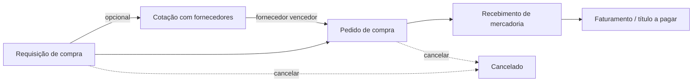

# P2P — Compras: visão funcional

**Status:** decisões fechadas · **Data:** 2026-07-11 · **Módulo:** `operacoes-service` (microsserviço único, também dono de vendas e estoque)

> Este documento descreve o processo de compra em linguagem de negócio — sem schema de banco, endpoint ou detalhe técnico. Para a implementação, ver `spec/p2p-compras.md`.

---

## Objetivo

Levar uma compra da requisição interna até o pagamento ao fornecedor, passando por cotação (opcional), pedido, recebimento de mercadoria e faturamento — entregando ao financeiro um título a pagar pronto.

## O fluxo, passo a passo

### 1. Requisição de compra (opcional)

Alguém da empresa solicita a compra de um produto, informando quantidade e depósito de destino. Passa por aprovação antes de virar cotação ou pedido.

### 2. Cotação com fornecedores (opcional)

O comprador convida um ou mais fornecedores para dar preço nos itens da requisição (ou avulsos). Cada fornecedor responde com preço, prazo de entrega e condição de pagamento — digitado pelo comprador, já que o fornecedor não tem acesso ao sistema.

**Critério de desempate** quando várias cotações competem: 1º menor preço líquido, 2º menor prazo de entrega, 3º melhor condição de pagamento. Em empate total, vale a cotação com validade mais longa ou a mais recente. **No lançamento inicial do módulo**, porém, essa comparação é só uma referência visual — é o comprador quem escolhe manualmente o vencedor.

Ao encerrar a cotação escolhendo um vencedor, o sistema já gera o pedido de compra automaticamente com os dados daquele fornecedor.

### 3. Pedido de compra

Pode nascer direto (sem requisição nem cotação), de uma requisição aprovada, ou de uma cotação vencedora. Precisa de fornecedor ativo e condição de pagamento definida.

**Verificação de preço:** se o preço do item estiver mais de 30% acima do último custo conhecido daquele produto com aquele fornecedor, o sistema **apenas alerta** — não bloqueia o envio para aprovação. Quem aprova decide se aceita o preço mais alto ou não.

**Aprovação:** no lançamento inicial, basta ter a permissão de aprovador — inclusive a própria pessoa que criou o pedido pode aprová-lo (não há separação obrigatória entre quem pede e quem aprova ainda). Alçada por faixa de valor fica para uma fase futura.

### 4. Recebimento de mercadoria

Quando a mercadoria chega, registra-se o recebimento com os dados da nota fiscal de entrada (número, série, valor). Um pedido pode ter vários recebimentos (entregas parciais).

**Quantidade recebida a maior que o pedido:** aceita até **5% a mais** do que foi pedido (cobre diferenças normais de pesagem/conversão de unidade). Acima disso, o sistema **recusa o excesso** — o pedido já enviado não pode ser editado (só pedidos em rascunho são editáveis), então o ajuste do que sobrou é tratado fora do sistema: devolução ao fornecedor, ou abertura de um pedido novo/complementar para o excedente.

**Impostos da nota (IBS/CBS/IS):** por enquanto ficam **zerados/informativos** — não é exigida digitação manual precisa desses valores, só o valor total da nota e dos produtos. Isso evita erro de digitação quebrar a integração com o financeiro; quando o motor fiscal (`fiscal-service`) existir, o cálculo passa a ser automático.

**Depósito:** cada recebimento vai para **um único depósito** (sem dividir a mesma nota entre vários depósitos no lançamento inicial). Distribuir entre depósitos depois de recebido fica fora de escopo por ora — não existe hoje um fluxo de transferência interna no sistema; a movimentação teria que ser feita fora dele.

Confirmar o recebimento dá entrada no estoque **imediatamente e na mesma operação** (recebimento e estoque atualizam juntos — não há espera nem risco de um confirmar sem o outro). **O sistema não valida se há espaço/capacidade no depósito** — mesma lógica do lado de vendas: é um registro, sem bloqueio, até o controle real de estoque existir (nesse momento, a checagem é ligada nos dois fluxos — recebimento e expedição — de uma vez, é o mesmo módulo). **O preço de custo cadastrado do produto não é atualizado automaticamente** com o valor da nota — isso é intencional, porque o custo "oficial" do produto envolve frete, seguro, impostos e descontos que a nota sozinha não reflete direito. Fica registrado um campo separado, só informativo, com o último preço de compra, sem mexer no custo contábil do produto.

### 5. Faturamento

Fecha o ciclo: gera o título a pagar para o financeiro, com as parcelas calculadas pela condição de pagamento. Esse aviso é enviado mesmo que o sistema financeiro ainda não exista para recebê-lo agora — quando ele nascer, faz uma carga dos históricos pendentes e passa a escutar dali em diante.

### Cancelamento

Pode ser feito até o primeiro recebimento confirmado. Depois disso, só é possível "encerrar o saldo restante" (não dá mais pra cancelar o pedido inteiro), preservando o histórico do que já foi recebido.

---

## Resumo das regras de negócio

| Situação | Regra |
|---|---|
| Preço do item 30% acima do custo conhecido | Apenas alerta, não bloqueia |
| Recebimento acima da quantidade pedida | Tolera até +5%; acima disso, bloqueia |
| Escolha do vencedor da cotação | Critério automático de desempate existe, mas escolha é manual no lançamento inicial |
| Aprovação do pedido | Permissão única; o próprio solicitante pode aprovar |
| Impostos da nota de entrada | Zerados/informativos até existir motor fiscal |
| Atualização do preço de custo do produto | Não é automática — fica um campo separado só informativo |
| Depósito por recebimento | Um único depósito por recebimento |

## O que fica de fora por enquanto

- Cálculo automático de impostos (IBS/CBS/IS) — entra com o `fiscal-service`.
- Alçada de aprovação por faixa de valor / segregação solicitante ≠ aprovador.
- Portal do fornecedor (resposta de cotação online, sem depender do comprador digitar).
- Sugestão automática de compra por ponto de reposição de estoque.
- Devolução ao fornecedor.
- Rateio de recebimento entre múltiplos depósitos.
