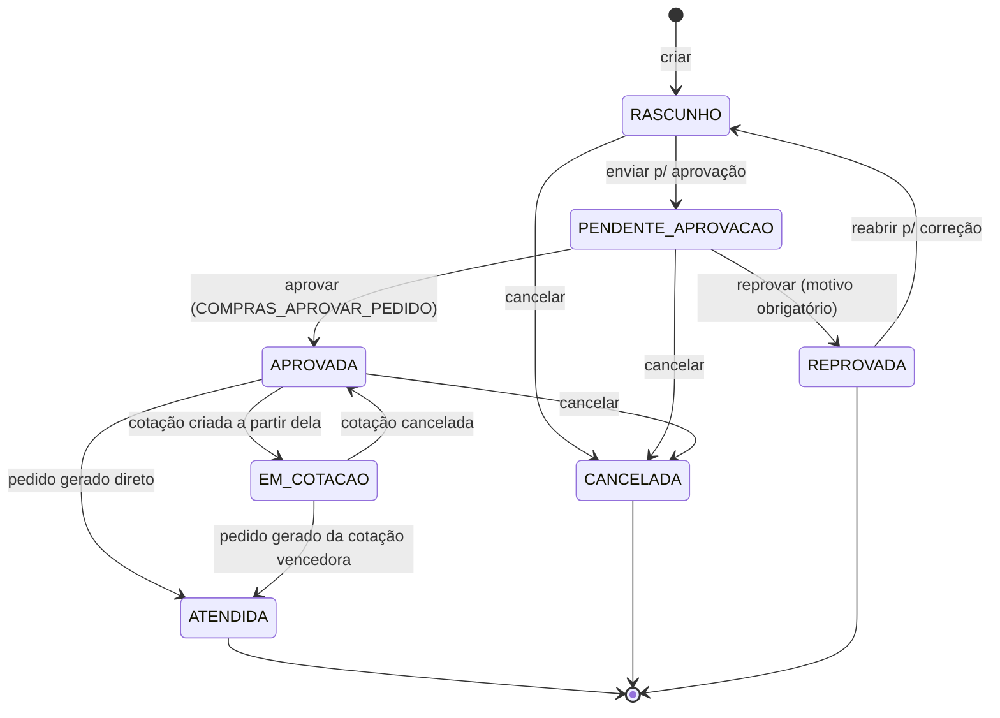
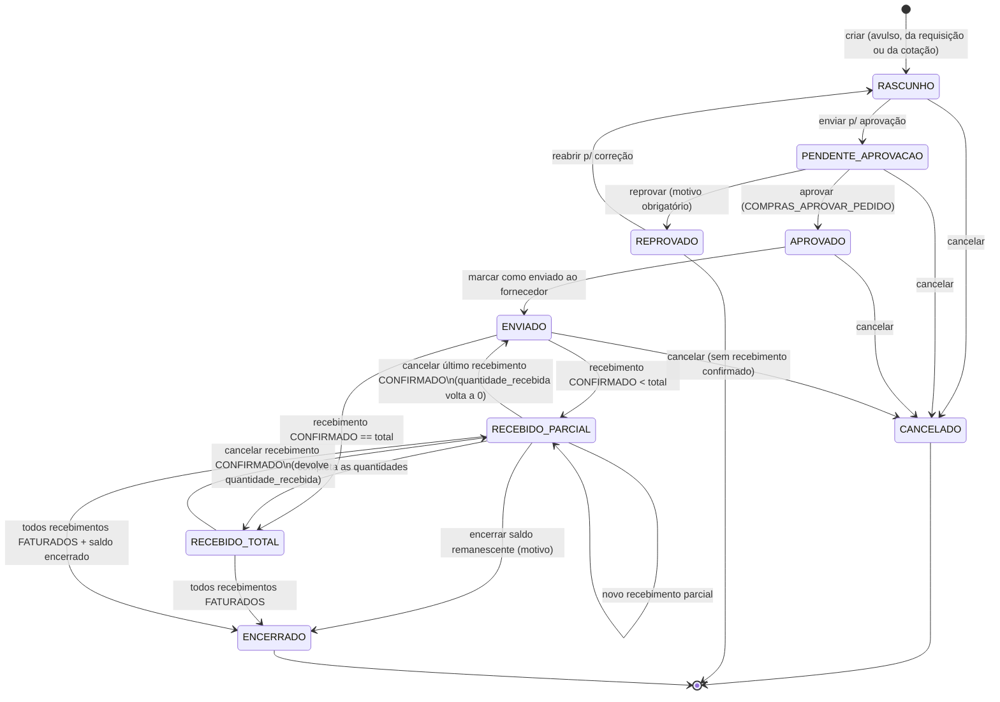

# Módulo P2P — Compras (Procure-to-Pay) — Plano de implementação

**Status:** EM IMPLEMENTAÇÃO — Fase 0 (infra) feita, não testada · **Data:** 2026-07-10 · **Rev.:** 2026-07-11 (decisões do usuário aplicadas) · **Rev. 2:** 2026-07-11 (arquitetura consolidada) · **Rev. 3:** 2026-09-01 (Fase 0 implementada — módulo `operacoes-service` criado, não testada) · **Serviços:** `operacoes-service` (**novo**, foco — também dono de O2C, ver `o2c-vendas.md`) · `cadastro-service` (validação de referências via API) · `fiscal-service` (**novo** — dono futuro de NF-e/motor fiscal) · `liquibase-service` (migrações) · `auth-service` (seed de permissões) · `Angular/erp-front-end-web` (última fase) · integração futura com `financeiro-service` (Fin.md — ainda não implementado)

**Decisões fechadas (rev. 2026-07-11):**
- **[Rev. 2] P2P nasce dentro do `operacoes-service`, o mesmo serviço do O2C** — decisão revista do usuário: em vez de `compra-service` e `estoque-service` como serviços à parte, os três domínios (vendas, compras, estoque) vivem juntos num único serviço novo, com **schema Postgres próprio `compras`** no mesmo banco `loop-erp` compartilhado (padrão do projeto: um Postgres, um schema por domínio, DDL via `liquibase-service`). As tabelas de estoque (`movimento_estoque`/`estoque_saldo`, schema **`estoque`**) continuam num schema à parte — porque vendas (expedição) e compras (recebimento) escrevem nelas — mas agora dentro do **mesmo serviço**, não mais um `estoque-service` externo. Justificativa e consequências em "Contexto → Onde o módulo mora".
- Referências a cadastros (`fornecedor`, `produto`, `deposito`, `condicao_pagamento`) são **UUIDs sem FK física** — validação via HTTP ao `cadastro-service` (`RestClient` `@LoadBalanced` via Eureka, mesmo padrão do `o2c-vendas.md` §2). Essa fronteira permanece porque cadastro-service segue sendo serviço separado.
- **[Rev. 2] Integração com o estoque é chamada in-process, não evento Kafka** — como estoque agora é módulo do mesmo `operacoes-service`, o recebimento chama o módulo de estoque direto, na mesma transação Java. Kafka deixa de ser necessário para essa integração (era só para desacoplar serviços diferentes); continua fazendo sentido nas fronteiras reais (financeiro, fiscal). Justificativa em "Integração com estoque".
- **RN-P2P-04 (tolerância de preço) é ALERTA, não bloqueio** — decisão do usuário; o aprovador decide.
- **RN-P2P-05 (recebimento a maior): tolerância de +5%** sobre a quantidade do pedido — decisão do usuário.
- **Impostos da NF de entrada zerados/informativos no MVP** — decisão do usuário: foco no valor total da nota e dos produtos; nada de digitação obrigatória de IBS/CBS/IS (evita erro manual contaminando o contas a pagar). O motor fiscal é do futuro `fiscal-service`.
- **`ProdutoFornecedor.preco_custo` NÃO é atualizado pelo P2P** — decisão do usuário. Em vez disso, campo novo e separado **`ultimo_preco_compra`** (informativo, sem impacto contábil/DRE), atualizado a cada recebimento confirmado (ver "Preço de compra").
- **`nfe.entrada.aprovada` é publicado desde já**, mesmo sem o financeiro-service existir — decisão do usuário (retenção do tópico e carga histórica: ver "Integração com o financeiro").
- **Recebimento mono-depósito confirmado** para o MVP (decisão do usuário — já era o default do spec).
- **Aprovação confirmada**: permissão única `COMPRAS_APROVAR_PEDIDO`, auto-aprovação permitida no MVP (decisão do usuário).
- **Preço de compra ≠ motor de resolução de preço.** O preço de compra vem **direto da cotação/pedido**; `ProdutoFornecedor.precoCusto` é apenas **referência/sugestão e baliza de validação**. Não existe hierarquia de resolução como no lado de venda (`spec/motor-resolucao-preco.md`) — justificativa em "Contexto → Preço de compra".
- Integração com o financeiro é **exclusivamente via Kafka**: o faturamento da NF de entrada publica **`nfe.entrada.aprovada`** com o payload exato do **Fin.md §F4.2** — o financeiro-service (quando existir) consome e cria os títulos a pagar com `origem = 'NF_ENTRADA'`. Nenhuma chamada REST síncrona ao financeiro.
- **Recebimento físico não gera título** — só a aprovação/faturamento da NF fiscal gera (Fin.md §11.2, track P2P). Recebimento e faturamento são passos separados.
- Estoque: criadas **`movimento_estoque`** (append-only, imutável) e **`estoque_saldo`** (materializado por produto+depósito, atualizado na mesma transação). Hoje não existe nenhuma tabela de saldo/movimento no projeto — `ProdutoEstoqueConfig` é só parametrização (mín/máx/ponto de reposição).
- Aprovação no MVP = **permissão simples** (`COMPRAS:APROVAR_PEDIDO` no padrão `DOMINIO_ACAO` do RBAC existente). Alçada por faixa de valor fica como upgrade, alinhada ao padrão `approval_regra` do Fin.md §4.10.
- Cotação multi-fornecedor **existe no modelo desde o início**, mas é **opcional no fluxo**: pedido pode ser criado direto da requisição (ou avulso). Vencedor de cotação é escolhido **por fornecedor inteiro** (split por item = YAGNI).
- Numeração sequencial por tenant via tabela `compra_numeracao` com `SELECT ... FOR UPDATE` (sem sequence global — sequence vaza contagem entre tenants).

---

## Contexto

### O que existe hoje (verificado no código em 2026-07-10)

Tudo em `cadastro-service/src/main/java/com/l/erp/cadastroservice/domain/`:

| Entidade | Tabela | Campos relevantes pro P2P |
|---|---|---|
| `Fornecedor` | `cadastros.fornecedor` | `pessoa_id` (FK `Pessoa`), `ativo` |
| `ProdutoFornecedor` | `cadastros.produto_fornecedor` | `produto_id`, `fornecedor_id`, `codigo_produto_fornecedor`, **`preco_custo` numeric(15,4)**, **`lead_time_dias`**, **`preferencial`**, `ativo` |
| `Produto` | `cadastros.produto` | catálogo (NCM etc.) |
| `Deposito` | `cadastros.deposito` | destino físico do recebimento |
| `CondicaoPagamento` / `CondicaoPagamentoParcela` | `cadastros.condicao_pagamento` | gera vencimentos das parcelas do título |
| `ProdutoEstoqueConfig` | `cadastros.produto_estoque_config` | `produto_id`, `deposito_id`, `fornecedor_preferencial_id` (FK **ProdutoFornecedor**), `estoque_minimo`, `estoque_maximo`, `ponto_reposicao`, `lead_time_dias` |

Multi-tenancy: todas estendem `BaseTenantEntity` (`repository/filter/BaseTenantEntity.java`) — `tenant_id BIGINT NOT NULL` + Hibernate `@FilterDef/@Filter tenantFilter`, ativado pelo `TenantInterceptor` via `TenantContext` (ThreadLocal). Auditoria por colunas: `created_at`, `updated_at`, `created_by`, `last_updated_by` (repetidas em cada entidade — seguir o mesmo padrão, não inventar `@MappedSuperclass` de auditoria novo).

Migrações: a pasta `cadastro/` vai até `cadastro-schema-007.yaml`, e **`cadastro-schema-008.yaml` já está reservado pelo `spec/motor-resolucao-preco.md`** (coluna `cliente.tabela_preco_id`). Este spec cria pastas novas `compras/` e `estoque/` no changelog (padrão por schema, como `auth/`, `billing/` e a `vendas/` do o2c-vendas.md) e **uma única mudança na pasta `cadastro/`**: `cadastro-schema-0XX` (próximo número livre após o 008 reservado) com a coluna informativa `produto_fornecedor.ultimo_preco_compra`.

### O que NÃO existe (confirmado por busca no monorepo inteiro)

- Nenhuma entidade/controller/service de `RequisicaoCompra`, `PedidoCompra`, `Cotacao`, `Recebimento` em nenhum serviço (grep por `compra|requisicao|recebimento|pedido` em `**/*.java` só retorna `WebhookController`/`WebhookLogService` do billing, que são "compra de assinatura" — nada a ver).
- Nenhuma tabela de **movimento ou saldo de estoque**. `ProdutoEstoqueConfig` é parametrização, não saldo.
- `financeiro-service` (Fin.md) **não existe ainda** — o tópico `nfe.entrada.aprovada` será publicado sem consumidor até lá (decisão fechada: publicar desde já — ver "Integração com o financeiro").
- Motor fiscal (IBS/CBS) não existe — será responsabilidade do **`fiscal-service`** (novo serviço, spec futuro); os `impostos` do evento vão **zerados** no MVP (decisão fechada).

### Onde o módulo mora — decisão e consequências

**[Rev. 2] Um único microsserviço novo: `operacoes-service`, compartilhado com vendas (`o2c-vendas.md`)** — decisão revista do usuário (2026-07-11): em vez de `compra-service` e `estoque-service` como serviços à parte, compras e estoque vivem no mesmo serviço que vendas. Motivo: os três domínios usariam o mesmo Postgres de qualquer forma, então separar em serviços distintos só somava custo de infra (3× Maven/Docker/Eureka/gateway/Jenkins) sem ganhar isolamento real. Só o **`fiscal-service`** nasce separado.

Parâmetros (padrão verificado nos `application.yaml` dos serviços existentes):
- **Banco:** o mesmo Postgres **`loop-erp`** compartilhado por todos os serviços, isolando por schema — dentro do `operacoes-service`: schema `compras` (P2P), schema `estoque` (saldo/movimento), schema `vendas` (O2C, ver `o2c-vendas.md`). DDL 100% no `liquibase-service`; o serviço roda `ddl-auto=validate`.
- **Porta:** `operacoes-service` fica com `8089` (8085-8088 e 8090 ocupados — ver tabela de módulos do CLAUDE.md). Não há mais portas 8091/8092 separadas.
- **Infra a criar (uma vez só, compartilhada com o2c-vendas.md — não duplicar):** `SecurityConfig` + leitura de `X-Tenant-Id` (`TenantInterceptor`/`TenantContext`/`SecurityUtils`/`BaseTenantEntity`), Kafka producer (para financeiro/fiscal, fronteiras externas), convenção de pacotes.

**Consequências (explícitas):**
1. **Sem integridade referencial com cadastros** (fronteira que permanece — cadastro-service segue sendo serviço separado). `fornecedor_id`, `produto_id`, `deposito_id`, `condicao_pagamento_id` são colunas **UUID sem FK física** — validação de existência/atividade na borda via HTTP ao `cadastro-service`. Padrão de chamada: **`RestClient` `@LoadBalanced` resolvendo `lb://cadastro-service` via Eureka** (o monorepo não tem chamada interna síncrona hoje — só clients externos com `RestClient`/`RestTemplate`; não adicionar OpenFeign). Reutilizar o endpoint interno de **validação em lote** proposto no `o2c-vendas.md` §2 (`POST /api/v1/interno/referencias/validar`).
2. **Estoque via chamada in-process, não evento Kafka** (Rev. 2 — mudou porque compras e estoque agora são módulos do mesmo serviço): o recebimento chama o módulo de estoque direto, na mesma transação Java — sem retry/DLQ, porque não há fronteira de rede para falhar. Consulta de saldo (leitura) também é chamada Java direta, não API.
3. **Rotas no gateway:** hoje `Path=/api/**` é catch-all do cadastro-service. Rotas novas `Path=/api/v1/compras/**` e `Path=/api/v1/estoque/**` → `lb://operacoes-service`, declaradas **antes** do catch-all.
4. **`ProdutoFornecedor` (incl. `preco_custo`/`ultimo_preco_compra`) continua no cadastro-service** — o `operacoes-service` lê via API (sugestão de preço, baliza do alerta RN-P2P-04) e atualiza `ultimo_preco_compra` via evento (ver "Preço de compra") — essa integração continua sendo evento Kafka, porque cruza a fronteira real entre `operacoes-service` e `cadastro-service`.

> **Riscos aceitos (registrados):** consistência eventual só na fronteira com cadastro (revalidar referências nas transições); latência extra de chamadas HTTP de validação ao cadastro-service; nenhum fluxo precisa de transação distribuída — escritas de compras/estoque são locais ao mesmo serviço (mesma transação Java quando fizer sentido) e só as integrações externas (financeiro, fiscal, cadastro) usam eventos idempotentes por `event_id`.

### Preço de compra — por que NÃO precisa de motor de resolução

O `spec/motor-resolucao-preco.md` resolve o problema de **venda**: "qual preço do produto X para o cliente Y na data Z", com hierarquia CLIENTE → GRUPO → PADRÃO e vigências sobrepostas. No lado de **compra** esse problema não existe:

- O preço de compra é **negociado por transação** — vem da resposta de cotação do fornecedor ou é digitado no pedido. Não há hierarquia a resolver: o valor que vale é o do documento.
- `ProdutoFornecedor.preco_custo` já existe e cumpre dois papéis: (a) **sugestão** — ao adicionar item no pedido/cotação, o front pré-preenche com ele (lido via API do cadastro-service); (b) **baliza do alerta** — desvio grande entre preço do pedido e o custo histórico gera **alerta** (RN-P2P-04).
- **`preco_custo` NÃO é atualizado pelo P2P (decisão do usuário):** o custo real de reposição envolve frete, seguro, substituição tributária e IPI — não é só o valor da nota; atualizar automaticamente com o `preco_unitario_nf` contaminaria margem/DRE. Em vez disso, o cadastro-service ganha um campo novo e separado **`ProdutoFornecedor.ultimo_preco_compra`** (`numeric(15,4)`, informativo, sem impacto contábil), atualizado a cada recebimento confirmado: o `cadastro-service` consome o evento `compra.recebimento.confirmado` (que já carrega produto+fornecedor+`preco_unitario_nf`) e grava o valor. Migração: coluna nova via changelog `cadastro/cadastro-schema-0XX` (próximo número livre — `008` está reservado pelo motor de preço).

Conclusão: **nenhuma entidade nova de preço de compra, nenhum resolver.** `preco_custo` segue manual; `ultimo_preco_compra` é o rastro informativo automático.

---

## Modelagem de dados

Entidades de compras: **schema `compras`** (`@Table(schema = "compras")`), dentro do `operacoes-service`. `movimento_estoque`/`estoque_saldo` ficam no **schema `estoque`**, também no mesmo `operacoes-service` — descritas aqui porque o P2P é o primeiro produtor de movimentos, mas o módulo de estoque é quem as possui. `id UUID` gerado (`GenerationType.UUID`), estendem `BaseTenantEntity` (replicado do cadastro-service), e carregam as 4 colunas de auditoria padrão (`created_at NOT NULL`, `updated_at`, `created_by NOT NULL`, `last_updated_by`) — omitidas das tabelas abaixo por brevidade, mas **obrigatórias em todas**.

> **Referências cross-serviço:** onde as tabelas abaixo dizem "FK → `fornecedor`/`produto`/`deposito`/`condicao_pagamento`", leia-se **coluna UUID sem FK física** (a entidade mora no cadastro-service; validação via API na borda). FKs físicas existem apenas **entre tabelas do mesmo schema** (`requisicao_compra_item → requisicao_compra`, `pedido_compra_item → pedido_compra`, `recebimento_mercadoria → pedido_compra`, etc.).

Estrutura de pacotes de cada serviço novo: a convenção padrão do projeto (`api/controllers`, `api/dto`, `api/mappers`, `domain`, `repository`, `services`, `infra/config`, `util`).

### `compra_numeracao`

Contador sequencial por tenant/tipo de documento (número "humano" — o id continua UUID).

| Coluna | Tipo | Notas |
|---|---|---|
| `tenant_id` | BIGINT PK (composta) | |
| `tipo_documento` | VARCHAR(20) PK (composta) | `'REQUISICAO'` \| `'COTACAO'` \| `'PEDIDO'` \| `'RECEBIMENTO'` |
| `proximo_numero` | BIGINT NOT NULL DEFAULT 1 | lido com `SELECT ... FOR UPDATE` e incrementado na mesma transação de criação do documento |

### `requisicao_compra` + `requisicao_compra_item`

**`requisicao_compra`**

| Coluna | Tipo | Notas |
|---|---|---|
| `id` | UUID PK | |
| `numero` | BIGINT NOT NULL | UNIQUE (`tenant_id`, `numero`) |
| `solicitante_id` | UUID NOT NULL | userId do JWT (`SecurityUtils`) — não é FK física (usuário mora no auth-service) |
| `deposito_id` | UUID NOT NULL FK → `deposito` | destino pretendido |
| `status` | VARCHAR(25) NOT NULL | enum `StatusRequisicaoCompra` (máquina de estados abaixo) |
| `justificativa` | VARCHAR(500) | |
| `data_necessidade` | DATE | quando o material precisa estar disponível |
| `aprovador_id` / `aprovado_em` | UUID / TIMESTAMPTZ | preenchidos na aprovação/reprovação |
| `motivo_reprovacao` | VARCHAR(500) | |

**`requisicao_compra_item`**

| Coluna | Tipo | Notas |
|---|---|---|
| `id` | UUID PK | |
| `requisicao_id` | UUID NOT NULL FK → `requisicao_compra` (cascade delete-orphan no JPA, itens só editáveis em RASCUNHO) | |
| `produto_id` | UUID NOT NULL FK → `produto` | |
| `quantidade` | NUMERIC(15,4) NOT NULL CHECK (> 0) | |
| `observacao` | VARCHAR(255) | |

### `cotacao_compra` + `cotacao_compra_fornecedor` + `cotacao_compra_fornecedor_item`

Uma cotação convida N fornecedores a precificar os mesmos itens; cada fornecedor responde com preços/prazo; escolhe-se **um** vencedor, que vira pedido.

**`cotacao_compra`**

| Coluna | Tipo | Notas |
|---|---|---|
| `id` | UUID PK · `numero` BIGINT NOT NULL (UNIQUE tenant+numero) | |
| `requisicao_id` | UUID FK → `requisicao_compra`, **nullable** | cotação pode ser avulsa |
| `status` | VARCHAR(20) NOT NULL | `'ABERTA'` \| `'ENCERRADA'` \| `'CANCELADA'` |
| `data_limite_resposta` | DATE | informativo |
| `deposito_id` | UUID NOT NULL FK → `deposito` | herdado da requisição quando houver |
| `cotacao_fornecedor_vencedor_id` | UUID FK → `cotacao_compra_fornecedor`, nullable | setado no encerramento |

Itens cotados (o "o quê"): reusa os itens da requisição quando `requisicao_id` presente; quando avulsa, tabela própria **`cotacao_compra_item`** (`id`, `cotacao_id` FK, `produto_id` FK, `quantidade NUMERIC(15,4)`). Para simplificar o código, **sempre** materializar `cotacao_compra_item` (copiando da requisição na criação) — a cotação fica autocontida e imune a edições posteriores da requisição.

**`cotacao_compra_fornecedor`** (o convite/resposta de cada fornecedor)

| Coluna | Tipo | Notas |
|---|---|---|
| `id` | UUID PK | |
| `cotacao_id` | UUID NOT NULL FK | UNIQUE (`cotacao_id`, `fornecedor_id`) |
| `fornecedor_id` | UUID NOT NULL FK → `fornecedor` | precisa `ativo = true` no convite |
| `status` | VARCHAR(20) NOT NULL | `'AGUARDANDO'` \| `'RESPONDIDA'` \| `'DECLINADA'` |
| `condicao_pagamento_id` | UUID FK → `condicao_pagamento` | obrigatória quando `RESPONDIDA` |
| `prazo_entrega_dias` | INTEGER | |
| `valor_frete` | NUMERIC(15,2) DEFAULT 0 | |
| `observacao` | VARCHAR(500) | |

**`cotacao_compra_fornecedor_item`** (preço de cada fornecedor por item)

| Coluna | Tipo | Notas |
|---|---|---|
| `id` | UUID PK | |
| `cotacao_fornecedor_id` | UUID NOT NULL FK | |
| `cotacao_item_id` | UUID NOT NULL FK → `cotacao_compra_item` | UNIQUE (`cotacao_fornecedor_id`, `cotacao_item_id`) |
| `preco_unitario` | NUMERIC(15,4) NOT NULL CHECK (>= 0) | pré-preenchido no front com `ProdutoFornecedor.preco_custo` se houver vínculo |

A resposta é **digitada pelo comprador** (fornecedor não tem acesso ao sistema — portal do fornecedor = fora de escopo).

### `pedido_compra` + `pedido_compra_item`

**`pedido_compra`**

| Coluna | Tipo | Notas |
|---|---|---|
| `id` | UUID PK · `numero` BIGINT NOT NULL (UNIQUE tenant+numero) | |
| `fornecedor_id` | UUID NOT NULL FK → `fornecedor` | `ativo = true` na emissão (RN-P2P-02) |
| `condicao_pagamento_id` | UUID **NOT NULL** FK → `condicao_pagamento` | obrigatória (RN-P2P-03) |
| `deposito_id` | UUID NOT NULL FK → `deposito` | |
| `requisicao_id` | UUID FK, nullable | origem, se veio de requisição |
| `cotacao_fornecedor_id` | UUID FK → `cotacao_compra_fornecedor`, nullable | origem, se veio de cotação |
| `status` | VARCHAR(25) NOT NULL | enum `StatusPedidoCompra` (máquina de estados abaixo) |
| `data_emissao` | DATE, nullable | preenchida na transição `enviar()` (RASCUNHO/APROVADO → ENVIADO) — é a data em que foi enviado ao fornecedor, não a data de criação. Fica `null` enquanto o pedido não passou por `ENVIADO`. |
| `data_previsao_entrega` | DATE | sugestão: `data_emissao + ProdutoFornecedor.lead_time_dias` do item de maior lead time |
| `valor_frete` | NUMERIC(15,2) NOT NULL DEFAULT 0 | |
| `valor_total` | NUMERIC(15,2) NOT NULL | soma dos itens + frete; recalculado no service a cada alteração |
| `aprovador_id` / `aprovado_em` | UUID / TIMESTAMPTZ | |
| `motivo_cancelamento` | VARCHAR(500) | |
| `observacao` | VARCHAR(500) | |

**`pedido_compra_item`**

| Coluna | Tipo | Notas |
|---|---|---|
| `id` | UUID PK | |
| `pedido_id` | UUID NOT NULL FK | |
| `produto_id` | UUID NOT NULL FK → `produto` | |
| `quantidade` | NUMERIC(15,4) NOT NULL CHECK (> 0) | |
| `preco_unitario` | NUMERIC(15,4) NOT NULL CHECK (>= 0) | mesma precisão do `preco_custo` existente |
| `quantidade_recebida` | NUMERIC(15,4) NOT NULL DEFAULT 0 | acumulada pelos recebimentos CONFIRMADOS |
| `valor_total` | NUMERIC(15,2) NOT NULL | `quantidade × preco_unitario`, persistido |

### `recebimento_mercadoria` + `recebimento_mercadoria_item`

Um pedido pode ter N recebimentos (entrega parcial). O recebimento carrega os dados da NF de entrada **digitados manualmente** (importação de XML = módulo fiscal, fora de escopo).

**`recebimento_mercadoria`**

| Coluna | Tipo | Notas |
|---|---|---|
| `id` | UUID PK · `numero` BIGINT NOT NULL (UNIQUE tenant+numero) | |
| `pedido_id` | UUID NOT NULL FK → `pedido_compra` | |
| `deposito_id` | UUID NOT NULL FK → `deposito` | default = do pedido, editável |
| `status` | VARCHAR(20) NOT NULL | `'EM_CONFERENCIA'` \| `'CONFIRMADO'` \| `'FATURADO'` \| `'CANCELADO'` |
| `data_recebimento` | DATE NOT NULL | |
| `nfe_numero` | VARCHAR(20) NOT NULL | |
| `nfe_serie` | VARCHAR(5) NOT NULL | |
| `nfe_chave` | VARCHAR(44), nullable | UNIQUE (`tenant_id`, `nfe_chave`) quando não nula — evita NF duplicada |
| `nfe_data_emissao` | DATE NOT NULL | |
| `valor_total_nf` | NUMERIC(15,2) NOT NULL | |
| `condicao_pagamento_id` | UUID NOT NULL FK | default = do pedido, editável (NF pode vir com condição diferente) |
| `impostos_ibs` / `impostos_cbs` / `impostos_is` | NUMERIC(15,2) DEFAULT 0 | **zerados/informativos no MVP (decisão do usuário)** — o front não exige digitação; campos opcionais que ficam em 0 até o motor fiscal do `fiscal-service` preenchê-los. Foco do MVP: `valor_total_nf` + valores dos produtos |
| `faturado_em` | TIMESTAMPTZ | quando o evento `nfe.entrada.aprovada` foi publicado |
| `observacao` | VARCHAR(500) | |

**`recebimento_mercadoria_item`**

| Coluna | Tipo | Notas |
|---|---|---|
| `id` | UUID PK | |
| `recebimento_id` | UUID NOT NULL FK | |
| `pedido_item_id` | UUID NOT NULL FK → `pedido_compra_item` | |
| `quantidade` | NUMERIC(15,4) NOT NULL CHECK (> 0) | validada contra saldo pendente do item (RN-P2P-05) |
| `preco_unitario_nf` | NUMERIC(15,4) NOT NULL | preço efetivo da NF (pode divergir do pedido) |

### `compra_status_historico`

Histórico único pra requisição, pedido e recebimento (evita 3 tabelas iguais).

| Coluna | Tipo | Notas |
|---|---|---|
| `id` | UUID PK | |
| `documento_tipo` | VARCHAR(20) NOT NULL | `'REQUISICAO'` \| `'COTACAO'` \| `'PEDIDO'` \| `'RECEBIMENTO'` |
| `documento_id` | UUID NOT NULL | índice (`tenant_id`, `documento_tipo`, `documento_id`) |
| `status_anterior` / `status_novo` | VARCHAR(25) / NOT NULL | |
| `usuario_id` | UUID NOT NULL | |
| `motivo` | VARCHAR(500) | |
| `ocorrido_em` | TIMESTAMPTZ NOT NULL | |

Gravado pelo service em **toda** transição de estado, na mesma transação.

### `movimento_estoque` + `estoque_saldo` — **entidades do módulo de estoque** (schema `estoque`, mesmo `operacoes-service`)

Dono: o módulo de estoque dentro do `operacoes-service`. O módulo de compras chama esse módulo direto, na mesma transação (ver "Integração com estoque") — não é mais evento, porque estão no mesmo serviço. O módulo de vendas (expedição, `o2c-vendas.md`) alimenta as mesmas tabelas pelo mesmo caminho in-process (`SAIDA_VENDA`).

**`movimento_estoque`** — append-only, nunca UPDATE/DELETE; estorno = movimento contrário.

| Coluna | Tipo | Notas |
|---|---|---|
| `id` | UUID PK | |
| `produto_id` | UUID NOT NULL FK → `produto` | |
| `deposito_id` | UUID NOT NULL FK → `deposito` | |
| `tipo` | VARCHAR(30) NOT NULL | MVP: `'ENTRADA_COMPRA'` \| `'ESTORNO_ENTRADA_COMPRA'` \| `'SAIDA_VENDA'` \| `'ESTORNO_SAIDA_VENDA'` (o o2c-vendas.md alimenta os dois últimos). `AJUSTE_INVENTARIO`… ficam pros módulos futuros |
| `quantidade` | NUMERIC(15,4) NOT NULL | sempre positiva; o sinal vem do `tipo` |
| `origem_tipo` | VARCHAR(20) NOT NULL | `'RECEBIMENTO'` no MVP |
| `origem_id` | UUID NOT NULL | id do `recebimento_mercadoria` |
| `usuario_id` | UUID NOT NULL · `ocorrido_em` TIMESTAMPTZ NOT NULL | |

**`estoque_saldo`** — saldo materializado.

| Coluna | Tipo | Notas |
|---|---|---|
| `id` | UUID PK | |
| `produto_id` + `deposito_id` | UUID NOT NULL FKs | UNIQUE (`tenant_id`, `produto_id`, `deposito_id`) |
| `quantidade` | NUMERIC(15,4) NOT NULL DEFAULT 0 | atualizado com `SELECT ... FOR UPDATE` (upsert) na mesma transação do movimento, dentro do módulo de estoque |

CHECK `quantidade >= 0` **não** é aplicado — decisão fechada no o2c-vendas.md: estoque negativo sistêmico é aceitável no MVP (venda/expedição não valida saldo). **Flag temporária (expedição):** quando o controle real de disponibilidade for implementado (mesmo módulo, mesmo serviço), a checagem de saldo suficiente passa a existir na expedição; não muda de serviço nem de schema, só liga a validação. O recebimento não usa essa mesma checagem — receber mercadoria só *aumenta* saldo, então "saldo insuficiente" não se aplica; a validação futura equivalente no recebimento é outra, de **capacidade física do depósito** (espaço disponível), não de saldo do produto.

### Migrações Liquibase

O `liquibase-service` continua dono único do DDL de todos os schemas, mesmo com `compras`, `estoque` e `vendas` pertencendo ao mesmo serviço novo (mesmo banco `loop-erp`). Pastas novas no changelog (padrão por schema, como `auth/`, `billing/` e a `vendas/` do o2c-vendas.md):

- `compras/compras-schema-001.yaml` — `CREATE SCHEMA compras` + `compra_numeracao`, `requisicao_compra(_item)`, `compra_status_historico`.
- `compras/compras-schema-002.yaml` — `pedido_compra(_item)`.
- `estoque/estoque-schema-001.yaml` — `CREATE SCHEMA estoque` + `movimento_estoque`, `estoque_saldo` (schema do módulo de estoque, dentro do `operacoes-service`).
- `compras/compras-schema-003.yaml` — `recebimento_mercadoria(_item)`.
- `compras/compras-schema-004.yaml` — `cotacao_compra(_item)`, `cotacao_compra_fornecedor(_item)` + coluna `pedido_compra.cotacao_fornecedor_id`.
- `cadastro/cadastro-schema-0XX.yaml` (próximo número livre; `008` reservado pelo motor de preço) — coluna `produto_fornecedor.ultimo_preco_compra NUMERIC(15,4)` (informativa, ver "Preço de compra").

(Incluir todos no `db.changelog-master.yaml`. `ddl-auto=validate` exige migração antes das entidades subirem.)

---

## Máquinas de estado

### Requisição de compra



### Pedido de compra (documento central)



Regras estruturais:
- Itens só editáveis em `RASCUNHO`.
- `CANCELADO` proibido a partir do primeiro recebimento `CONFIRMADO` — daí em diante só "encerrar saldo" (mantém histórico de estoque intacto).
- Recebimento: `EM_CONFERENCIA → CONFIRMADO → FATURADO`; `EM_CONFERENCIA → CANCELADO`; `CONFIRMADO → CANCELADO` gera movimento `ESTORNO_ENTRADA_COMPRA` e devolve `quantidade_recebida`; `FATURADO` é **terminal** (título já foi disparado pro financeiro — desfazer vira operação financeira, fora do P2P).

---

## Endpoints REST

Documentos de compra sob `/api/v1/compras/**` e consultas de estoque sob `/api/v1/estoque/**`, ambos no mesmo **`operacoes-service`**. Rotas novas no gateway (`Path=/api/v1/compras/**` → `lb://operacoes-service`, `Path=/api/v1/estoque/**` → `lb://operacoes-service`), declaradas **antes** do catch-all `Path=/api/**` do cadastro-service. Autenticação via gateway (headers `X-Tenant-Id` etc.), respostas paginadas seguindo o padrão HATEOAS já usado nos CRUDs existentes. Permissões no padrão `DOMINIO_ACAO` do RBAC (seed no auth, `auth-schema-0xx`): `COMPRAS_VISUALIZAR`, `COMPRAS_CRIAR`, `COMPRAS_APROVAR_PEDIDO`, `COMPRAS_RECEBER`, `COMPRAS_FATURAR`, `ESTOQUE_VISUALIZAR`.

### Requisições

| Método | Rota | Ação |
|---|---|---|
| POST | `/requisicoes` | cria em RASCUNHO (com itens) |
| GET | `/requisicoes` · `/requisicoes/{id}` | lista (filtros: status, solicitante, período) / detalhe |
| PUT | `/requisicoes/{id}` | edita (só RASCUNHO) |
| POST | `/requisicoes/{id}/enviar-aprovacao` | RASCUNHO → PENDENTE_APROVACAO |
| POST | `/requisicoes/{id}/aprovar` · `/reprovar` · `/cancelar` · `/reabrir` | transições (reprovar/cancelar com `{motivo}`) |

### Cotações

| Método | Rota | Ação |
|---|---|---|
| POST | `/cotacoes` | cria ABERTA; body: `requisicaoId?` (copia itens) ou `itens[]` avulsos + `fornecedorIds[]` |
| GET | `/cotacoes` · `/cotacoes/{id}` | lista / detalhe (com mapa comparativo de respostas) |
| PUT | `/cotacoes/{id}/fornecedores/{cfId}/resposta` | registra resposta: `{condicaoPagamentoId, prazoEntregaDias, valorFrete, itens:[{cotacaoItemId, precoUnitario}]}` → RESPONDIDA |
| POST | `/cotacoes/{id}/fornecedores/{cfId}/declinar` | DECLINADA |
| POST | `/cotacoes/{id}/encerrar` | body `{cotacaoFornecedorVencedorId}` → ENCERRADA + **gera `pedido_compra` em RASCUNHO** a partir da resposta vencedora; retorna o pedido. **No MVP o comprador escolhe o vencedor manualmente** (decisão do usuário); o mapa comparativo apenas ordena as respostas pelo critério de desempate abaixo, como sugestão |
| POST | `/cotacoes/{id}/cancelar` | CANCELADA (requisição volta a APROVADA) |

**Critério de desempate (decisão do usuário)** — usado como ordenação/sugestão no comparativo do MVP e como desempate automático quando a seleção automática existir (upgrade): 1º menor preço líquido total (itens + frete), 2º menor prazo de entrega, 3º melhor condição de pagamento (maior prazo médio ponderado); persistindo empate, a cotação com maior prazo de validade ou, por fim, a resposta mais recente.

### Pedidos

| Método | Rota | Ação |
|---|---|---|
| POST | `/pedidos` | cria RASCUNHO (avulso ou `requisicaoId`) |
| GET | `/pedidos` · `/pedidos/{id}` | lista (filtros: status, fornecedor, período) / detalhe com itens + recebimentos + histórico |
| PUT | `/pedidos/{id}` | edita (só RASCUNHO) |
| POST | `/pedidos/{id}/enviar-aprovacao` · `/aprovar` · `/reprovar` · `/reabrir` · `/enviar` · `/cancelar` · `/encerrar-saldo` | transições da máquina de estados |

### Recebimentos

| Método | Rota | Ação |
|---|---|---|
| POST | `/pedidos/{id}/recebimentos` | cria EM_CONFERENCIA (pedido em ENVIADO/RECEBIDO_PARCIAL); body: dados da NF + `itens:[{pedidoItemId, quantidade, precoUnitarioNf}]` |
| GET | `/recebimentos` · `/recebimentos/{id}` | lista / detalhe |
| PUT | `/recebimentos/{id}` | edita (só EM_CONFERENCIA) |
| POST | `/recebimentos/{id}/confirmar` | EM_CONFERENCIA → CONFIRMADO: **entrada de estoque** + atualiza `quantidade_recebida` + status do pedido |
| POST | `/recebimentos/{id}/faturar` | CONFIRMADO → FATURADO: **publica `nfe.entrada.aprovada`** (permissão `COMPRAS_FATURAR`) |
| POST | `/recebimentos/{id}/cancelar` | EM_CONFERENCIA/CONFIRMADO → CANCELADO (se CONFIRMADO: estorno de estoque) |

### Estoque (consulta — módulo interno do `operacoes-service`)

| Método | Rota | Ação |
|---|---|---|
| GET | `/api/v1/estoque/saldos` | filtros: produto, depósito; cruza `estoque_saldo` com `ProdutoEstoqueConfig` (mín/ponto de reposição **lidos via API do cadastro-service**) pra sinalizar abaixo do mínimo |
| GET | `/api/v1/estoque/movimentos` | extrato por produto/depósito/período |

---

## Integração com estoque (recebimento → chamada in-process → saldo)

**[Rev. 2] Por que chamada Java direta e não evento Kafka:** com compras e estoque no mesmo `operacoes-service`, não existe fronteira de serviço para desacoplar — a chamada in-process é mais simples e igualmente segura (mesma transação, sem risco de mensagem perdida). Evento Kafka continua fazendo sentido só nas integrações que cruzam serviço de verdade (financeiro, fiscal, `cadastro-service`).

No `POST /recebimentos/{id}/confirmar`, em **uma única transação** (recebimento + estoque juntos):

1. Valida status do recebimento (`EM_CONFERENCIA`) e do pedido (`ENVIADO`/`RECEBIDO_PARCIAL`).
2. Por item: valida RN-P2P-05 (quantidade ≤ pendente + 5%), soma em `pedido_compra_item.quantidade_recebida`.
3. Recalcula status do pedido: todas as quantidades completas → `RECEBIDO_TOTAL`; senão `RECEBIDO_PARCIAL`.
4. Grava `compra_status_historico` (recebimento e, se mudou, pedido).
5. **Chama o módulo de estoque, na mesma transação:** por item, insere 1 `movimento_estoque` (`ENTRADA_COMPRA`, `origem_tipo='RECEBIMENTO'`, `origem_id=recebimento_id`) e faz upsert em `estoque_saldo` com lock pessimista (`FOR UPDATE`). Se qualquer passo falhar, tudo é revertido junto — não há janela de inconsistência entre recebimento e estoque.
6. **Após o commit** (`@TransactionalEventListener(AFTER_COMMIT)`, mesmo padrão do faturamento), publica **evento externo** `compra.recebimento.confirmado` só para quem está fora do serviço (ex.: futuro consumer de BI) — não é mais o mecanismo que atualiza o estoque, é notificação. Payload rico: `event_id`, `tenant_id`, `recebimento_id`, `deposito_id`, itens `[{produto_id, fornecedor_id, quantidade, preco_unitario_nf}]`.

`ProdutoFornecedor.ultimo_preco_compra` **continua sendo atualizado via evento** (não in-process) porque isso cruza a fronteira real com o `cadastro-service` — ver "Preço de compra".

Cancelamento de recebimento `CONFIRMADO` roda o espelho, na mesma transação: devolve `quantidade_recebida`, recalcula status do pedido (pode voltar de `RECEBIDO_TOTAL` pra `RECEBIDO_PARCIAL`/`ENVIADO`) e registra `ESTORNO_ENTRADA_COMPRA` decrementando o saldo — tudo atômico; após commit publica **`compra.recebimento.cancelado`** só como notificação externa.

> Consistência: **transacional**, não mais eventual — recebimento e estoque commitam juntos ou nenhum dos dois commita. A ausência de *validação bloqueante* de saldo continua sendo uma decisão de negócio separada (RN aceita no MVP), não uma limitação técnica da integração. **Flag temporária:** quando o controle real de disponibilidade for exigido, adiciona-se uma checagem antes do passo 5 — mesmo módulo, mesma transação, sem mudança de arquitetura.

`ProdutoEstoqueConfig` **não é alterado** pelo P2P — é lido (via API do cadastro-service) apenas para: (a) alerta visual de "abaixo do mínimo" na consulta de saldos; (b) futura sugestão automática de requisição por ponto de reposição (fora de escopo, ver YAGNI).

---

## Integração com o financeiro (faturamento → contas a pagar)

Fonte de verdade: **Fin.md §F4.1/F4.2** (evento) e **§11.2 track P2P** (papel do módulo de compras). O contrato é o **tópico Kafka `nfe.entrada.aprovada`** — o financeiro-service consome e cria N títulos a pagar com `origem = 'NF_ENTRADA'`, `origem_documento_id = nfe_chave`, `pessoa_id = fornecedor_pessoa_id`, `impostos` no JSONB do título. O endpoint `POST /api/financeiro/titulos/pagar` (Fin.md §4.1) existe pra lançamento manual — **o P2P não o chama**; a via automática é o evento (Fin.md F4.2 define inclusive o consumer com DLQ).

No `POST /recebimentos/{id}/faturar`, o `operacoes-service` publica em `nfe.entrada.aprovada` o payload **exato do F4.2** ("payload rico — o financeiro não precisa chamar ninguém"; os dados do fornecedor/pessoa são buscados do cadastro-service via API no momento da publicação e desnormalizados no evento):

```json
{
  "event_id": "uuid-v4",
  "tenant_id": 1,
  "nfe_chave": "35250612345678000195550010000001231234567890",
  "nfe_numero": "000001234",
  "nfe_serie": "001",
  "data_emissao": "2025-06-15",

  "fornecedor_id": "<pedido.fornecedor_id>",
  "fornecedor_pessoa_id": "<fornecedor.pessoa_id>",
  "fornecedor_nome": "<pessoa razão social>",
  "fornecedor_cnpj": "<pessoa cnpj>",
  "fornecedor_regime": "<pessoa regime tributário>",

  "itens": [
    { "produto_id": "...", "ncm": "<produto.ncm>", "cst": null, "c_class_trib": null,
      "regime_diferenciado": null, "ibge_destino": "<endereco do deposito/estabelecimento>",
      "valor": 15000.00 }
  ],

  "impostos": { "ibs": 0.00, "cbs": 0.00, "is": 0.00 },

  "condicao_pagamento_id": "<recebimento.condicao_pagamento_id>",
  "parcelas": [
    { "numero": 1, "vencimento": "2025-07-15", "valor": 5000.00 }
  ]
}
```

Detalhes de preenchimento:
- **`parcelas`** — calculadas pelo P2P a partir de `CondicaoPagamentoParcela` (dias/percentual) sobre `valor_total_nf` e `nfe_data_emissao`. Ajuste de centavos na última parcela.
- **`impostos`** — **zerados no MVP (decisão do usuário)**: `{ "ibs": 0, "cbs": 0, "is": 0 }`, sem digitação manual obrigatória — o foco é `valor_total_nf` e os valores dos produtos; o preenchimento real vem com o motor fiscal do **`fiscal-service`**. Campos fiscais por item (`cst`, `c_class_trib`, `regime_diferenciado`) vão `null` — o consumer do Fin.md armazena o JSONB como veio.
- **`nfe_chave` nula** (NF sem chave digitada): enviar `null`; o financeiro usa `origem_documento_id` — comportamento a alinhar quando o financeiro-service for implementado.
- **Publicar desde já, sem consumidor (decisão do usuário):** o contrato fica congelado e exercitado. **Retenção do tópico: a definir conforme o prazo do financeiro-service** (sem data hoje) — configurar retenção longa no tópico quando o prazo for conhecido. *Nota de upgrade (sync histórico):* se o financeiro nascer meses depois e eventos tiverem expirado, ele faz **carga histórica via API** do `operacoes-service` (recebimentos `FATURADO` são a fonte de verdade persistida) — perder eventos antigos não perde dados.
- Publicação **após commit** da transação de faturamento (`@TransactionalEventListener(AFTER_COMMIT)` ou outbox simples), pra nunca publicar título de um faturamento que sofreu rollback. Idempotência no consumidor via `event_id` (padrão Fin.md).
- Registrar o tópico em `spec/kafka-topics.md` e as constantes (nome do tópico, tipos de movimento, ações de auditoria) em `common/Constants.java` (diretiva do projeto).

O recebimento guarda `faturado_em` e o pedido vai a `ENCERRADO` quando todos os recebimentos estiverem `FATURADO` e não houver saldo pendente (ou saldo encerrado manualmente).

---

## Validações de negócio

| # | Regra | Onde |
|---|---|---|
| RN-P2P-01 | **Aprovação por permissão**: `aprovar`/`reprovar` exigem authority `COMPRAS_APROVAR_PEDIDO` (JWT `authorities`, RBAC existente). Solicitante **pode** aprovar o próprio documento no MVP (segregação de funções = upgrade junto com alçada) | service + `@PreAuthorize` |
| RN-P2P-02 | **Fornecedor ativo** (`fornecedor.ativo = true`) na criação/aprovação de pedido e no convite de cotação — 400 (`BusinessException`, default `BAD_REQUEST` no `common`) com mensagem PT-BR se inativo | service |
| RN-P2P-03 | **Condição de pagamento obrigatória** no pedido (`NOT NULL` no schema) e na resposta de cotação | schema + Bean Validation |
| RN-P2P-04 | **Preço fora da faixa = ALERTA, não bloqueio (decisão do usuário)**: se existir `ProdutoFornecedor.preco_custo` (lido via API do cadastro-service) pro par produto+fornecedor e `preco_unitario > preco_custo × 1,30`, o envio pra aprovação **prossegue**, mas o item é sinalizado — flag `precoForaDaFaixa` no payload de resposta (por item: preço, referência, desvio %) e destaque visual na tela de aprovação. O aprovador decide. Tolerância **30%** em `Constants` no MVP (configurável por tenant = upgrade). Sem `preco_custo` cadastrado → não sinaliza | service |
| RN-P2P-05 | **Quantidade recebida ≤ pendente + tolerância de 5% (decisão do usuário)** por item: `quantidade_recebida + nova ≤ quantidade × 1,05` (granel/peso variável). Acima disso → 400. Tolerância **5%** em `Constants` (configurável por tenant = upgrade). `quantidade_recebida` pode então exceder `quantidade` em até 5% — o status `RECEBIDO_TOTAL` considera "completou" quando `quantidade_recebida ≥ quantidade` | service |
| RN-P2P-06 | **Soma das parcelas = valor da NF** no faturamento (gerado pelo próprio service, mas re-validado antes de publicar — invariante do Fin.md) | service |
| RN-P2P-07 | **NF duplicada**: `nfe_chave` única por tenant (constraint) e alerta pra mesmo `fornecedor + nfe_numero + nfe_serie` já usado | schema + service |
| RN-P2P-08 | **Tenant scoping**: todo `findById` de documento de compra busca por `id + tenantId` no repository (não confiar só no `@Filter` — pendência conhecida M8 de IDOR em `findById`; o P2P já nasce com o padrão correto) | repository |
| RN-P2P-09 | Transições de estado só pelas setas dos diagramas; transição inválida → 400 PT-BR via `BusinessException`/`GlobalExceptionHandler` (mesmo padrão do o2c-vendas.md) (4xx = WARN sem stack, padrão do projeto) | service |
| RN-P2P-10 | Datas: `data_necessidade`/`data_previsao_entrega` ≥ hoje na criação; `data_recebimento` não futura | Bean Validation + service |

Auditoria: além de `compra_status_historico`, publicar os eventos de auditoria Kafka no padrão já usado pelo cadastro-service (ações `DOMINIO_ACAO` em `Constants`).

> **Exposição conhecida — compra cara fechada por uma pessoa só (risco aceito no MVP):** RN-P2P-01 permite o solicitante **aprovar o próprio pedido** e RN-P2P-04 só **alerta** (não bloqueia) preço >30% acima do custo. Somadas, uma pessoa cria um pedido a preço inflado, ignora o alerta e aprova sozinha — sem segunda vista. É exposição real de fraude/erro. **Decisão do usuário: aceito no lançamento** (perfil de cliente pequeno, muitas vezes uma pessoa faz tudo; forçar dois aprovadores é impraticável). As duas mitigações são baratas quando o negócio pedir — segregação `aprovador_id != created_by` é uma linha (já listada em "fora de escopo") e o alerta pode virar bloqueio duro acima de um teto. Não é lacuna técnica, é escolha; a trilha de auditoria (`compra_status_historico` + evento Kafka) preserva quem aprovou o quê.

---

## Impacto nos frontends

- **`erp-front-end-web`** (único afetado) — novo grupo de menu "Compras":
  1. **Requisições** — lista + form (itens com autocomplete de produto), botões de transição por status.
  2. **Cotações** — form de convite (multi-select de fornecedores ativos), tela de digitação de resposta por fornecedor e **mapa comparativo** (matriz item × fornecedor, menor preço destacado) com ação "definir vencedor".
  3. **Pedidos** — lista com filtros, form (pré-preenchimento de `preco_unitario` com `ProdutoFornecedor.preco_custo` e de previsão de entrega com `lead_time_dias`), timeline de status (`compra_status_historico`), aba de recebimentos.
  4. **Recebimento** — a partir do pedido: grid de itens com pendente × recebido, dados da NF, ações confirmar/faturar.
  5. **Estoque** — consulta de saldos (badge "abaixo do mínimo" via `ProdutoEstoqueConfig`) e extrato de movimentos.
  - Seguir o design system dark `jb-*` das telas recém-redesenhadas; `{{ }}` sempre, nunca `[innerHTML]`.
- **`erp-front-end-admin`** — **sem impacto** (P2P é operação do tenant, não do backoffice Syax).
- **`erp-front-end-partner`** — **sem impacto**.
- Menu/rotas condicionados às authorities `COMPRAS_*` do JWT.

---

## Fases de implementação

| Fase | Entrega | Depende de |
|---|---|---|
| **0** | **✅ Feito em 01/09/2026, não testado** (compartilhado com o2c-vendas.md, não duplicado) — módulo Maven `operacoes-service` (porta 8089) no POM raiz, Dockerfile, rotas no gateway (`/api/v1/pedidos/**`, `/api/v1/compras/**`, `/api/v1/estoque/**` antes do catch-all `/api/**`), `SecurityConfig`/`TenantInterceptor`/`TenantContext`/`BaseTenantEntity`/`TenantFilterAspect`/`SecurityUtils` replicados, `RestClientConfig` com `RestClient` `@LoadBalanced` → `lb://cadastro-service`, `Jenkinsfile` com `operacoes-service` nas 4 listas (verify/sonar/docker build/docker cleanup). **Pendente dentro da Fase 0:** endpoint interno de validação de referências em lote no cadastro-service (compartilhado com o2c-vendas.md) ainda não criado | — |
| **1** | Migração `compras-schema-001` (schema + numeração, requisição, histórico) + entidades/repos/DTOs/mappers + CRUD de requisição com máquina de estados + permissões `COMPRAS_*`/`ESTOQUE_*` seedadas no auth (`DOMINIO_ACAO`) | Fase 0 |
| **2** | Migração `compras-schema-002` + pedido de compra completo (criação avulsa/da requisição, aprovação RN-P2P-01/02/03, alerta RN-P2P-04, transições, histórico) | Fase 1 |
| **3** | Migrações `estoque-schema-001` + `compras-schema-003` + recebimento (RN-P2P-05 com tolerância 5%) + chamada in-process ao módulo de estoque (movimento/saldo, mesma transação) + evento externo `compra.recebimento.confirmado`/`cancelado` (notificação) + consumer no `cadastro-service` (`ultimo_preco_compra`, com `cadastro-schema-0XX`) + endpoints de consulta de estoque | Fase 2 |
| **4** | Faturamento: publicação `nfe.entrada.aprovada` (payload F4.2 com impostos zerados, AFTER_COMMIT, constantes em `common`), RN-P2P-06/07, registro em `kafka-topics.md`. Publicado desde já, sem consumidor (decisão do usuário) | Fase 3 · consumo real depende do financeiro-service (Fin.md) existir |
| **5** | Migração `compras-schema-004` + cotação multi-fornecedor (convite, resposta, comparativo ordenado pelo critério de desempate, vencedor **escolhido manualmente** → pedido) | Fase 2 (não bloqueia 3/4) |
| **6** | Frontend `erp-front-end-web` (telas na ordem das fases 1→5) | backend correspondente |

Testes por fase no padrão do projeto (`@WebMvcTest` + MockMvc; JaCoCo ≥ 40%): máquina de estados (transições válidas/inválidas), RN-P2P-04/05 (faixa de preço e quantidade), geração de parcelas (centavos), estorno de estoque. **Nada é considerado funcionando até rodado — o usuário executa builds/testes.**

---

## Fora de escopo (YAGNI) — com caminho de upgrade

| Item | Por que fora | Upgrade |
|---|---|---|
| **Importação de XML NF-e** | módulo fiscal separado (Fin.md §11.1) | o import preencherá `recebimento_mercadoria` + itens em vez da digitação manual; resto do fluxo inalterado |
| **Alçada por faixa de valor / multi-nível** | MVP = permissão única | adotar o padrão `approval_regra` do Fin.md §4.10 (faixas por tenant, escalonamento, timeout); a máquina de estados já tem `PENDENTE_APROVACAO` como ponto de encaixe |
| **Segregação solicitante ≠ aprovador** | junto com alçada | checagem `aprovador_id != created_by` no service |
| **Vencedor de cotação por item (split)** | complexidade de N pedidos por cotação | `cotacao_compra.vencedor` deixa de ser único; `encerrar` recebe mapa item→fornecedor e gera N pedidos |
| **Portal do fornecedor** (fornecedor responde cotação online) | fornecedor não tem acesso ao sistema | novo frontend + auth de terceiro; o modelo `cotacao_compra_fornecedor` já suporta |
| **Sugestão automática de compra** (ponto de reposição → requisição) | precisa de saldo estabilizado primeiro | job que cruza `estoque_saldo × ProdutoEstoqueConfig.ponto_reposicao` e cria requisições RASCUNHO |
| **Devolução ao fornecedor** | fluxo fiscal próprio (NF de devolução) | novo `tipo` de movimento + documento próprio; até lá, cancelamento de recebimento cobre o caso simples |
| **Motor fiscal na entrada** (CST, créditos IBS/CBS por item) | dono: **`fiscal-service`** (novo serviço, spec próprio futuro) | campos do payload F4.2 já reservados (`cst`, `c_class_trib`, `impostos` — zerados no MVP); o fiscal-service passa a calcular/preencher |
| **Atualização automática de `preco_custo`** | decisão do usuário: custo real envolve frete/seguro/ST/IPI, não só o valor da nota — atualizar automático contaminaria margem/DRE | `ultimo_preco_compra` (informativo) já registra o rastro; quando existir custo médio/landed cost, vira cálculo próprio |
| **Margem confiável (preço venda − custo)** | `preco_custo` é mantido **manualmente** (só `ultimo_preco_compra` atualiza sozinho, e é informativo). Qualquer relatório de margem herda esse custo possivelmente defasado — por isso **não há relatório de margem no MVP** (ver `o2c-vendas.md`, nota "vs. tabela, não vs. custo") | pré-requisito da margem confiável = custo médio ponderado/landed cost (linha abaixo) alimentando o `preco_custo`; até lá, margem é sob responsabilidade de quem mantém o custo na mão |
| **Seleção automática do vencedor de cotação** | MVP: escolha manual do comprador | aplicar o critério de desempate já documentado (preço líquido → prazo → condição → validade/recência) como seleção automática opcional |
| **Custo médio ponderado / contabilidade de estoque** | GL é spec separado (Fin.md §11.1) | `movimento_estoque` append-only com preço no recebimento dá a matéria-prima; cálculo vira projeção |
| **Tolerância de preço configurável por tenant** | constante em `Constants` resolve o MVP | tabela de parâmetros de compras por tenant |

---

## Decisões pendentes do usuário

**Nenhuma pendência — todas as decisões foram fechadas na revisão de 2026-07-11:**

1. ~~Tolerância de preço (RN-P2P-04)~~ → **alerta, não bloqueio**; 30% mantido como default em `Constants`; aprovador decide.
2. ~~Recebimento a maior (RN-P2P-05)~~ → **aceito com tolerância de +5%** sobre a quantidade do pedido.
3. ~~Cotação no MVP~~ → mantida como fase 5; **escolha de vencedor manual no MVP**, com critério de desempate documentado (preço líquido → prazo → condição de pagamento → validade/recência) usado como ordenação/sugestão.
4. ~~Aprovação~~ → **confirmada** permissão única `COMPRAS_APROVAR_PEDIDO`, auto-aprovação permitida; alçada/segregação = upgrade.
5. ~~Impostos da NF de entrada~~ → **zerados/informativos** até o motor fiscal (`fiscal-service`) existir; foco no valor total da nota e dos produtos.
6. ~~Publicar `nfe.entrada.aprovada` sem consumidor~~ → **publicar desde já**; retenção do tópico a definir conforme o prazo do financeiro-service; carga histórica via API cobre eventos expirados.
7. ~~Atualizar `preco_custo` automaticamente~~ → **não**; campo novo informativo `ultimo_preco_compra` atualizado a cada recebimento confirmado.
8. ~~Depósito por recebimento~~ → **mono-depósito confirmado** no MVP.

**[Rev. 2]** ~~Arquitetura~~ → **consolidada num único `operacoes-service`** (vendas + compras + estoque); só `fiscal-service` permanece separado. Decisão revista pelo usuário em 2026-07-11 e refletida em todo o spec.